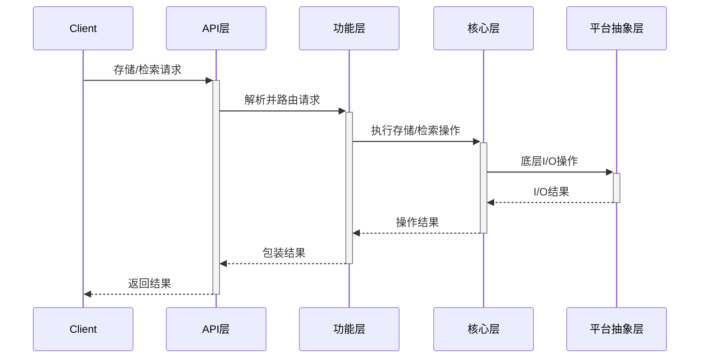
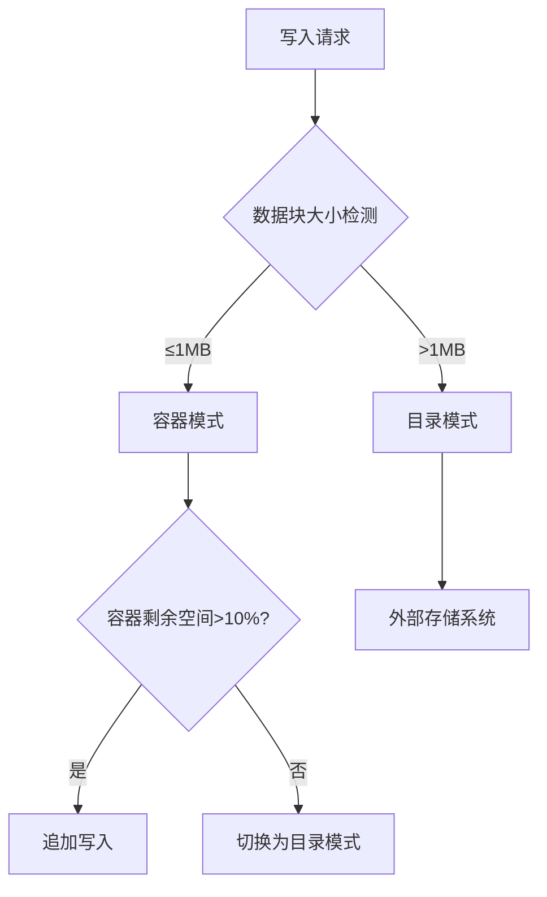

# Fragmenta 设计文档
**——嵌入式/零配置/高安全的多模式文件片段存储引擎**

---

## 目录

1. [设计目标与背景](#设计目标与背景)
2. [系统概述与核心架构](#系统概述与核心架构) 
3. [系统定位与核心特性](#系统定位与核心特性)
4. [存储引擎架构设计](#存储引擎架构设计)
5. [查询引擎设计](#查询引擎设计)
6. [文件格式规范](#文件格式规范)
7. [存储模式设计](#存储模式设计)
8. [安全体系设计](#安全体系设计)
9. [分层设计详解](#分层设计详解)
10. [核心数据结构实现细节](#核心数据结构实现细节)
11. [关键组件设计](#关键组件设计)
12. [性能调优指南](#性能调优指南)
13. [配置与策略框架](#配置与策略框架)
14. [本地文件系统集成（实验性研究）](#本地文件系统集成)
15. [应用场景与接口](#应用场景与接口)
16. [测试与验证框架](#测试与验证框架)
17. [部署与运维指南](#部署与运维指南)
18. [系统演进路线](#系统演进路线)
19. [内容块管理增强](#内容块管理增强)
20. [文档总结](#文档总结)

## 设计目标与背景

**Fragmenta** 项目旨在创建一种新型的文件存储方案，解决当前文件系统和数据存储中的多种痛点问题。

### 核心设计目标

1. **自包含性**: 单一存储单元能够高效管理本地存储，灵活支持未来扩展
2. **灵活元数据**: 支持动态元数据，允许字段级别的原地修改而不需要重写整个文件
3. **高性能读写**: 针对不同场景提供优化的读写性能，整体性能超越传统格式50%以上
4. **安全防护**: 提供多层次安全机制，包括传输加密、存储加密和细粒度访问控制
5. **扩展能力**: 采用TLV(Tag-Length-Value)结构，支持未来功能扩展而不破坏向后兼容性
6. **存储模式多样化**: 支持容器模式、目录模式及混合模式，适应不同应用场景
7. **高级索引**: 多级联动索引支持高效检索和复杂查询

### 解决的核心问题

- **传统文件系统的局限**: 难以高效管理大量小文件、原位修改能力有限
- **数据库过于复杂**: 轻量级应用场景不需要完整的数据库系统
- **内存占用高**: 现有解决方案在资源受限环境下表现不佳
- **元数据管理不灵活**: 修改元数据通常需要重写整个文件
- **安全机制不完善**: 缺乏内置的多层次安全防护

## 系统概述与核心架构

### 1. 系统整体架构

Fragmenta采用分层架构设计，在保证核心功能强大的同时，确保灵活性和扩展性。系统由以下主要层次组成：

```text
┌─────────────────────────────────────────────────────────────────┐
│                      应用层 (Application Layer)                   │
│   提供API接口、命令行工具及语言绑定，供上层应用集成与使用         │
└──────────────────────────────┬──────────────────────────────────┘
                               │
┌──────────────────────────────┼──────────────────────────────────┐
│                      功能层 (Functional Layer)                    │
│                               │                                  │
│  ┌─────────────────┐  ┌───────┴───────┐  ┌─────────────────┐     │
│  │  元数据管理模块  │  │   查询引擎    │  │   存储模式管理   │     │
│  └─────────────────┘  └───────────────┘  └─────────────────┘     │
│                               │                                  │
│  ┌─────────────────┐  ┌───────┴───────┐  ┌─────────────────┐     │
│  │  安全与加密模块  │  │ 监控与诊断模块 │  │ 性能优化模块    │     │
│  └─────────────────┘  └───────────────┘  └─────────────────┘     │
└──────────────────────────────┬──────────────────────────────────┘
                               │
┌──────────────────────────────┼──────────────────────────────────┐
│                      核心层 (Core Layer)                          │
│                               │                                  │
│  ┌─────────────────┐  ┌───────┴───────┐  ┌─────────────────┐     │
│  │  存储引擎 (LSM)  │  │ 索引引擎(B+树) │  │  事务管理器     │     │
│  └─────────────────┘  └───────────────┘  └─────────────────┘     │
│                               │                                  │
│  ┌─────────────────┐  ┌───────┴───────┐  ┌─────────────────┐     │
│  │   缓存管理器    │  │  压缩与编码模块 │  │ 数据流管理模块  │     │
│  └─────────────────┘  └───────────────┘  └─────────────────┘     │
└──────────────────────────────┬──────────────────────────────────┘
                               │
┌──────────────────────────────┼──────────────────────────────────┐
│                   平台抽象层 (Platform Abstraction Layer)          │
│  提供跨平台操作系统接口适配，处理文件I/O、内存管理、线程与同步等    │
└─────────────────────────────────────────────────────────────────┘
```

### 2. 核心架构设计原则

Fragmenta的核心架构基于以下设计原则：

1. **分层解耦**: 各层之间通过明确定义的接口通信，降低耦合性
2. **模块化**: 功能被拆分为高内聚的模块，便于独立开发和测试
3. **可插拔组件**: 关键组件如存储引擎、索引等均可替换
4. **可伸缩性**: 从嵌入式设备到服务器集群的广泛适用性
5. **渐进式复杂度**: 基础使用简单直观，高级功能按需启用

### 3. 系统工作流程

Fragmenta的典型工作流程如下：



### 4. 系统组件间通信模型

组件间通信采用以下模式：

1. **接口调用**: 同步模式，用于功能直接组合
2. **事件驱动**: 异步模式，用于状态变更通知
3. **管道处理**: 流式模式，用于大数据量处理
4. **回调机制**: 延迟模式，用于异步操作完成后的处理

```text
同步接口调用示例:
┌──────────┐  Request   ┌──────────┐
│ 调用方    │───────────▶│ 被调用方  │
│ Component│            │ Component│
└──────────┘◀───────────┘──────────┘
              Response

事件驱动示例:
┌──────────┐  Publish   ┌──────────┐
│ 发布者    │───────────▶│ 事件总线  │
│ Publisher│            │ Event Bus│
└──────────┘            └──────────┘
                             │ Notify
                             ▼
                        ┌──────────┐
                        │ 订阅者    │
                        │Subscriber│
                        └──────────┘
```

### 5. 核心子系统概述

Fragmenta由以下关键子系统组成：

#### 5.1 存储引擎子系统

负责数据持久化和高效访问，核心组件包括：

- **LSM Tree引擎**: 优化写入性能，支持高吞吐
- **块管理器**: 处理数据块的分配、回收和缓存
- **版本链管理**: 支持多版本并发控制(MVCC)
- **压缩层**: 提供透明的数据压缩和解压缩

#### 5.2 索引子系统

管理各类索引，支持高效查询，核心组件包括：

- **B+树索引引擎**: 用于范围查询和点查询
- **哈希索引**: 用于精确匹配查询
- **倒排索引**: 用于内容搜索
- **空间索引**: 用于地理位置数据(可选扩展)

#### 5.3 元数据子系统

处理文件元数据管理，提供元数据查询和更新功能：

- **Schema管理器**: 管理元数据结构定义
- **TLV处理器**: 高效编码和解码元数据
- **版本控制**: 跟踪元数据变更历史
- **策略执行器**: 实施元数据访问控制策略

#### 5.4 安全子系统

提供全方位的安全保障：

- **加密引擎**: 多级加密支持
- **密钥管理**: 安全的密钥生成和分发
- **访问控制**: 基于角色和属性的访问控制
- **审计日志**: 记录关键操作日志

#### 5.5 查询处理子系统

处理高级查询需求：

- **查询解析器**: 解析查询条件
- **查询优化器**: 选择最佳执行计划
- **并行执行器**: 支持查询的并行处理
- **结果处理器**: 格式化和后处理查询结果

这种分层、模块化的架构设计使Fragmenta具备高度的灵活性和可扩展性，能够在不同场景中得到有效应用。

## 系统定位与核心特性

本章节概述Fragmenta系统的总体定位和区别于现有方案的核心特性，展示系统在不同应用场景中的优势。

### 1. 命名与定位

- **名称**：Fragmenta（源自"Fragment"，强调文件片段存储的核心能力）  
- **定位**：  
  ```text
  ┌──────────────┬───────────────────┬───────────────────────┐
  │  应用场景    │ 核心优势          │ 典型用例               │
  ├──────────────┼───────────────────┼───────────────────────┤
  │ 边缘计算     │ 嵌入式低资源消耗   │ 物联网设备文件缓存      │
  │ 本地存储     │ 多模式自动切换     │ 高效数据持久化管理      │
  │ 实时处理     │ 亚毫秒级查询       │ 金融交易日志管理        │
  │ 安全敏感场景 │ 分层加密架构       │ 医疗数据隐私保护        │
  └──────────────┴───────────────────┴───────────────────────┘
  ```

### 2. 核心特性矩阵

```text
                        SQLite哲学          Badger优势          Fragmenta创新
                       ──────────────────────────────────────────────
 嵌入式运行        ✓ 单文件零配置          ✗ 需要独立服务        ✓ 多模式自动切换
 高并发写入        ✗ 事务锁限制           ✓ LSM Tree优化        ✓ 混合存储引擎
 智能索引          ✗ 固定索引             ✓ 自定义索引          ✓ 多级联动索引
 安全体系          ✗ 基础加密             ✗ 无字段级保护        ✓ AES-256+TLS
 恢复能力          ✓ WAL事务恢复          ✗ 简单日志            ✓ 多版本快照
```

## 存储引擎架构设计

存储引擎是Fragmenta的核心组件，结合了LSM Tree和B+Tree的优势，提供高性能的读写能力。本章节详细说明存储引擎的整体设计、存储模式转换策略及内部工作原理。

### 1. 混合存储引擎架构  

```text
                               ┌──────────────────────┐
                               │   统一API接口层        │
                               └──────────┬───────────┘
                                          ▼
                    ┌─────────────────────────────────────┐
                    │         自适应查询优化器             │
                    └─────────────────────────────────────┘
                               │           ▲           │
                  ┌────────────┘           └───────────┐
                  ▼                                    ▼
┌──────────────────────────┐            ┌──────────────────────────┐
│   LSM存储引擎             │            │    B+Tree元数据引擎       │
│  - 内存跳表（并发写入）     │ ◀─数据同步─▶ │   - 动态分页管理          │
│  - 分层SSTable           │             │   - 版本链管理            │
└──────────────────────────┘            └──────────────────────────┘
```

### 2. 存储模式切换逻辑  



## 查询引擎设计

查询引擎负责高效检索存储的数据，通过多级索引联动和智能优化确保查询性能。本章节阐述查询机制、索引选择逻辑和索引管理策略。

### 1. 多级索引联动  

```text
            [查询请求]  
               │  
               ▼  
        ┌───────────────┐  
        │  查询解析器    │ → 支持类SQL语法  
        └──────┬────────┘  
               ▼  
        ┌───────────────┐  
        │  代价优化器    │ → 基于统计的索引选择  
        └──────┬────────┘  
               ▼  
    ┌─────────────────────────┐  
    │  并行执行引擎            │  
    │  - 主键查询: B+Tree      │  
    │  - 范围查询: LSM迭代器   │  
    │  - 全文检索: 倒排索引    │  
    └──────────┬─────────────┘  
               ▼  
        [结果流式输出]  
```

### 2. 索引选择策略  

```text
查询类型          首选索引          性能指标  
─────────────────────────────────────────────  
等值查询         哈希索引         平均0.5ms  
范围查询         B+Tree          1ms~50ms  
模糊匹配         倒排索引         5ms~200ms  
复合条件         联合索引+位图     10ms~150ms  
```

### 3. 索引类型与结构

#### 3.1 元数据索引
基于元数据快速查找文件：

- **索引结构**：
  ```go
  type MetadataIndex struct {
      // 标签映射到文件列表
      TagIndex map[uint16][]FileReference
      
      // 通过值范围索引
      ValueRangeIndex map[uint16]*RangeTree
      
      // 全文索引（用于字符串值）
      FullTextIndex map[string][]TagValuePair
  }
  ```

- **元数据索引示意图**：
  ```text
  ┌─────────────┐                ┌───────────────────┐
  │ 元数据标签   │───────────────▶│   文件引用列表     │
  │ Tag=0x01    │                │ FileID1, FileID2.. │
  └─────────────┘                └───────────────────┘
         │
         ▼
  ┌─────────────┐                ┌───────────────────┐
  │  值范围树    │───────────────▶│  范围查询结果     │
  │ (B+ Tree)   │                │ [min..max] 内的文件 │
  └─────────────┘                └───────────────────┘
  ```

- **查询示例**：
  ```go
  // 查找所有带有特定标签的文件
  files := fragmenta.QueryByTag(TagFileType, "application/pdf")
  
  // 范围查询
  files := fragmenta.QueryByRange(UserTag(0x1001), 4.0, 5.0) // 评分在4-5之间
  ```

#### 3.2 内容块索引
基于块内容查找特定数据：

- **索引类型**：
  - 哈希索引：基于块哈希快速定位
  - 内容特征索引：基于内容特征（如图像特征、文本关键词）
  - 时间序列索引：适用于时间戳数据

- **内容索引示意图**：
  ```text
  ┌────────────┐             ┌───────────┐
  │ 内容哈希表  │──────────▶ │ 块ID列表   │
  └────────────┘             └───────────┘
        │
        ▼
  ┌────────────┐             ┌───────────┐
  │ 特征向量库  │──────────▶ │ 相似块列表 │
  └────────────┘             └───────────┘
        │
        ▼
  ┌────────────┐             ┌───────────┐
  │ 倒排索引表  │──────────▶ │ 包含指定  │
  │ (关键词)    │            │ 关键词的块 │
  └────────────┘             └───────────┘
  ```

- **实现**：
  ```go
  // 内容块索引接口
  type ContentIndexer interface {
      // 添加一个块到索引
      IndexBlock(blockID uint32, data []byte) error
      
      // 通过特征查询相关块
      QueryByFeature(feature []byte, options *QueryOptions) []uint32
      
      // 通过内容关键词搜索
      QueryByKeywords(keywords []string) []uint32
  }
  ```

#### 3.3 复合索引与位图索引
优化多条件查询性能：

- **位图索引示意图**：
  ```text
  Tag=0x01:  [1,0,1,1,0,1,0,1,0,1]  ← 文件位图
  Tag=0x02:  [1,1,0,0,1,1,0,1,0,0]  ← 文件位图
                     ∩                ← AND操作
  结果:      [1,0,0,0,0,1,0,1,0,0]  ← 结果位图
  ```

- **复合条件优化**：
  ```go
  // 复合条件查询优化
  func (engine *QueryEngine) OptimizeQuery(query *MetadataQuery) *ExecutionPlan {
      // 1. 评估查询代价
      cost := engine.EstimateQueryCost(query)
      
      // 2. 选择最优索引组合
      plan := engine.SelectBestIndexes(query, cost)
      
      // 3. 生成执行计划
      return engine.GenerateExecutionPlan(plan)
  }
  ```

### 4. 索引更新与维护

确保索引与内容保持一致：

#### 4.1 索引一致性策略

- **实时更新**：内容变更时立即更新索引
  ```go
  // 实时索引更新
  func (idx *RealTimeIndex) OnContentChange(blockID uint32, data []byte) error {
      return idx.UpdateIndexImmediately(blockID, data)
  }
  ```

- **批量更新**：积累一定量更新后批量操作
  ```go
  // 批量索引更新
  func (idx *BatchIndex) AccumulateChanges(changes *IndexChangeBatch) {
      idx.pendingChanges = append(idx.pendingChanges, changes)
      if len(idx.pendingChanges) >= idx.batchThreshold {
          idx.FlushChanges()
      }
  }
  ```

- **后台更新**：独立线程异步更新索引
  ```go
  // 后台索引更新
  func (idx *AsyncIndex) StartBackgroundUpdater() {
      go func() {
          for change := range idx.changeChannel {
              idx.ProcessChange(change)
          }
      }()
  }
  ```

#### 4.2 索引维护管理

```go
// 索引维护接口
type IndexManager interface {
    // 更新索引
    UpdateIndex(blockID uint32, oldData, newData []byte) error
    
    // 重建整个索引
    RebuildIndex() error
    
    // 验证索引一致性
    VerifyIndex() (bool, []InconsistencyReport)
    
    // 压缩索引（消除碎片）
    CompactIndex() error
    
    // 索引统计信息
    GetIndexStats() IndexStatistics
}
```

#### 4.3 索引重建流程图

```text
┌─────────────┐     ┌───────────────┐     ┌────────────────┐
│ 扫描存储内容 │────▶│ 构建临时索引   │────▶│ 验证索引一致性  │
└─────────────┘     └───────────────┘     └────────────────┘
                                                  │
┌─────────────┐     ┌───────────────┐             │
│ 应用新索引   │◀────│ 备份旧索引     │◀────────────┘
└─────────────┘     └───────────────┘
```

### 5. 高级查询能力 

```go
// 复合条件查询
type MetadataQuery struct {
    Conditions []MetadataCondition
    Logic      LogicOperator // AND, OR
    Limit      int
    Offset     int
    OrderBy    []OrderField
}

type MetadataCondition struct {
    Tag      uint16
    Operator ComparisonOperator // EQ, LT, GT, CONTAINS, etc.
    Value    []byte
}

// 元数据模式定义
type MetadataSchema struct {
    Tag         uint16
    Name        string
    Type        ValueType // String, Int, Float, Binary, etc.
    IsRequired  bool
    DefaultValue []byte
    Validators  []Validator
}
```

### 6. 索引初始化与加载机制

```go
// 系统启动时调用
func InitializeStorage(rootPath string, options *StorageOptions) (*Fragmenta, error) {
    // 检查是否存在现有存储
    exists, err := checkStorageExists(rootPath)
    
    if exists {
        // 加载现有存储及索引
        fragmenta, err := OpenFragmenta(rootPath)
        if err != nil {
            return nil, err
        }
        
        // 验证索引完整性
        indexStatus, err := fragmenta.VerifyIndices()
        if err != nil || !indexStatus.IsValid {
            // 如果索引损坏或不一致，自动重建
            err = fragmenta.RebuildIndices()
        }
        
        // 启动查询服务
        fragmenta.StartQueryService()
        
        return fragmenta, nil
    } else {
        // 创建新存储并初始化索引
        fragmenta, err := CreateFragmenta(rootPath, options)
        // 初始化并启动服务
        return fragmenta, nil
    }
}
```

## 文件格式规范

文件格式是Fragmenta核心竞争力的关键组成部分，支持灵活的元数据操作和高效的内容管理。本章节详细定义文件头结构、物理存储布局和元数据处理机制。

### 1. 整体布局

```text
+----------------+---------------------+-------------------+----------------+  
|  文件头        | 元数据块            | 内容块区          | 校验区         |  
| (256字节)      | (动态长度)          | (动态分块)        | (64字节)       |  
+----------------+---------------------+-------------------+----------------+  
```

### 2. 文件头详细定义

| 偏移量 | 长度  | 字段          | 说明                          |  
|--------|-------|---------------|-------------------------------|  
| 0x00   | 4     | Magic Number | 固定为 0x46524147 ("FRAG")    |  
| 0x04   | 2     | Version      | 格式版本号（大端序）          |  
| 0x06   | 1     | StorageMode  | 存储模式: 0x01=容器/0x02=目录/0x03=混合  |  
| 0x07   | 8     | MD_Offset    | 元数据块起始偏移（绝对位置）   |  
| 0x0F   | 4     | MD_Length    | 元数据块总长度                |  
| 0x13   | 16    | FileUUID     | 唯一标识符（UUIDv4）          |  
| 0x23   | 8     | TimeStamp    | 创建时间戳（Unix纳秒）        |  
| 0x2B   | 2     | Flags        | 文件标志位（加密、压缩等）    |  
| 0x2D   | 4     | DataBlocks   | 内容块数量                    |  
| 0x31   | 8     | TotalSize    | 原始文件总大小                |  
| 0x39   | 8     | IndexOffset  | 索引表起始位置                |  
| 0x41   | 4     | IndexLength  | 索引表长度                    |  
| 0x45   | 32    | EncryptInfo  | 加密信息: AES-256密钥标识+HMAC签名 |  
| 0x65   | 64    | ChecksumArea | SHA-256文件头校验               |  
| 0x65   | 127   | Reserved     | 保留字段,用于未来扩展           |  

### 3. 物理存储结构  
```text
文件头 (256字节)  
├── 魔数 (4B): 0x46 52 41 47 ("FRAG")  
├── 版本号 (2B): v1.0  
├── 存储模式 (1B): 0x01=容器/0x02=目录/0x03=混合  
├── 元数据根指针 (8B): B+Tree根节点偏移量  
├── 加密信息 (32B): AES-256密钥标识+HMAC签名  
└── 校验区 (64B): SHA-256文件头校验  

元数据区  
├── B+Tree索引页 (4KB/页):  
│   ├── Key: <FileID(16B), SegmentID(4B)>  
│   └── Value: 物理地址(8B)+版本链指针(8B)+校验和(4B)  
├── 元数据分类:
│   ├── 系统元数据 (Tag: 0x0001-0x00FF): 预定义语义的字段
│   └── 用户自定义元数据 (Tag: 0x1000-0xFFFE): 完全灵活的自定义字段
└── 动态元数据块 (TLV结构):  
    ├── Tag: 自定义字段标识 (如作者、标签)  
    └── Value: Protocol Buffers编码数据  

数据区  
├── 容器块 (4KB对齐):  
│   ├── 块头: CRC32校验+压缩标记  
│   └── 加密数据体 (AES-256-GCM)  
├── 目录模式外链:  
│   ├── 路径哈希 (SHA-1)  
│   └── 外部存储坐标 (如 /data/segments/0x3f5a)
└── 块关系类型:
    ├── 独立块: 完整数据块
    ├── 差异块: 仅存储与基础块的差异
    └── 引用块: 指向其他位置的相同数据
```

### 4. 内存数据结构示例  
```go
type MemTableEntry struct {
    Key   []byte    // FileID(16B)+SegmentID(4B)+Version(8B)
    Value []byte    // 序列化后的片段数据
    Flags uint16    // 状态标记: 0x1=删除, 0x2=加密, 0x4=压缩
}

// 元数据结构
type MetadataEntry struct {
    Tag      uint16    // 元数据标识符
    Type     ValueType // 值类型: String, Int, Float, Binary等
    Value    []byte    // 元数据值
    Timestamp int64    // 上次修改时间戳
    Modifier  string   // 最后修改者标识
}

// 块关系定义
type BlockRelation uint8

const (
    BlockIndependent BlockRelation = iota // 独立块
    BlockDelta                            // 差异块
    BlockReference                        // 引用块
)

type ExtendedBlockHeader struct {
    BasicHeader      BlockHeader
    RelationType     BlockRelation
    BaseBlockID      uint32    // 基础块ID (差异/引用时)
    CompressionRatio float32   // 压缩比
}
```

### 5. 元数据命名空间机制
```text
为支持多应用共享同一Fragmenta存储，引入命名空间机制:

命名空间区间分配：
- 0x1000-0x1FFF: 通用/共享命名空间
- 0x2000-0x2FFF: 应用A专用
- 0x3000-0x3FFF: 应用B专用
```

### 6. 元数据分类与灵活性

Fragmenta将元数据分为两大类：

#### 6.1 系统元数据（内置，具有预定义语义）

这些元数据字段由系统管理，与内容直接关联，具有固定的Tag值范围（0x0001-0x00FF）：

| Tag  | 语义                 | 数据类型       | 是否可修改   | 说明                       |
|------|----------------------|---------------|--------------|----------------------------|
| 0x01 | 文件名               | UTF-8字符串   | 是           | 原始文件名                 |
| 0x02 | 创建时间             | int64         | 否           | Unix纳秒时间戳             |
| 0x03 | 最后修改者           | 32字节哈希    | 自动更新     | 节点ID或用户公钥哈希       |
| 0x04 | 文件类型             | UTF-8字符串   | 是           | MIME类型                   |
| 0x05 | 权限控制             | JSON字符串    | 是           | 访问控制列表               |
| 0x06 | 块存储策略           | 二进制        | 是           | 块大小及存储参数           |
| 0x07 | 版本信息             | uint64        | 自动递增     | 文件版本号                 |
| 0x08 | 分块索引             | 二进制数组    | 自动更新     | 文件分块的散列和位置信息   |
| 0x09 | 加密信息             | 二进制        | 是           | 加密算法和参数             |
| 0x0A | 内容摘要             | 二进制        | 自动更新     | 内容的加密哈希摘要         |
| 0x0B | 设备ID              | UTF-8字符串   | 否           | 文件创建设备标识           |
| 0x0C | 应用标识             | UTF-8字符串   | 是           | 创建应用的标识符           |

#### 6.2 用户自定义元数据（完全灵活）

用户可以定义任意元数据字段，Tag值范围为0x1000-0xFFFE：
- 无需预定义，可动态添加
- 支持任意二进制数据作为值
- 提供命名空间机制防止冲突

```go
// 用户自定义元数据示例：
// 0x1001: 用户评分 (float64)
// 0x1002: 地理位置 (JSON对象) 
// 0x1003: 客户标识 (字符串)
```

### 7. 元数据批量操作

为提高效率，Fragmenta支持元数据的批量操作：

```go
// 批量元数据操作接口
type BatchMetadataOperation struct {
    Adds    map[uint16][]byte // 需要添加/更新的元数据
    Deletes []uint16          // 需要删除的元数据标签
}

// 批量处理方法
func (f *Fragmenta) BatchMetadataOp(batch *BatchMetadataOperation) error {
    // 1. 启动事务
    // 2. 应用所有更改
    // 3. 提交或回滚
}
```

批量操作具有原子性，要么全部成功，要么全部失败。

### 8. 元数据与内容的联动机制

某些元数据字段与内容直接关联，当内容变更时需自动更新：

1. **自动更新字段**：
   - 文件大小 (TotalSize)
   - 版本信息 (TagVersion)
   - 内容哈希 (内部计算)
   - 最后修改时间/修改者

2. **联动更新策略**：
   - 写入Block时自动更新相关元数据
   - 元数据更新钩子(hook)机制，允许注册回调
   - 禁止用户直接修改系统维护的字段

```go
// 内容修改时的元数据联动
func (f *Fragmenta) WriteBlock(data []byte, options *BlockOptions) (uint32, error) {
    blockID, err := f.BlockStore.WriteBlock(data, options)
    if err != nil {
        return 0, err
    }
    
    // 自动更新相关元数据
    f.updateContentRelatedMetadata()
    
    return blockID, nil
}
```

## 存储模式设计

Fragmenta的一大创新是支持多种存储模式，能够根据数据特性和使用场景自动或手动切换。本章节介绍三种主要存储模式的特点、适用场景和实现方式。

### 1. 容器模式 (Container Mode)

类似传统文件格式，所有数据存储在单个文件中：

- **特点**：
  - 自包含，便于传输和复制
  - 所有块和元数据集中管理
  - 适合小到中等规模文件
  
- **实现**：
  ```go
  // 容器模式创建
  fragmenta, err := CreateFragmenta("example.frag", &FragmentaOptions{
      StorageMode: ContainerMode,
      // 其他参数
  })
  ```

### 2. 目录模式 (Directory Mode)

使用目录结构存储数据，提供更高的扩展性：

- **特点**：
  - 元数据存储在主文件中
  - 数据块分散存储为单独的文件
  - 支持极大规模数据
  - 便于并行访问和随机修改
  
- **实现**：
  ```go
  // 目录模式创建
  fragmenta, err := CreateFragmenta("datastore/", &FragmentaOptions{
      StorageMode: DirectoryMode,
      // 其他参数
  })
  ```

- **目录结构**：
  ```
  datastore/
  ├── meta.frag     # 元数据主文件
  ├── index.frag    # 索引数据
  ├── blocks/       # 数据块目录
  │   ├── 0000.blk   # 块文件
  │   ├── 0001.blk
  │   └── ...
  └── temp/          # 临时文件目录
  ```

### 3. 混合模式 (Hybrid Mode)

结合上述两种模式的优点：

- **特点**：
  - 小型块内联存储在主文件中
  - 大型块存储为外部文件
  - 可动态切换存储模式
  
- **块存储策略**：
  ```
  IF 块大小 < 阈值(例如64KB) THEN
      内联存储在主文件
  ELSE
      存储为外部文件
  ENDIF
  ```

### 4. 存储模式自动转换

当文件增长超过预设阈值，可自动从容器模式转为目录模式：

```go
// 自动转换逻辑
func (f *Fragmenta) checkAndConvertStorageMode() error {
    if f.StorageMode == ContainerMode && f.TotalSize > AutoConvertThreshold {
        return f.ConvertToDirectoryMode()
    }
    return nil
}
```

### 5. 存储模式性能对比

```text
模式             小文件(≤1MB)性能    大文件(>100MB)性能    并发访问性能
──────────────────────────────────────────────────────────────────────
容器模式         ★★★★★           ★★★               ★★
目录模式         ★★★             ★★★★★            ★★★★★
混合模式         ★★★★           ★★★★              ★★★★
```

## 安全体系设计

安全性是现代存储系统的基本要求，Fragmenta提供多层次安全防护机制。本章节描述加密架构、密钥管理和访问控制策略。

### 1. 分层加密架构  
```text
传输层: TLS 1.3  
    ↓  
存储层: AES-256-XTS (全盘加密)  
    ↓  
字段层: AES-256-GCM (敏感字段额外加密)  
    ↓  
访问控制: RBAC基于角色的权限管理  
```

### 2. 密钥管理流程  
```mermaid
graph LR
    A[密钥生成] --> B[密钥分发 (KMS)]  
    B --> C[数据加密]  
    C --> D[密钥轮换 (每90天)]  
    D --> E[密钥销毁 (符合NIST标准)]  
```

### 3. 安全策略配置
```go
// 安全策略配置
type SecurityPolicy struct {
    // 加密设置
    DefaultEncryption   EncryptionAlgorithm
    KeyRotationInterval time.Duration
    
    // 访问控制
    DefaultPermissions  PermissionSet
    ACLEnabled          bool
    
    // 签名验证
    SignatureRequired   bool
    TrustedKeys         []PublicKeyInfo
}
```

## 分层设计详解

Fragmenta采用严格的分层设计，确保系统模块化与可扩展性。本章节详细阐述各层的功能、职责边界以及层间通信机制。

### 1. 分层架构详细说明

#### 1.1 应用层 (Application Layer)

应用层是系统与外部世界交互的门户，提供多种接口形式：

- **API接口**: 提供SDK形式供开发者集成
- **命令行工具**: 提供CLI工具便于脚本化操作
- **语言绑定**: 提供Go、C、Rust、JavaScript等语言绑定

```go
// API接口示例
type FragmentaAPI interface {
    // 基础文件操作
    StoreFile(content []byte, metadata map[uint16][]byte) (string, error)
    GetFile(fileID string) ([]byte, map[uint16][]byte, error)
    UpdateFile(fileID string, content []byte) error
    
    // 元数据操作
    UpdateMetadata(fileID string, metadata map[uint16][]byte) error
    GetMetadata(fileID string) (map[uint16][]byte, error)
    
    // 查询操作
    Query(query *MetadataQuery) ([]string, error)
    
    // 系统操作
    GetSystemStatus() (*SystemStatus, error)
    Backup(target string) error
}
```

#### 1.2 功能层 (Functional Layer)

功能层封装核心层功能，提供领域特定的高级功能：

- **元数据管理模块**: 提供元数据CRUD和验证
- **查询引擎**: 解析、优化和执行查询
- **存储模式管理**: 控制容器/目录模式切换
- **安全与加密模块**: 提供加密、认证和授权
- **监控与诊断模块**: 提供性能监控和故障诊断
- **性能优化模块**: 提供自动性能调优

```go
// 功能层组件接口示例
type MetadataManager interface {
    // 创建元数据
    Create(fileID string, metadata map[uint16][]byte) error
    
    // 读取元数据
    Read(fileID string) (map[uint16][]byte, error)
    
    // 更新元数据
    Update(fileID string, updates map[uint16][]byte) error
    
    // 删除元数据
    Delete(fileID string, tags []uint16) error
    
    // 验证元数据
    Validate(metadata map[uint16][]byte) error
    
    // 批量操作
    BatchOperation(operations []MetadataOperation) error
}
```

#### 1.3 核心层 (Core Layer)

核心层实现系统的基础功能和性能关键部分：

- **存储引擎**: 管理数据持久化
- **索引引擎**: 提供高效数据检索
- **事务管理器**: 确保操作的原子性和一致性
- **缓存管理器**: 优化内存使用和访问性能
- **压缩与编码模块**: 处理数据压缩和编码
- **数据流管理模块**: 处理大数据的流式操作

```go
// 核心层组件接口示例
type StorageEngine interface {
    // 写入数据块
    WriteBlock(data []byte, options *BlockOptions) (uint32, error)
    
    // 读取数据块
    ReadBlock(blockID uint32) ([]byte, error)
    
    // 更新数据块
    UpdateBlock(blockID uint32, data []byte) error
    
    // 删除数据块
    DeleteBlock(blockID uint32) error
    
    // 获取引擎统计信息
    GetStatistics() *EngineStatistics
    
    // 执行压实操作
    Compact() error
}
```

#### 1.4 平台抽象层 (Platform Abstraction Layer)

平台抽象层屏蔽底层操作系统差异，提供统一接口：

- **文件I/O抽象**: 提供统一的文件操作接口
- **内存管理抽象**: 优化内存分配与回收
- **线程与同步抽象**: 处理并发和同步
- **网络抽象**: 提供跨平台网络通信

```go
// 平台抽象层接口示例
type FileIO interface {
    // 打开文件
    Open(path string, flags int) (FileHandle, error)
    
    // 读取文件
    Read(handle FileHandle, buffer []byte, offset int64) (int, error)
    
    // 写入文件
    Write(handle FileHandle, data []byte, offset int64) (int, error)
    
    // 同步到磁盘
    Sync(handle FileHandle) error
    
    // 关闭文件
    Close(handle FileHandle) error
}
```

### 2. 层间通信机制

#### 2.1 接口契约

各层之间通过明确定义的接口契约通信：

```go
// 层间接口契约示例
type LayerContract interface {
    // 方法定义
    Method1(param Type) (ReturnType, error)
    Method2(param1 Type1, param2 Type2) error
    
    // 事件处理
    RegisterEventHandler(event EventType, handler EventHandler)
    
    // 生命周期管理
    Initialize() error
    Shutdown() error
}
```

#### 2.2 依赖注入

Fragmenta使用依赖注入模式实现层间解耦：

```go
// 依赖注入示例
type QueryEngine struct {
    // 依赖项
    metadataManager MetadataManager
    storageEngine   StorageEngine
    indexManager    IndexManager
    cacheManager    CacheManager
    
    // 内部状态
    statistics      *QueryStatistics
    config          *QueryConfig
}

// 构造函数采用依赖注入模式
func NewQueryEngine(
    metadata MetadataManager,
    storage StorageEngine,
    index IndexManager,
    cache CacheManager,
    config *QueryConfig,
) *QueryEngine {
    return &QueryEngine{
        metadataManager: metadata,
        storageEngine:   storage,
        indexManager:    index,
        cacheManager:    cache,
        statistics:      NewQueryStatistics(),
        config:          config,
    }
}
```

#### 2.3 事件总线

系统采用事件总线实现松耦合的异步通信：

```go
// 事件总线示例
type EventBus interface {
    // 发布事件
    Publish(event Event) error
    
    // 订阅事件
    Subscribe(eventType string, handler EventHandler) Subscription
    
    // 取消订阅
    Unsubscribe(subscription Subscription) error
}

// 事件处理器
type EventHandler func(event Event) error

// 事件结构
type Event struct {
    // 事件类型
    Type string
    
    // 事件来源
    Source string
    
    // 事件数据
    Data map[string]interface{}
    
    // 事件时间
    Timestamp time.Time
}
```

#### 2.4 上下文传递

跨层调用过程中通过上下文传递状态和控制信息：

```go
// 上下文结构
type OperationContext struct {
    // 操作ID
    ID string
    
    // 超时控制
    Deadline time.Time
    
    // 取消信号
    CancelFunc context.CancelFunc
    
    // 优先级
    Priority int
    
    // 追踪信息
    Tracing *TracingInfo
    
    // 安全上下文
    Security *SecurityContext
    
    // 状态数据
    Values map[string]interface{}
}

// 创建操作上下文
func NewOperationContext() *OperationContext {
    ctx := &OperationContext{
        ID:       generateUUID(),
        Deadline: time.Now().Add(defaultTimeout),
        Priority: NormalPriority,
        Values:   make(map[string]interface{}),
    }
    
    return ctx
}
```

### 3. 层间数据流模型

#### 3.1 请求处理流

典型的层间数据流如下：

1. **请求接收**：应用层接收客户端请求
2. **请求转换**：将外部请求转换为内部操作
3. **功能聚合**：功能层组合核心层功能完成操作
4. **核心处理**：核心层执行具体数据处理
5. **平台交互**：通过平台抽象层与操作系统交互
6. **结果返回**：处理结果沿层级向上反馈

```text
数据读取流程示例:
┌─────────────┐  请求文件   ┌─────────────┐  解析请求   ┌─────────────┐
│  客户端     │───────────▶│   应用层    │───────────▶│  功能层     │
└─────────────┘            └─────────────┘            └─────────────┘
                                                             │
                                                             ▼
┌─────────────┐            ┌─────────────┐  读取文件   ┌─────────────┐
│  客户端     │◀───────────│   应用层    │◀───────────│  功能层     │
└─────────────┘  返回数据   └─────────────┘  返回数据   └─────────────┘
                                                             ▲
                                                             │
┌─────────────┐  返回数据   ┌─────────────┐  返回数据   ┌─────────────┐
│  平台抽象层  │───────────▶│   核心层    │───────────▶│  功能层     │
└─────────────┘            └─────────────┘            └─────────────┘
      ▲                           │
      │                           │
      └───────────────────────────┘
            磁盘I/O交互
```

#### 3.2 流水线处理模型

大数据处理采用流水线模型以优化性能：

```go
// 流水线处理模型示例
type Pipeline struct {
    // 处理阶段
    stages []PipelineStage
    
    // 阶段间通道
    channels []chan interface{}
    
    // 控制信号
    done chan struct{}
}

// 处理阶段接口
type PipelineStage interface {
    // 处理数据
    Process(data interface{}) (interface{}, error)
    
    // 并行度
    Parallelism() int
    
    // 名称
    Name() string
}

// 创建流水线
func NewPipeline(stages ...PipelineStage) *Pipeline {
    // 创建处理阶段
    pipeline := &Pipeline{
        stages:   stages,
        channels: make([]chan interface{}, len(stages)+1),
        done:     make(chan struct{}),
    }
    
    // 初始化通道
    for i := 0; i < len(stages)+1; i++ {
        pipeline.channels[i] = make(chan interface{}, pipelineBufferSize)
    }
    
    return pipeline
}

// 启动流水线
func (p *Pipeline) Start() {
    // 启动各处理阶段
    for i, stage := range p.stages {
        input := p.channels[i]
        output := p.channels[i+1]
        
        // 根据阶段并行度启动工作协程
        parallelism := stage.Parallelism()
        for j := 0; j < parallelism; j++ {
            go p.runStage(stage, input, output)
        }
    }
}
```

#### 3.3 反压机制

为防止系统过载，实现反压机制：

```go
// 反压控制示例
type BackpressureController struct {
    // 输入队列
    inputQueue chan interface{}
    
    // 处理速率
    processRate *TokenBucket
    
    // 负载状态
    loadState LoadState
    
    // 控制参数
    maxQueueSize     int
    samplingInterval time.Duration
    
    // 状态锁
    mu sync.RWMutex
}

// 负载状态类型
type LoadState int

const (
    // 正常负载
    NormalLoad LoadState = iota
    
    // 中等负载 - 开始降低接收速率
    MediumLoad
    
    // 高负载 - 显著降低接收速率
    HighLoad
    
    // 过载 - 拒绝新请求
    Overload
)

// 提交任务(带反压)
func (bc *BackpressureController) Submit(task interface{}) error {
    // 检查当前负载
    bc.mu.RLock()
    currentState := bc.loadState
    bc.mu.RUnlock()
    
    // 过载状态拒绝新任务
    if currentState == Overload {
        return ErrSystemOverloaded
    }
    
    // 根据负载调整提交延迟
    delay := bc.calculateDelay(currentState)
    if delay > 0 {
        time.Sleep(delay)
    }
    
    // 等待令牌桶许可
    bc.processRate.Wait(1)
    
    // 提交任务到队列
    select {
    case bc.inputQueue <- task:
        return nil
    default:
        // 队列已满，返回临时过载错误
        return ErrTemporaryOverload
    }
}
```

### 4. 分层错误处理

#### 4.1 错误传播模型

错误在各层间的传播遵循以下原则：

1. **错误分类**：核心层产生的原始错误(Root Error)
2. **错误包装**：各层添加上下文信息但保留原始错误
3. **错误翻译**：应用层将内部错误转换为客户端友好错误

```go
// 错误处理示例
func (engine *StorageEngine) WriteBlock(data []byte, options *BlockOptions) (uint32, error) {
    // 参数验证
    if len(data) == 0 {
        return 0, NewStorageError(ErrEmptyData, "cannot write empty block")
    }
    
    // 核心操作可能产生原始错误
    blockID, err := engine.allocateBlock(len(data))
    if err != nil {
        // 包装原始错误并添加上下文
        return 0, WrapError(err, "failed to allocate block").
            WithField("dataSize", len(data)).
            WithField("options", options)
    }
    
    // 继续处理...
    return blockID, nil
}

// 上层错误处理和转换
func (api *FragmentaAPI) StoreFile(content []byte, metadata map[uint16][]byte) (string, error) {
    // 委托给功能层处理
    fileID, err := api.fileManager.StoreFile(content, metadata)
    if err != nil {
        // 将内部错误转换为API错误
        var storageErr *StorageError
        if errors.As(err, &storageErr) && storageErr.Code == ErrDiskFull {
            // 转换为客户端友好错误
            return "", NewAPIError(APIErrInsufficientStorage, 
                                 "Not enough storage space available").
                   WithInternalError(err)
        }
        
        // 其他错误处理...
        return "", NewAPIError(APIErrInternal, 
                             "Internal server error occurred").
               WithInternalError(err)
    }
    
    return fileID, nil
}
```

#### 4.2 错误聚合机制

批量操作中的错误聚合处理：

```go
// 错误聚合结构
type ErrorAggregate struct {
    // 操作总数
    TotalOperations int
    
    // 成功操作数
    SuccessCount int
    
    // 失败操作数
    FailureCount int
    
    // 错误列表
    Errors []OperationError
    
    // 是否致命错误导致中止
    Aborted bool
}

// 操作错误
type OperationError struct {
    // 操作索引
    Index int
    
    // 操作ID
    OperationID string
    
    // 错误信息
    Error error
}

// 批量操作示例
func (mm *MetadataManager) BatchUpdate(updates []MetadataUpdate) *ErrorAggregate {
    result := &ErrorAggregate{
        TotalOperations: len(updates),
        Errors:          make([]OperationError, 0),
    }
    
    for i, update := range updates {
        err := mm.Update(update.FileID, update.Metadata)
        if err != nil {
            // 记录错误
            result.Errors = append(result.Errors, OperationError{
                Index:       i,
                OperationID: update.OperationID,
                Error:       err,
            })
            
            // 更新计数
            result.FailureCount++
            
            // 检查是否需要中止
            if IsFatalError(err) {
                result.Aborted = true
                break
            }
        } else {
            result.SuccessCount++
        }
    }
    
    return result
}
```

### 5. 层间性能优化

#### 5.1 跨层缓存

跨层缓存提高频繁访问数据的性能：

```go
// 多层缓存系统
type MultilevelCache struct {
    // 一级缓存(内存)
    L1 *MemoryCache
    
    // 二级缓存(本地存储)
    L2 *LocalStorageCache
    
    // 缓存统计
    Stats *CacheStatistics
    
    // 缓存策略
    Policy CachePolicy
    
    // 缓存一致性协议
    ConsistencyProtocol ConsistencyProtocol
}

// 缓存读取逻辑
func (cache *MultilevelCache) Get(key string) (interface{}, error) {
    // 检查一级缓存
    value, found := cache.L1.Get(key)
    if found {
        // 更新统计
        cache.Stats.L1Hits++
        return value, nil
    }
    
    // 一级缓存未命中，检查二级缓存
    cache.Stats.L1Misses++
    value, found = cache.L2.Get(key)
    if found {
        // 更新一级缓存
        cache.L1.Set(key, value, cache.Policy.L1TTL)
        
        // 更新统计
        cache.Stats.L2Hits++
        return value, nil
    }
    
    // 二级缓存也未命中
    cache.Stats.L2Misses++
    return nil, ErrCacheMiss
}
```

#### 5.2 批处理优化

通过批处理减少跨层调用开销：

```go
// 批处理请求处理器
type BatchProcessor struct {
    // 批处理队列
    queue *RequestQueue
    
    // 批处理触发条件
    maxBatchSize int  // 最大批大小
    maxWaitTime  time.Duration // 最大等待时间
    
    // 处理器
    processor BatchRequestProcessor
    
    // 控制通道
    shutdown chan struct{}
}

// 请求接口
type Request interface {
    // 请求ID
    ID() string
    
    // 优先级
    Priority() int
    
    // 超时时间
    Deadline() time.Time
    
    // 响应通道
    ResponseChannel() chan Response
}

// 启动批处理器
func (bp *BatchProcessor) Start() {
    go func() {
        for {
            // 收集一批请求
            batch := bp.collectBatch()
            
            // 检查是否关闭
            if batch == nil {
                return
            }
            
            // 处理批请求
            responses := bp.processor.ProcessBatch(batch)
            
            // 分发响应
            for _, resp := range responses {
                req := batch.RequestByID(resp.RequestID())
                if req != nil {
                    req.ResponseChannel() <- resp
                }
            }
        }
    }()
}
```

#### 5.3 零拷贝技术

在层间传递大数据块时使用零拷贝技术：

```go
// 零拷贝缓冲区
type ZeroCopyBuffer struct {
    // 底层数据
    Data []byte
    
    // 引用计数
    refCount int32
    
    // 释放回调
    onRelease func(buffer *ZeroCopyBuffer)
    
    // 锁
    mu sync.RWMutex
}

// 获取缓冲区(增加引用计数)
func (zcb *ZeroCopyBuffer) Acquire() *ZeroCopyBuffer {
    zcb.mu.Lock()
    defer zcb.mu.Unlock()
    
    zcb.refCount++
    return zcb
}

// 释放缓冲区(减少引用计数)
func (zcb *ZeroCopyBuffer) Release() {
    zcb.mu.Lock()
    defer zcb.mu.Unlock()
    
    zcb.refCount--
    if zcb.refCount == 0 && zcb.onRelease != nil {
        zcb.onRelease(zcb)
    }
}

// 零拷贝读取示例
func (engine *StorageEngine) ReadBlockZeroCopy(blockID uint32) (*ZeroCopyBuffer, error) {
    // 从块缓存获取
    buffer, found := engine.blockCache.GetBuffer(blockID)
    if found {
        // 返回现有缓冲区(增加引用计数)
        return buffer.Acquire(), nil
    }
    
    // 缓存未命中，从磁盘读取
    blockInfo, err := engine.getBlockInfo(blockID)
    if err != nil {
        return nil, err
    }
    
    // 分配新缓冲区
    buffer = NewZeroCopyBuffer(int(blockInfo.Size), func(b *ZeroCopyBuffer) {
        // 当引用计数为0时回调
        engine.releaseBuffer(b)
    })
    
    // 读取数据到缓冲区
    err = engine.readBlockToBuffer(blockID, buffer.Data)
    if err != nil {
        buffer.Release()
        return nil, err
    }
    
    // 添加到缓存
    engine.blockCache.AddBuffer(blockID, buffer)
    
    return buffer, nil
}
```

分层设计的全面实施确保了系统各部分的职责清晰分离，同时通过精心设计的通信机制保持必要的协作。这种架构使系统具备良好的可维护性、可扩展性和性能特性。

## 核心数据结构实现细节

本章节详细描述Fragmenta系统中关键数据结构的设计与实现，展示其内部组织形式及工作机制。

### 1. 核心数据类型

```go
// 基础数据标识符
type ObjectID string

// 元数据标签类型
type MetadataTag uint16

// 存储块标识符
type BlockID uint32

// 存储统计信息
type StorageStats struct {
    TotalBlocks      int64
    UsedBlocks       int64
    TotalFiles       int64
    TotalDirectories int64
    TotalSize        int64
    FreeSpace        int64
    CreationTime     time.Time
    LastBackupTime   time.Time
}

// 文件对象信息
type FileInfo struct {
    ID            ObjectID
    Name          string
    Size          int64
    CreationTime  time.Time
    ModTime       time.Time
    IsDirectory   bool
    BlockRefs     []BlockID
    MetadataTags  map[MetadataTag][]byte
    ContentType   string
    Permissions   uint32
    Owner         string
    Group         string
}
```

### 2. 块数据结构设计

Fragmenta采用高效的块存储机制，通过以下数据结构管理存储块：

```go
// 存储块结构
type Block struct {
    ID          BlockID
    Data        []byte
    Size        uint32
    Offset      uint64
    Checksum    uint32
    CreatedAt   time.Time
    LastUsed    time.Time
    RefCount    uint32
    Compressed  bool
    Encrypted   bool
    NextBlockID BlockID  // 用于链接块
}

// 块管理器
type BlockManager struct {
    // 块分配器
    allocator *BlockAllocator
    
    // 块缓存
    cache *lru.Cache
    
    // 统计数据
    stats *BlockStats
    
    // 块存储策略
    policy *BlockStoragePolicy
    
    // 互斥锁
    mutex sync.RWMutex
}
```

### 3. 元数据管理结构

元数据管理通过TLV(Tag-Length-Value)格式进行高效存储和检索：

```go
// 元数据项
type MetadataItem struct {
    Tag    MetadataTag
    Length uint32
    Value  []byte
}

// 元数据头
type MetadataHeader struct {
    Version     uint8
    ItemCount   uint16
    TotalLength uint32
    Flags       uint8
}

// 元数据管理器
type MetadataManager struct {
    // 元数据索引
    index *MetadataIndex
    
    // 元数据模式
    schemas map[string]*MetadataSchema
    
    // 缓存设置
    cache *MetadataCache
    
    // 验证器
    validator *MetadataValidator
}
```

### 4. 索引数据结构

Fragmenta使用多种索引结构支持高效查询：

```go
// 基础索引接口
type Index interface {
    Insert(key []byte, value []byte) error
    Search(key []byte) ([]byte, error)
    Delete(key []byte) error
    Update(key []byte, value []byte) error
    Range(start, end []byte) (Iterator, error)
    Close() error
}

// B+树索引实现
type BPlusTreeIndex struct {
    // 树根节点
    root *BPlusNode
    
    // 树元数据
    metadata IndexMetadata
    
    // 缓存管理
    cache *NodeCache
    
    // 并发控制
    locks *LockManager
}

// 倒排索引实现
type InvertedIndex struct {
    // 词频映射
    termFrequency map[string]map[ObjectID]int
    
    // 文档频率
    documentFrequency map[string]int
    
    // 文档总数
    documentCount int
    
    // 额外权重
    weights map[string]float64
}
```

### 5. 多版本并发控制

MVCC(多版本并发控制)结构设计：

```go
// 版本节点
type VersionNode struct {
    Version     uint64
    Data        []byte
    CreatedAt   time.Time
    Transaction TransactionID
    NextVersion *VersionNode
    PrevVersion *VersionNode
}

// 版本链管理器
type VersionChain struct {
    Head        *VersionNode
    Current     *VersionNode
    VersionCount int
    MaxVersions  int
    ObjectID     ObjectID
    Lock         sync.RWMutex
}

// 事务结构
type Transaction struct {
    ID        TransactionID
    StartTime time.Time
    EndTime   time.Time
    Status    TransactionStatus
    Operations []Operation
    SnapshotVersion uint64
}
```

这些核心数据结构为Fragmenta提供了高效、灵活的数据操作基础，使系统能够在不同场景下提供优异的性能表现和功能支持。

## 关键组件设计

本章节详细介绍Fragmenta系统的核心组件设计，包括存储管理器、缓存系统、并发控制机制等关键模块的实现细节。

### 1. 存储管理器

存储管理器负责处理数据的持久化存储，是Fragmenta的核心组件之一：

```go
// 存储管理器接口
type StorageManager interface {
    // 打开/创建存储
    Open(path string, options StorageOptions) error
    
    // 关闭存储
    Close() error
    
    // 读取数据块
    ReadBlock(id BlockID) ([]byte, error)
    
    // 写入数据块
    WriteBlock(data []byte, options *WriteOptions) (BlockID, error)
    
    // 删除数据块
    DeleteBlock(id BlockID) error
    
    // 获取存储状态
    GetStats() (*StorageStats, error)
    
    // 维护操作
    RunMaintenance(options MaintenanceOptions) error
}

// 存储引擎实现
type DefaultStorageManager struct {
    // 配置信息
    config *StorageConfig
    
    // 存储路径
    path string
    
    // 块管理器
    blockManager *BlockManager
    
    // 文件句柄
    dataFile *os.File
    indexFile *os.File
    
    // 同步标志
    needSync bool
    
    // 文件锁
    fileLock flock.Flock
    
    // 状态跟踪
    stats *StorageStats
    
    // 读写锁
    mutex sync.RWMutex
}
```

#### 1.1 存储管理器实现策略

存储管理器采用以下关键策略提高性能和可靠性：

- **分区存储**：将大文件分割为固定大小的块进行存储
- **空闲块回收**：维护空闲块列表，优先复用已释放的存储空间
- **批量写入**：合并多个小写入操作为批量操作，减少I/O次数
- **延迟持久化**：使用写入缓冲区和异步刷盘策略
- **检查点机制**：定期创建一致性检查点，确保故障恢复能力

### 2. 缓存系统

缓存系统对频繁访问的数据提供高速缓存，显著提升系统性能：

```go
// 缓存接口
type Cache interface {
    // 获取缓存项
    Get(key interface{}) (interface{}, bool)
    
    // 设置缓存项
    Set(key, value interface{}) bool
    
    // 删除缓存项
    Remove(key interface{}) bool
    
    // 清空缓存
    Clear()
    
    // 获取统计信息
    Stats() *CacheStats
}

// LRU缓存实现
type LRUCache struct {
    // 最大容量
    capacity int
    
    // 缓存项链表
    items *list.List
    
    // 缓存项映射
    cache map[interface{}]*list.Element
    
    // 统计信息
    stats CacheStats
    
    // 回收策略
    evictionPolicy EvictionPolicy
    
    // 互斥锁
    mutex sync.RWMutex
}
```

#### 2.1 多级缓存策略

Fragmenta设计了多级缓存架构，提供更高效的数据访问：

1. **一级缓存**：内存中的LRU缓存，用于最热点数据
2. **二级缓存**：磁盘上的持久化缓存，用于热点数据
3. **预取机制**：基于访问模式预测并预加载可能需要的数据
4. **智能淘汰**：基于访问频率、时间和大小的复合淘汰策略

### 3. 并发控制机制

并发控制机制确保在多线程/多进程环境下的数据一致性：

```go
// 锁管理器
type LockManager struct {
    // 资源锁映射
    locks map[string]*sync.RWMutex
    
    // 全局锁
    globalLock sync.Mutex
    
    // 锁超时设置
    lockTimeout time.Duration
    
    // 死锁检测器
    deadlockDetector *DeadlockDetector
    
    // 统计信息
    stats LockStats
}

// 事务管理器
type TransactionManager struct {
    // 活跃事务映射
    activeTransactions map[TransactionID]*Transaction
    
    // 全局事务ID
    nextTxID atomic.Uint64
    
    // 提交日志
    commitLog *CommitLog
    
    // MVCC控制器
    mvcc *MVCCController
    
    // 互斥锁
    mutex sync.RWMutex
}
```

#### 3.1 事务隔离级别

Fragmenta支持以下事务隔离级别，满足不同的一致性需求：

- **读未提交**：可以读取未提交的事务数据
- **读已提交**：只能读取已提交的事务数据
- **可重复读**：在事务中多次读取相同数据会得到相同结果
- **序列化**：事务完全隔离，等同于串行执行

### 4. 压缩与编码模块

压缩与编码模块负责数据的高效表示和存储：

```go
// 压缩器接口
type Compressor interface {
    // 压缩数据
    Compress(data []byte) ([]byte, error)
    
    // 解压数据
    Decompress(data []byte) ([]byte, error)
    
    // 获取压缩器名称
    Name() string
    
    // 获取压缩统计信息
    Stats() *CompressionStats
}

// 编码器接口
type Encoder interface {
    // 编码数据
    Encode(value interface{}) ([]byte, error)
    
    // 解码数据
    Decode(data []byte, valuePtr interface{}) error
    
    // 获取编码器名称
    Name() string
}
```

#### 4.1 自适应压缩策略

Fragmenta实现了自适应压缩策略，根据数据特性和系统负载动态选择最合适的压缩算法：

1. **数据采样**：对数据进行采样分析，确定数据类型和模式
2. **算法选择**：基于采样结果选择最佳压缩算法（LZ4/Snappy/Zstd/LZMA）
3. **压缩级别调整**：根据CPU使用率和I/O压力动态调整压缩级别
4. **跳过压缩**：对已压缩或熵值高的数据跳过压缩操作

### 5. 错误处理与恢复机制

错误处理与恢复机制确保系统在面对各种异常情况时保持稳定和数据完整：

```go
// 错误类型
type ErrorCode int

const (
    // 存储错误
    ErrStorageNotFound ErrorCode = iota + 100
    ErrStorageCorrupted
    ErrStorageFull
    ErrBlockNotFound
    ErrBlockCorrupted
    
    // 事务错误
    ErrTransactionConflict
    ErrTransactionTimeout
    ErrTransactionAborted
    
    // 安全错误
    ErrAccessDenied
    ErrInvalidCredentials
    ErrEncryptionFailed
)

// 恢复管理器
type RecoveryManager struct {
    // WAL日志
    wal *WALLogger
    
    // 检查点管理器
    checkpointer *CheckpointManager
    
    // 数据验证器
    validator *DataValidator
    
    // 恢复选项
    options RecoveryOptions
}
```

#### 5.1 故障恢复策略

Fragmenta采用多层次故障恢复策略，确保数据安全：

1. **预写日志(WAL)**：所有写操作先记录日志，再执行实际修改
2. **定期检查点**：创建系统一致性状态的快照，加速恢复过程
3. **增量备份**：支持增量备份方案，在保持效率的同时提供完整恢复能力
4. **自我修复**：通过冗余信息自动检测和修复轻微数据损坏

这些关键组件的精心设计与实现，使Fragmenta能够在各种复杂场景下提供高性能、可靠的数据存储与管理服务。

## 性能调优指南

## 配置与策略框架

Fragmenta 配置与策略框架提供了一套灵活的机制，使系统能够适应不同的应用场景与性能需求。

### 1. 存储策略配置

存储策略控制 Fragmenta 如何组织和管理数据：

```go
// 存储策略配置
type StoragePolicy struct {
    // 存储模式: 容器模式、目录模式或混合模式
    Mode StorageMode `json:"mode"`
    
    // 容器模式自动转换阈值(字节)
    AutoConvertThreshold int64 `json:"autoConvertThreshold"`
    
    // 块存储策略
    BlockStrategy BlockStrategy `json:"blockStrategy"`
    
    // 缓存策略
    CacheStrategy CacheStrategy `json:"cacheStrategy"`
    
    // 压缩设置
    Compression CompressionSettings `json:"compression"`
}

// 存储模式
type StorageMode uint8

const (
    // 容器模式(单文件)
    ContainerMode StorageMode = iota
    
    // 目录模式
    DirectoryMode
    
    // 混合模式
    HybridMode
)

// 块存储策略
type BlockStrategy struct {
    // 块大小(字节)
    BlockSize int `json:"blockSize"`
    
    // 预分配块数量
    PreallocateBlocks int `json:"preallocateBlocks"`
    
    // 块缓存大小
    BlockCacheSize int `json:"blockCacheSize"`
    
    // 允许不对齐写入
    AllowUnalignedWrites bool `json:"allowUnalignedWrites"`
}

// 缓存策略
type CacheStrategy struct {
    // 元数据缓存大小
    MetadataCacheSize int `json:"metadataCacheSize"`
    
    // 元数据缓存TTL(秒)
    MetadataCacheTTL int `json:"metadataCacheTTL"`
    
    // 数据缓存大小
    DataCacheSize int64 `json:"dataCacheSize"`
    
    // 预读取策略
    PrefetchStrategy string `json:"prefetchStrategy"`
    
    // 预读取窗口大小
    PrefetchWindowSize int64 `json:"prefetchWindowSize"`
}
```

存储策略配置界面示例：

```
┌──────────────────────── 存储策略配置 ────────────────────────┐
│                                                              │
│  存储模式:   ● 容器模式   ○ 目录模式   ○ 混合模式              │
│                                                              │
│  自动转换阈值: [      512      ] MB                           │
│                                                              │
│  ┌──────── 块配置 ────────┐  ┌──────── 缓存配置 ────────┐    │
│  │                       │  │                          │    │
│  │  块大小: [   64   ] KB │  │  元数据缓存: [  256  ] MB │    │
│  │                       │  │                          │    │
│  │  预分配块: [   32   ]  │  │  数据缓存:   [  1024 ] MB │    │
│  │                       │  │                          │    │
│  │  ☑ 允许不对齐写入     │  │  预读取策略:            │    │
│  │                       │  │  ● 自适应  ○ 连续  ○ 禁用 │    │
│  │                       │  │                          │    │
│  └───────────────────────┘  └──────────────────────────┘    │
│                                                              │
│  ┌────────── 压缩配置 ──────────┐                            │
│  │                             │                            │
│  │  算法:  ○ None ● LZ4 ○ Zstd │                            │
│  │                             │                            │
│  │  级别:  [   4   ]           │                            │
│  │                             │                            │
│  │  ☑ 小文件不压缩(<4KB)       │                            │
│  │                             │                            │
│  └─────────────────────────────┘                            │
│                                                              │
│  [ 保存设置 ]           [ 重置为默认值 ]                      │
└──────────────────────────────────────────────────────────────┘
```

### 2. 性能优化配置

性能优化配置控制 Fragmenta 的内部行为以平衡性能和资源使用：

```go
// 性能配置
type PerformanceConfig struct {
    // 并行处理设置
    Parallelism ParallelismConfig `json:"parallelism"`
    
    // I/O优化设置
    IOSettings IOOptimizationConfig `json:"ioSettings"`
    
    // 内存管理设置
    MemoryManagement MemoryManagementConfig `json:"memoryManagement"`
    
    // 热路径优化
    HotPathOptimization bool `json:"hotPathOptimization"`
}

// 并行处理配置
type ParallelismConfig struct {
    // 最大工作协程数
    MaxWorkers int `json:"maxWorkers"`
    
    // 工作队列长度
    WorkQueueLength int `json:"workQueueLength"`
    
    // 批处理大小
    BatchSize int `json:"batchSize"`
    
    // 任务优先级层级数
    PriorityLevels int `json:"priorityLevels"`
}

// I/O优化配置
type IOOptimizationConfig struct {
    // 使用直接I/O
    UseDirectIO bool `json:"useDirectIO"`
    
    // 使用异步I/O
    UseAsyncIO bool `json:"useAsyncIO"`
    
    // 文件描述符缓存大小
    FDCacheSize int `json:"fdCacheSize"`
    
    // I/O向量大小
    IOVectorSize int `json:"ioVectorSize"`
    
    // 写入延迟合并窗口(毫秒)
    WriteMergeWindow int `json:"writeMergeWindow"`
}

// 内存管理配置
type MemoryManagementConfig struct {
    // 最大内存使用量(MB)
    MaxMemoryUsage int `json:"maxMemoryUsage"`
    
    // 内存回收阈值(%)
    ReclamationThreshold int `json:"reclamationThreshold"`
    
    // 使用内存池
    UseMemoryPool bool `json:"useMemoryPool"`
    
    // 内存块大小列表
    PoolBlockSizes []int `json:"poolBlockSizes"`
}

// 自适应性能优化
func AdaptivePerformanceOptimization(config *PerformanceConfig, metrics *PerformanceMetrics) *PerformanceConfig {
    optimized := *config
    
    // 根据CPU使用率调整并行度
    if metrics.CPUUtilization > 80 {
        // CPU使用率高，减少并行度
        optimized.Parallelism.MaxWorkers = max(1, config.Parallelism.MaxWorkers-2)
    } else if metrics.CPUUtilization < 30 {
        // CPU使用率低，增加并行度
        optimized.Parallelism.MaxWorkers = min(runtime.NumCPU()*2, config.Parallelism.MaxWorkers+2)
    }
    
    // 根据I/O等待时间调整I/O策略
    if metrics.AverageIOWaitTime > 50*time.Millisecond {
        // I/O等待时间长，启用异步I/O
        optimized.IOSettings.UseAsyncIO = true
        // 增加I/O向量大小
        optimized.IOSettings.IOVectorSize = min(64, config.IOSettings.IOVectorSize*2)
    }
    
    // 根据内存压力调整内存设置
    if metrics.MemoryPressure > 80 {
        // 内存压力大，降低缓存大小
        optimized.MemoryManagement.MaxMemoryUsage = max(128, config.MemoryManagement.MaxMemoryUsage/2)
        optimized.MemoryManagement.ReclamationThreshold -= 5
    }
    
    return &optimized
}
```

### 3. 安全策略配置

安全策略配置定义了 Fragmenta 的安全行为：

```go
// 安全策略
type SecurityPolicy struct {
    // 加密设置
    Encryption EncryptionSettings `json:"encryption"`
    
    // 访问控制
    AccessControl AccessControlSettings `json:"accessControl"`
    
    // 签名验证
    SignatureVerification bool `json:"signatureVerification"`
    
    // 完整性校验级别
    IntegrityCheckLevel IntegrityLevel `json:"integrityCheckLevel"`
    
    // 安全审计
    SecurityAudit AuditSettings `json:"securityAudit"`
}

// 加密设置
type EncryptionSettings struct {
    // 是否启用加密
    Enabled bool `json:"enabled"`
    
    // 加密算法
    Algorithm string `json:"algorithm"`
    
    // 密钥大小(位)
    KeySize int `json:"keySize"`
    
    // 密钥源
    KeySource KeySourceType `json:"keySource"`
    
    // 是否加密元数据
    EncryptMetadata bool `json:"encryptMetadata"`
}

// 访问控制设置
type AccessControlSettings struct {
    // 启用访问控制
    Enabled bool `json:"enabled"`
    
    // 默认权限
    DefaultPermissions uint32 `json:"defaultPermissions"`
    
    // 强制执行权限
    EnforcePermissions bool `json:"enforcePermissions"`
    
    // 访问控制模型
    Model AccessControlModel `json:"model"`
}

// 安全级别预设
var SecurityPresets = map[string]SecurityPolicy{
    "high": {
        Encryption: EncryptionSettings{
            Enabled:         true,
            Algorithm:       "AES-256-GCM",
            KeySize:         256,
            KeySource:       KeySourceTPM,
            EncryptMetadata: true,
        },
        AccessControl: AccessControlSettings{
            Enabled:            true,
            DefaultPermissions: 0600,
            EnforcePermissions: true,
            Model:              ModelRBAC,
        },
        SignatureVerification: true,
        IntegrityCheckLevel:   IntegrityLevelFull,
        SecurityAudit: AuditSettings{
            Enabled:   true,
            LogLevel:  AuditLevelDetail,
            RetainLogs: 90,
        },
    },
    "medium": {
        Encryption: EncryptionSettings{
            Enabled:         true,
            Algorithm:       "AES-128-GCM",
            KeySize:         128,
            KeySource:       KeySourceFile,
            EncryptMetadata: false,
        },
        AccessControl: AccessControlSettings{
            Enabled:            true,
            DefaultPermissions: 0644,
            EnforcePermissions: true,
            Model:              ModelACL,
        },
        SignatureVerification: false,
        IntegrityCheckLevel:   IntegrityLevelBasic,
        SecurityAudit: AuditSettings{
            Enabled:   true,
            LogLevel:  AuditLevelBasic,
            RetainLogs: 30,
        },
    },
    "low": {
        Encryption: EncryptionSettings{
            Enabled:         false,
            Algorithm:       "",
            KeySize:         0,
            KeySource:       KeySourceNone,
            EncryptMetadata: false,
        },
        AccessControl: AccessControlSettings{
            Enabled:            false,
            DefaultPermissions: 0666,
            EnforcePermissions: false,
            Model:              ModelNone,
        },
        SignatureVerification: false,
        IntegrityCheckLevel:   IntegrityLevelNone,
        SecurityAudit: AuditSettings{
            Enabled:   false,
            LogLevel:  AuditLevelNone,
            RetainLogs: 0,
        },
    },
}
```

安全级别配置表：

| 配置项 | 高安全级别 | 中安全级别 | 低安全级别 |
|-------|-----------|-----------|-----------|
| 加密算法 | AES-256-GCM | AES-128-GCM | 无加密 |
| 密钥存储 | TPM/HSM | 加密文件 | 无 |
| 元数据加密 | 是 | 否 | 否 |
| 访问控制 | RBAC | ACL | 无 |
| 审计日志 | 详细 | 基本 | 无 |
| 完整性校验 | 全量校验 | 基本校验 | 无校验 |

### 4. 索引策略配置

索引策略配置控制元数据索引的行为：

```go
// 索引策略
type IndexPolicy struct {
    // 启用的索引类型
    EnabledIndexTypes []IndexType `json:"enabledIndexTypes"`
    
    // 索引性能配置
    Performance IndexPerformanceConfig `json:"performance"`
    
    // 索引持久化设置
    Persistence IndexPersistenceConfig `json:"persistence"`
    
    // 索引字段配置
    FieldsConfig []IndexFieldConfig `json:"fieldsConfig"`
}

// 索引类型
type IndexType string

const (
    // B+树索引
    BPlusTreeIndex IndexType = "bplus_tree"
    
    // 哈希索引
    HashIndex IndexType = "hash"
    
    // 倒排索引
    InvertedIndex IndexType = "inverted"
    
    // R树空间索引
    RTreeIndex IndexType = "rtree"
    
    // 全文搜索索引
    FullTextIndex IndexType = "fulltext"
)

// 索引性能配置
type IndexPerformanceConfig struct {
    // 最大内存使用(MB)
    MaxMemoryUsage int `json:"maxMemoryUsage"`
    
    // 异步索引构建
    AsyncIndexBuilding bool `json:"asyncIndexBuilding"`
    
    // 批量索引阈值
    BatchIndexingThreshold int `json:"batchIndexingThreshold"`
    
    // 并发索引级别
    ConcurrencyLevel int `json:"concurrencyLevel"`
}

// 索引持久化配置
type IndexPersistenceConfig struct {
    // 持久化频率(秒)
    PersistenceFrequency int `json:"persistenceFrequency"`
    
    // 增量持久化
    IncrementalPersistence bool `json:"incrementalPersistence"`
    
    // 索引压缩
    CompressIndices bool `json:"compressIndices"`
    
    // 冷索引迁移
    ColdIndexMigration bool `json:"coldIndexMigration"`
    
    // 冷索引迁移阈值(天)
    ColdMigrationThreshold int `json:"coldMigrationThreshold"`
}

// 索引字段配置
type IndexFieldConfig struct {
    // 字段ID
    FieldID uint16 `json:"fieldID"`
    
    // 索引类型
    IndexType IndexType `json:"indexType"`
    
    // 分词设置(全文索引)
    TokenizerConfig *TokenizerConfig `json:"tokenizerConfig,omitempty"`
    
    // 空间索引设置
    SpatialConfig *SpatialIndexConfig `json:"spatialConfig,omitempty"`
    
    // 优先级
    Priority int `json:"priority"`
}
```

索引性能与空间平衡：

```
           │ 性能需求
           │
    高     │            ●全内存索引
           │          (最高性能/最高内存)
           │
           │        ●混合索引
           │      (高性能/中等内存)
           │
           │      ●部分索引
           │    (中等性能/低内存)
           │
           │    ●按需索引
           │  (低性能/最低内存)
           │
    低     │
           └───────────────────────
             小              大
                 空间需求
```

### 5. 配置持久化与迁移

配置的持久化、加载和迁移接口：

```go
// 配置管理器
type ConfigManager interface {
    // 保存配置
    SaveConfig(config interface{}, path string) error
    
    // 加载配置
    LoadConfig(path string, configPtr interface{}) error
    
    // 导出配置
    ExportConfig(config interface{}) ([]byte, error)
    
    // 导入配置
    ImportConfig(data []byte, configPtr interface{}) error
    
    // 验证配置
    ValidateConfig(config interface{}) error
    
    // 应用新配置
    ApplyConfig(config interface{}) error
    
    // 迁移配置
    MigrateConfig(oldConfig, newConfig interface{}) error
}

// 配置管理器实现
type DefaultConfigManager struct {
    // 配置版本
    version int
    
    // 配置模式
    schema map[string]json.RawMessage
    
    // 验证器
    validator *validator.Validate
    
    // 默认值提供器
    defaultProvider DefaultProvider
}

// 验证配置
func (cm *DefaultConfigManager) ValidateConfig(config interface{}) error {
    // 基本验证
    if err := cm.validator.Struct(config); err != nil {
        return err
    }
    
    // 根据配置类型进行特定验证
    switch c := config.(type) {
    case *StoragePolicy:
        return cm.validateStoragePolicy(c)
    case *SecurityPolicy:
        return cm.validateSecurityPolicy(c)
    case *PerformanceConfig:
        return cm.validatePerformanceConfig(c)
    case *IndexPolicy:
        return cm.validateIndexPolicy(c)
    default:
        return fmt.Errorf("unknown config type: %T", config)
    }
}

// 特定配置类型验证
func (cm *DefaultConfigManager) validateStoragePolicy(policy *StoragePolicy) error {
    // 验证块大小是2的幂
    if policy.BlockStrategy.BlockSize & (policy.BlockStrategy.BlockSize - 1) != 0 {
        return fmt.Errorf("block size must be power of 2")
    }
    
    // 验证预分配块数量
    if policy.BlockStrategy.PreallocateBlocks < 0 {
        return fmt.Errorf("preallocate blocks cannot be negative")
    }
    
    // 容器模式下验证自动转换阈值
    if policy.Mode == ContainerMode && policy.AutoConvertThreshold <= 0 {
        return fmt.Errorf("auto convert threshold must be positive")
    }
    
    return nil
}
```

Fragmenta 的配置与策略框架提供了丰富的选项，使系统能够针对不同的使用场景和性能需求进行精细调整，在易用性和灵活性之间取得平衡。

## 本地文件系统集成（实验性研究）

Fragmenta 设计为可在多种环境中运行，特别是高效集成到本地文件系统中，实现文件系统与对象存储的功能融合。

### 1. 集成设计原则

- **透明访问**：对上层应用隐藏存储细节，提供标准文件系统接口
- **原生性能**：最小化性能开销，接近本地文件系统的读写性能
- **兼容现有工具**：确保与标准文件系统工具兼容
- **增强功能**：在保持兼容性基础上提供额外功能

### 2. 主要集成模式

#### 2.1 FUSE 挂载模式（实验性质，低优先级）

通过 FUSE (Filesystem in Userspace) 将 Fragmenta 挂载为本地文件系统，目前作为低优先级的实验性研究方向提供：

> **注意**: FUSE挂载功能目前作为实验性研究方向提供，且为低优先级功能。在macOS上需要手动安装macFUSE，这与我们希望无外部依赖的设计初衷有所冲突。

```go
// FUSE挂载服务
type FuseService struct {
    // 存储引擎
    storage *Storage
    
    // 挂载点配置
    mountPoint string
    mountOptions []string
    
    // FUSE服务实例
    server *fs.Server
    
    // 状态控制
    mutex sync.RWMutex
    mounted bool
}

// 实现FUSE文件系统接口
func (f *FuseService) Root() (fs.Node, error) {
    return &Dir{
        storage: f.storage,
        path:    "/",
    }, nil
}

// 挂载文件系统
func (f *FuseService) Mount() error {
    f.mutex.Lock()
    defer f.mutex.Unlock()
    
    if f.mounted {
        return ErrAlreadyMounted
    }
    
    c, err := fuse.Mount(
        f.mountPoint,
        fuse.FSName("fragmenta"),
        fuse.Subtype("fragmentafs"),
        fuse.LocalVolume(),
        fuse.AllowOther(),
    )
    if err != nil {
        return fmt.Errorf("mount error: %v", err)
    }
    
    f.server = fs.New(c, &fs.Config{
        Debug: f.debugMode,
    })
    
    // 启动服务
    go func() {
        if err := f.server.Serve(f); err != nil {
            log.Printf("FUSE server error: %v", err)
        }
    }()
    
    f.mounted = true
    return nil
}
```

挂载后，用户可以通过标准文件系统操作访问 Fragmenta：

```bash
# 挂载fragmenta存储
$ fragmenta mount /mnt/fragmenta

# 现在可以使用标准命令
$ ls -la /mnt/fragmenta
$ cp large_file.mp4 /mnt/fragmenta/
$ find /mnt/fragmenta -name "*.pdf" -type f

# 卸载
$ fragmenta unmount /mnt/fragmenta
# 或使用系统命令
$ fusermount -u /mnt/fragmenta
```

对于macOS用户，需要额外安装macFUSE：

```bash
# 使用Homebrew安装
$ brew install --cask macfuse

# 或从官方网站下载
# 1. 访问 https://github.com/osxfuse/osxfuse/releases
# 2. 下载最新版本的.pkg文件
# 3. 完成安装向导
```

需要注意，macOS Sonoma及更高版本中，需要在"系统设置 → 隐私与安全性"中允许macFUSE内核扩展。

#### 2.2 VFS 适配层

为不支持 FUSE 的环境提供虚拟文件系统适配层：

```go
// VFS适配层
type VFSAdapter struct {
    // 存储引擎
    storage *Storage
    
    // 缓存设置
    cacheEnabled bool
    cacheSize int
    
    // 访问统计
    accessStats *AccessStatistics
}

// 创建文件
func (vfs *VFSAdapter) Create(path string) (File, error) {
    return vfs.storage.Create(path)
}

// 打开文件
func (vfs *VFSAdapter) Open(path string, flags int) (File, error) {
    return vfs.storage.Open(path, flags)
}

// 删除文件
func (vfs *VFSAdapter) Remove(path string) error {
    return vfs.storage.Delete(path)
}

// 创建目录
func (vfs *VFSAdapter) Mkdir(path string, perm os.FileMode) error {
    return vfs.storage.CreateDirectory(path, perm)
}

// 读取目录
func (vfs *VFSAdapter) ReadDir(path string) ([]os.FileInfo, error) {
    return vfs.storage.ListDirectory(path)
}
```

#### 2.3 Direct I/O 接口

提供直接读写接口，绕过文件系统层，适用于性能敏感应用：

```go
// 直接I/O接口
type DirectIO struct {
    // 存储引擎
    storage *Storage
    
    // I/O优化选项
    blockSize int
    prefetchEnabled bool
    writeCache bool
}

// 直接读取
func (dio *DirectIO) Read(id string, offset int64, size int) ([]byte, error) {
    return dio.storage.ReadDirect(id, offset, size)
}

// 直接写入
func (dio *DirectIO) Write(id string, offset int64, data []byte) (int, error) {
    return dio.storage.WriteDirect(id, offset, data)
}

// 刷新缓存
func (dio *DirectIO) Flush(id string) error {
    return dio.storage.Flush(id)
}

// 获取文件信息
func (dio *DirectIO) Stat(id string) (*FileInfo, error) {
    return dio.storage.Stat(id)
}
```

### 3. 文件系统特性映射

Fragmenta 的高级特性与传统文件系统概念的映射：

| Fragmenta 特性 | 文件系统映射 | 实现方式 |
|---------------|------------|---------|
| 元数据标签     | 扩展属性(xattr) | 将元数据标签转换为文件的扩展属性 |
| 版本控制       | 隐藏目录(.versions) | 每个文件版本存储在特殊目录中 |
| 内容寻址       | 符号链接 | 基于哈希的文件可通过特殊链接访问 |
| 重复数据删除   | 硬链接 | 相同内容文件共享存储块 |
| 存储策略       | 文件/目录属性 | 通过特殊属性或配置文件控制 |

实现代码示例：

```go
// 扩展属性处理
func SetMetadataAsXattr(path string, metadata map[uint16][]byte) error {
    for key, value := range metadata {
        // 将uint16键转换为字符串
        keyStr := fmt.Sprintf("user.fragmenta.%d", key)
        
        // 设置扩展属性
        err := syscall.Setxattr(path, keyStr, value, 0)
        if err != nil {
            return fmt.Errorf("failed to set xattr %s: %v", keyStr, err)
        }
    }
    return nil
}

// 读取扩展属性
func GetMetadataFromXattr(path string) (map[uint16][]byte, error) {
    metadata := make(map[uint16][]byte)
    
    // 获取所有属性名
    buf := make([]byte, 1024)
    size, err := syscall.Listxattr(path, buf)
    if err != nil {
        return nil, fmt.Errorf("failed to list xattrs: %v", err)
    }
    
    // 解析属性名列表
    attrs := bytes.Split(buf[:size], []byte{0})
    for _, attr := range attrs {
        attrStr := string(attr)
        
        // 检查是否为Fragmenta元数据
        if strings.HasPrefix(attrStr, "user.fragmenta.") {
            keyStr := strings.TrimPrefix(attrStr, "user.fragmenta.")
            key, err := strconv.ParseUint(keyStr, 10, 16)
            if err != nil {
                continue
            }
            
            // 读取属性值
            value := make([]byte, 1024)
            size, err := syscall.Getxattr(path, attrStr, value)
            if err != nil {
                continue
            }
            
            metadata[uint16(key)] = value[:size]
        }
    }
    
    return metadata, nil
}
```

### 4. 版本控制实现

版本控制功能的文件系统实现：

```go
// 版本控制器
type VersionController struct {
    // 版本目录
    versionDir string
    
    // 存储引擎
    storage *Storage
    
    // 版本保留策略
    retentionPolicy *RetentionPolicy
}

// 创建新版本
func (vc *VersionController) CreateVersion(path string) (string, error) {
    // 确保版本目录存在
    versionPath := filepath.Join(vc.versionDir, path)
    if err := os.MkdirAll(filepath.Dir(versionPath), 0755); err != nil {
        return "", err
    }
    
    // 生成版本ID
    versionID := fmt.Sprintf("%d", time.Now().UnixNano())
    fullVersionPath := filepath.Join(versionPath, versionID)
    
    // 复制当前文件到版本目录
    if err := vc.storage.CopyFile(path, fullVersionPath); err != nil {
        return "", err
    }
    
    // 应用保留策略
    go vc.applyRetentionPolicy(path)
    
    return versionID, nil
}

// 恢复版本
func (vc *VersionController) RestoreVersion(path, versionID string) error {
    versionPath := filepath.Join(vc.versionDir, path, versionID)
    
    // 检查版本是否存在
    if _, err := os.Stat(versionPath); os.IsNotExist(err) {
        return ErrVersionNotFound
    }
    
    // 创建当前文件的新版本(备份)
    if _, err := vc.CreateVersion(path); err != nil {
        return err
    }
    
    // 恢复指定版本
    return vc.storage.CopyFile(versionPath, path)
}

// 列出所有版本
func (vc *VersionController) ListVersions(path string) ([]VersionInfo, error) {
    versionPath := filepath.Join(vc.versionDir, path)
    
    // 读取版本目录
    files, err := os.ReadDir(versionPath)
    if os.IsNotExist(err) {
        return []VersionInfo{}, nil
    } else if err != nil {
        return nil, err
    }
    
    versions := make([]VersionInfo, 0, len(files))
    for _, file := range files {
        // 解析版本ID
        versionID := file.Name()
        timestamp, err := strconv.ParseInt(versionID, 10, 64)
        if err != nil {
            continue
        }
        
        // 获取版本文件信息
        info, err := file.Info()
        if err != nil {
            continue
        }
        
        versions = append(versions, VersionInfo{
            ID:        versionID,
            Timestamp: time.Unix(0, timestamp),
            Size:      info.Size(),
        })
    }
    
    // 按时间排序
    sort.Slice(versions, func(i, j int) bool {
        return versions[i].Timestamp.After(versions[j].Timestamp)
    })
    
    return versions, nil
}

### 5. 性能优化

文件系统集成的性能优化措施：

#### 5.1 块缓存

```go
// 块缓存
type BlockCache struct {
    // 缓存容量
    capacity int
    
    // 缓存数据
    cache *lru.Cache
    
    // 访问统计
    stats *CacheStats
    
    // 读写锁
    mu sync.RWMutex
}

// 获取缓存块
func (bc *BlockCache) Get(blockID uint32) ([]byte, bool) {
    bc.mu.RLock()
    defer bc.mu.RUnlock()
    
    value, ok := bc.cache.Get(blockID)
    if !ok {
        bc.stats.Misses++
        return nil, false
    }
    
    bc.stats.Hits++
    return value.([]byte), true
}

// 添加块到缓存
func (bc *BlockCache) Put(blockID uint32, data []byte) {
    bc.mu.Lock()
    defer bc.mu.Unlock()
    
    bc.cache.Add(blockID, data)
    bc.stats.Puts++
}
```

#### 5.2 预读取机制

```go
// 预读取控制器
type PrefetchController struct {
    // 存储引擎
    storage *Storage
    
    // 预读取策略
    strategy PrefetchStrategy
    
    // 预读取队列
    queue chan prefetchRequest
    
    // 工作线程数
    workers int
    
    // 统计信息
    stats *PrefetchStats
}

// 预读取策略接口
type PrefetchStrategy interface {
    // 确定是否应该预读取
    ShouldPrefetch(path string, offset int64, size int) bool
    
    // 确定预读取范围
    GetPrefetchRange(path string, offset int64, size int) (int64, int)
}

// 启动预读取
func (pc *PrefetchController) Start() {
    pc.queue = make(chan prefetchRequest, 100)
    
    // 启动工作线程
    for i := 0; i < pc.workers; i++ {
        go pc.worker()
    }
}

// 处理读取请求并触发预读取
func (pc *PrefetchController) ProcessReadRequest(path string, offset int64, size int) {
    // 检查是否应该预读取
    if !pc.strategy.ShouldPrefetch(path, offset, size) {
        return
    }
    
    // 确定预读取范围
    prefetchOffset, prefetchSize := pc.strategy.GetPrefetchRange(path, offset, size)
    
    // 提交预读取请求
    select {
    case pc.queue <- prefetchRequest{
        path:   path,
        offset: prefetchOffset,
        size:   prefetchSize,
    }:
        // 请求已提交
        pc.stats.RequestsSubmitted++
    default:
        // 队列已满，丢弃请求
        pc.stats.RequestsDropped++
    }
}

// 预读取工作线程
func (pc *PrefetchController) worker() {
    for req := range pc.queue {
        // 执行预读取
        data, err := pc.storage.Read(req.path, req.offset, req.size)
        if err != nil {
            pc.stats.Failures++
            continue
        }
        
        // 缓存预读取的数据
        pc.storage.cache.Put(req.path, req.offset, data)
        pc.stats.Successes++
    }
}
```

### 6. 文件系统扩展与钩子

提供扩展接口，允许通过钩子自定义文件系统行为：

```go
// 文件系统钩子接口
type FSHook interface {
    // 文件创建前
    BeforeCreate(path string) error
    
    // 文件创建后
    AfterCreate(path string, success bool) error
    
    // 文件打开前
    BeforeOpen(path string, flags int) error
    
    // 文件打开后
    AfterOpen(path string, file File, err error) error
    
    // 文件写入前
    BeforeWrite(file File, offset int64, data []byte) error
    
    // 文件写入后
    AfterWrite(file File, offset int64, data []byte, written int, err error) error
    
    // 文件关闭前
    BeforeClose(file File) error
    
    // 文件关闭后
    AfterClose(file File, err error) error
    
    // 文件删除前
    BeforeRemove(path string) error
    
    // 文件删除后
    AfterRemove(path string, err error) error
}

// 文件系统钩子管理器
type FSHookManager struct {
    // 钩子列表
    hooks []FSHook
    
    // 锁
    mu sync.RWMutex
}

// 注册钩子
func (hm *FSHookManager) RegisterHook(hook FSHook) {
    hm.mu.Lock()
    defer hm.mu.Unlock()
    
    hm.hooks = append(hm.hooks, hook)
}

// 卸载钩子
func (hm *FSHookManager) UnregisterHook(hook FSHook) {
    hm.mu.Lock()
    defer hm.mu.Unlock()
    
    for i, h := range hm.hooks {
        if h == hook {
            hm.hooks = append(hm.hooks[:i], hm.hooks[i+1:]...)
            break
        }
    }
}

// 执行钩子
func (hm *FSHookManager) ExecuteBeforeCreate(path string) error {
    hm.mu.RLock()
    defer hm.mu.RUnlock()
    
    for _, hook := range hm.hooks {
        if err := hook.BeforeCreate(path); err != nil {
            return err
        }
    }
    return nil
}

// 其他钩子执行方法类似...
```

### 7. 跨平台兼容性

确保文件系统集成在不同操作系统上的兼容性：

| 操作系统 | 集成方式 | 特殊处理 |
|---------|---------|---------|
| Linux   | FUSE + Direct I/O | 使用原生FUSE和O_DIRECT标志 |
| macOS   | FUSE (macFUSE) | 适配macFUSE特性和限制 |
| Windows | Dokany + CBFS | 提供Dokany和CBFS双重支持 |
| FreeBSD | FUSE | 使用FreeBSD FUSE实现 |

针对Windows的特殊处理示例：

```go
// Windows文件系统实现
type WindowsFSAdapter struct {
    // 基本适配器
    baseAdapter *VFSAdapter
    
    // Windows特有配置
    useCBFS bool
    mountLetter string
    
    // CBFS或Dokany实例
    fsInstance unsafe.Pointer
}

// 初始化Windows文件系统
func (wfs *WindowsFSAdapter) Initialize() error {
    if wfs.useCBFS {
        // 初始化CBFS
        return wfs.initCBFS()
    } else {
        // 初始化Dokany
        return wfs.initDokany()
    }
}

// 处理Windows路径
func (wfs *WindowsFSAdapter) ConvertPath(path string) string {
    // 将POSIX路径转换为Windows路径
    path = strings.Replace(path, "/", "\\", -1)
    
    // 确保路径有效
    if !strings.HasPrefix(path, "\\") {
        path = "\\" + path
    }
    
    return path
}

// 处理Windows安全描述符
func (wfs *WindowsFSAdapter) GetSecurityDescriptor(path string) ([]byte, error) {
    // 获取Windows安全描述符
    // 实现略...
    return nil, nil
}

// 设置Windows安全描述符
func (wfs *WindowsFSAdapter) SetSecurityDescriptor(path string, sd []byte) error {
    // 设置Windows安全描述符
    // 实现略...
    return nil
}
```

Fragmenta 的本地文件系统集成设计使其成为一个强大的文件存储解决方案，既可以作为传统文件系统使用，又提供了更丰富的数据管理功能。

## 应用场景与接口

Fragmenta的核心设计支持多种高级应用场景。本章节描述内容管理系统、本地数据库、内容寻址存储等应用场景的实现方式。

### 1. 内容管理系统

作为本地内容管理系统的存储引擎：

```go
// 内容管理接口
type ContentManager interface {
    // 添加内容项
    AddItem(content []byte, metadata map[uint16][]byte) (string, error)
    
    // 获取内容
    GetItem(id string) (*ContentItem, error)
    
    // 搜索内容
    SearchItems(query string) ([]ContentItemSummary, error)
    
    // 更新内容
    UpdateItem(id string, updates *ContentUpdates) error
}
```

#### 1.1 内容管理系统架构

```text
┌─────────────────────────────────────────────────────────────────┐
│                   内容管理应用层                                  │
│  ┌───────────────┐  ┌───────────────┐  ┌───────────────────┐    │
│  │ 版本管理模块   │  │ 工作流模块     │  │ 用户权限模块      │    │
│  └───────────────┘  └───────────────┘  └───────────────────┘    │
└───────────────────────────┬─────────────────────────────────────┘
                            │
┌───────────────────────────▼─────────────────────────────────────┐
│                   Fragmenta API层                                │
│  ┌───────────────┐  ┌───────────────┐  ┌───────────────────┐    │
│  │ 元数据服务     │  │ 查询服务       │  │ 存储服务          │    │
│  └───────────────┘  └───────────────┘  └───────────────────┘    │
└───────────────────────────┬─────────────────────────────────────┘
                            │
┌───────────────────────────▼─────────────────────────────────────┐
│                  Fragmenta 核心引擎                              │
└─────────────────────────────────────────────────────────────────┘
```

### 2. 本地数据库

作为结构化数据的本地存储：

```go
// 数据库操作接口
type DatabaseOperations interface {
    // 创建/更新记录
    Put(key []byte, value []byte) error
    
    // 获取记录
    Get(key []byte) ([]byte, error)
    
    // 删除记录
    Delete(key []byte) error
    
    // 范围查询
    Scan(startKey, endKey []byte) Iterator
}
```

#### 2.1 事务支持

```go
// 事务接口
type Transaction interface {
    // 在事务中存入数据
    Put(key, value []byte) error
    
    // 从事务中读取数据
    Get(key []byte) ([]byte, error)
    
    // 事务中删除数据
    Delete(key []byte) error
    
    // 提交事务
    Commit() error
    
    // 回滚事务
    Rollback() error
}

// 开启事务
func (db *FragmentaDB) BeginTransaction() (Transaction, error) {
    return db.newTransaction()
}
```

#### 2.2 二级索引支持

```go
// 二级索引定义
type SecondaryIndexDefinition struct {
    Name        string
    KeyExtractor func(value []byte) ([]byte, error)
    Unique      bool
}

// 创建二级索引
func (db *FragmentaDB) CreateSecondaryIndex(def SecondaryIndexDefinition) error {
    // 实现二级索引创建
}

// 通过二级索引查询
func (db *FragmentaDB) QueryBySecondaryIndex(indexName string, indexKey []byte) ([][]byte, error) {
    // 实现通过二级索引查询
}
```

### 3. 内容寻址存储

基于内容哈希访问数据：

```go
// 内容寻址接口
type ContentAddressableStorage interface {
    // 存储数据，返回内容哈希
    Store(data []byte) ([]byte, error) // 返回哈希
    
    // 通过哈希获取数据
    Retrieve(contentHash []byte) ([]byte, error)
    
    // 验证内容完整性
    Verify(contentHash []byte) (bool, error)
}
```

#### 3.1 内容寻址用例

```text
                  ┌────────────────┐
                  │ 内容去重备份    │
                  └────────────────┘
                          │
                          ▼
┌────────────┐    ┌────────────────┐    ┌────────────────┐
│ 文件A      │──▶ │ 哈希计算        │──▶ │ 内容存储       │
└────────────┘    └────────────────┘    └────────────────┘
                          ▲                     │
┌────────────┐            │                     │
│ 文件B      │────────────┘                     │
└────────────┘                                  │
                                                ▼
┌────────────┐                         ┌────────────────┐
│ 查询请求   │─────────────────────────▶│ 哈希查找       │
└────────────┘                         └────────────────┘
```

### 4. 工具集成接口

提供与外部工具集成的接口：

```go
// 工具集成接口
type ToolIntegration interface {
    // 获取内容供工具处理
    GetContentForTool(id string, toolID string) ([]byte, error)
    
    // 从工具处理结果更新内容
    UpdateFromToolResult(id string, toolID string, result []byte) error
    
    // 注册处理钩子
    RegisterProcessingHook(toolID string, hook ProcessingHook)
}
```

#### 4.1 集成工具示例

```text
┌───────────────────────────────────────────────────────────────┐
│                     Fragmenta 系统                            │
└─────────────────────────────┬─────────────────────────────────┘
                              │
         ┌───────────────────┴───────────────────┐
         ▼                    ▼                  ▼
┌─────────────────┐  ┌─────────────────┐ ┌─────────────────┐
│ 图像处理工具    │  │ 文本分析工具     │ │ 格式转换工具    │
└─────────────────┘  └─────────────────┘ └─────────────────┘
```

#### 4.2 插件系统

```go
// 插件接口
type Plugin interface {
    // 初始化插件
    Initialize(ctx *PluginContext) error
    
    // 获取插件信息
    GetInfo() PluginInfo
    
    // 处理事件
    HandleEvent(event *Event) error
    
    // 清理资源
    Cleanup() error
}

// 插件管理器
type PluginManager interface {
    // 注册插件
    RegisterPlugin(plugin Plugin) error
    
    // 获取已注册插件
    GetPlugins() []PluginInfo
    
    // 调用插件处理
    InvokePlugin(pluginID string, method string, params interface{}) (interface{}, error)
}
```

### 5. 多语言客户端支持

为不同语言提供客户端库：

```text
┌────────────────────────────────────────────────────────────────┐
│                     Fragmenta 核心 (Go实现)                     │
└────────────────────────────┬───────────────────────────────────┘
                             │
    ┌──────────────┬─────────┴──────────┬───────────────┐
    ▼              ▼                    ▼               ▼
┌─────────┐    ┌─────────┐         ┌─────────┐     ┌─────────┐
│ Go客户端 │    │ C客户端  │         │Rust客户端│     │JS客户端 │
└─────────┘    └─────────┘         └─────────┘     └─────────┘
```

#### 5.1 语言绑定接口示例

```go
// Go客户端示例
client, err := fragmenta.NewClient(config)
if err != nil {
    log.Fatal(err)
}

// 存储文件
fileID, err := client.StoreFile("example.txt", []byte("文件内容"), metadata)

// C客户端示例 (伪代码)
// fragmenta_client_t* client = fragmenta_new_client(config);
// char* file_id = fragmenta_store_file(client, "example.txt", "文件内容", strlen("文件内容"), metadata);

// Rust客户端示例 (伪代码)
// let client = FragmentaClient::new(config)?;
// let file_id = client.store_file("example.txt", b"文件内容", metadata)?;
```


## 测试与验证框架

Fragmenta 的测试与验证框架设计确保系统在各种条件下的正确性、性能和可靠性。

### 1. 测试架构概述

Fragmenta 采用多层次测试策略，确保全面覆盖：

```
┌───────────────────────────────────────────────────────────┐
│                      集成测试套件                           │
│                                                           │
│  ┌─────────────────┐  ┌─────────────────┐  ┌────────────┐ │
│  │   功能测试       │  │    性能测试      │  │  兼容性测试 │ │
│  └─────────────────┘  └─────────────────┘  └────────────┘ │
│                                                           │
│  ┌─────────────────┐  ┌─────────────────┐  ┌────────────┐ │
│  │   压力测试       │  │    恢复测试      │  │  安全测试   │ │
│  └─────────────────┘  └─────────────────┘  └────────────┘ │
│                                                           │
└───────────────────────────────────────────────────────────┘
                             ▲
                             │
                             ▼
┌───────────────────────────────────────────────────────────┐
│                      单元测试套件                           │
│                                                           │
│  ┌─────────────────┐  ┌─────────────────┐  ┌────────────┐ │
│  │   存储引擎测试   │  │    索引引擎测试   │  │ 元数据测试  │ │
│  └─────────────────┘  └─────────────────┘  └────────────┘ │
│                                                           │
│  ┌─────────────────┐  ┌─────────────────┐  ┌────────────┐ │
│  │   缓存模块测试   │  │    事务测试      │  │  API测试   │ │
│  └─────────────────┘  └─────────────────┘  └────────────┘ │
│                                                           │
└───────────────────────────────────────────────────────────┘
```

### 2. 单元测试框架

#### 2.1 测试组织

每个组件的单元测试结构：

```go
// 测试套件结构
type StorageEngineSuite struct {
    // 测试上下文
    ctx context.Context
    
    // 临时目录
    tempDir string
    
    // 存储引擎实例
    engine *StorageEngine
    
    // 模拟依赖
    mockMetadataStore *MockMetadataStore
    mockCache *MockCache
}

// 套件设置
func (s *StorageEngineSuite) SetupSuite() {
    s.ctx = context.Background()
    
    // 创建临时目录
    var err error
    s.tempDir, err = os.MkdirTemp("", "fragmenta-test-*")
    if err != nil {
        panic(fmt.Sprintf("failed to create temp dir: %v", err))
    }
    
    // 初始化模拟对象
    s.mockMetadataStore = NewMockMetadataStore()
    s.mockCache = NewMockCache()
    
    // 创建引擎实例
    s.engine = NewStorageEngine(StorageConfig{
        BasePath: s.tempDir,
        BlockSize: 4096,
    }, WithMetadataStore(s.mockMetadataStore), WithCache(s.mockCache))
}

// 套件清理
func (s *StorageEngineSuite) TearDownSuite() {
    // 清理引擎
    if s.engine != nil {
        s.engine.Close()
    }
    
    // 删除临时目录
    if s.tempDir != "" {
        os.RemoveAll(s.tempDir)
    }
}

// 测试方法示例
func (s *StorageEngineSuite) TestWriteAndReadBlock() {
    // 测试数据
    testData := []byte("test block data")
    
    // 写入块
    blockID, err := s.engine.WriteBlock(testData, nil)
    assert.NoError(s.T(), err)
    assert.NotEqual(s.T(), uint32(0), blockID)
    
    // 读取块
    readData, err := s.engine.ReadBlock(blockID)
    assert.NoError(s.T(), err)
    assert.Equal(s.T(), testData, readData)
}
```

#### 2.2 模拟与依赖注入

为隔离测试而创建的模拟框架：

```go
// 模拟对象接口
type MetadataStore interface {
    // 接口方法
    Get(key []byte) ([]byte, error)
    Put(key, value []byte) error
    Delete(key []byte) error
}

// 模拟实现
type MockMetadataStore struct {
    // 内部存储
    data map[string][]byte
    
    // 操作记录
    calls []MockCall
    
    // 控制行为的锁
    mu sync.RWMutex
}

// 记录调用
type MockCall struct {
    // 方法名
    Method string
    
    // 参数
    Args []interface{}
    
    // 返回值
    Returns []interface{}
    
    // 调用时间
    Time time.Time
}

// 实现接口方法
func (m *MockMetadataStore) Get(key []byte) ([]byte, error) {
    m.mu.Lock()
    defer m.mu.Unlock()
    
    // 记录调用
    call := MockCall{
        Method: "Get",
        Args:   []interface{}{key},
        Time:   time.Now(),
    }
    
    // 执行模拟逻辑
    value, exists := m.data[string(key)]
    var err error
    if !exists {
        err = ErrKeyNotFound
    }
    
    // 完成调用记录
    call.Returns = []interface{}{value, err}
    m.calls = append(m.calls, call)
    
    return value, err
}

// 设置期望行为
func (m *MockMetadataStore) ExpectGet(key []byte, value []byte, err error) *MockMetadataStore {
    m.mu.Lock()
    defer m.mu.Unlock()
    
    m.data[string(key)] = value
    return m
}

// 验证调用
func (m *MockMetadataStore) VerifyCalls(t *testing.T, method string, minCalls, maxCalls int) bool {
    m.mu.RLock()
    defer m.mu.RUnlock()
    
    count := 0
    for _, call := range m.calls {
        if call.Method == method {
            count++
        }
    }
    
    if minCalls > 0 && count < minCalls {
        t.Errorf("expected at least %d calls to %s, got %d", minCalls, method, count)
        return false
    }
    
    if maxCalls >= 0 && count > maxCalls {
        t.Errorf("expected at most %d calls to %s, got %d", maxCalls, method, count)
        return false
    }
    
    return true
}
```

### 3. 集成测试框架

#### 3.1 测试场景构建

将复杂的测试场景构建为可重用的模块：

```go
// 场景构建器
type ScenarioBuilder struct {
    // 存储引擎
    engine *StorageEngine
    
    // 索引引擎
    indexEngine *IndexEngine
    
    // API层
    api *FragmentaAPI
    
    // 生成的文件ID
    fileIDs []string
    
    // 文件大小分布
    sizeDistribution *rand.Zipf
    
    // 场景配置
    config ScenarioConfig
}

// 场景配置
type ScenarioConfig struct {
    // 文件数量
    FileCount int
    
    // 最小文件大小
    MinFileSize int
    
    // 最大文件大小
    MaxFileSize int
    
    // 元数据字段数
    MetadataFieldCount int
    
    // 更新频率(0-1)
    UpdateRate float64
    
    // 删除频率(0-1)
    DeleteRate float64
    
    // 查询频率(0-1)
    QueryRate float64
}

// 构建场景
func (b *ScenarioBuilder) Build() (*TestScenario, error) {
    scenario := &TestScenario{
        Engine:    b.engine,
        IndexEngine: b.indexEngine,
        API:       b.api,
        FileIDs:   make([]string, 0, b.config.FileCount),
        Files:     make(map[string]*TestFile),
    }
    
    // 生成测试文件
    for i := 0; i < b.config.FileCount; i++ {
        // 确定文件大小
        size := b.MinFileSize + rand.Intn(b.MaxFileSize-b.MinFileSize+1)
        if b.sizeDistribution != nil {
            // 使用Zipf分布更真实地模拟实际数据
            size = b.MinFileSize + int(b.sizeDistribution.Uint64())%b.MaxFileSize
        }
        
        // 生成随机数据
        data := make([]byte, size)
        if _, err := rand.Read(data); err != nil {
            return nil, err
        }
        
        // 生成随机元数据
        metadata := generateRandomMetadata(b.config.MetadataFieldCount)
        
        // 存储文件
        fileID, err := b.api.StoreFile(data, metadata)
        if err != nil {
            return nil, err
        }
        
        // 记录文件信息
        scenario.FileIDs = append(scenario.FileIDs, fileID)
        scenario.Files[fileID] = &TestFile{
            ID:       fileID,
            Size:     size,
            Data:     data,
            Metadata: metadata,
        }
    }
    
    return scenario, nil
}

// 生成随机元数据
func generateRandomMetadata(fieldCount int) map[uint16][]byte {
    metadata := make(map[uint16][]byte)
    
    for i := 0; i < fieldCount; i++ {
        // 生成随机键 (1-1000范围内)
        key := uint16(1 + rand.Intn(1000))
        
        // 生成随机值 (1-100字节)
        valueSize := 1 + rand.Intn(100)
        value := make([]byte, valueSize)
        rand.Read(value)
        
        metadata[key] = value
    }
    
    return metadata
}
```

#### 3.2 性能测试框架

专门针对性能评估的测试工具：

```go
// 性能测试套件
type PerformanceSuite struct {
    // 基本测试套件
    BaseSuite
    
    // 性能配置
    config PerformanceConfig
    
    // 性能指标收集器
    metrics *MetricsCollector
    
    // 测试场景
    scenario *TestScenario
}

// 性能配置
type PerformanceConfig struct {
    // 并发级别
    ConcurrencyLevels []int
    
    // 操作类型及其比例
    OperationMix map[OperationType]float64
    
    // 每个测试运行的持续时间
    Duration time.Duration
    
    // 是否包含预热阶段
    IncludeWarmup bool
    
    // 预热持续时间
    WarmupDuration time.Duration
}

// 操作类型
type OperationType int

const (
    OpRead OperationType = iota
    OpWrite
    OpUpdate
    OpDelete
    OpQuery
)

// 运行性能测试
func (s *PerformanceSuite) RunPerformanceTest() *PerformanceReport {
    report := &PerformanceReport{
        StartTime: time.Now(),
        Config:    s.config,
        Results:   make(map[int]map[OperationType]*OperationStats),
    }
    
    // 对每个并发级别进行测试
    for _, concurrency := range s.config.ConcurrencyLevels {
        // 初始化该并发级别的结果
        report.Results[concurrency] = make(map[OperationType]*OperationStats)
        
        // 创建工作组
        var wg sync.WaitGroup
        
        // 创建指标收集器
        metrics := NewMetricsCollector()
        
        // 创建停止信号
        ctx, cancel := context.WithTimeout(context.Background(), s.config.Duration)
        defer cancel()
        
        // 预热阶段
        if s.config.IncludeWarmup {
            warmupCtx, warmupCancel := context.WithTimeout(context.Background(), s.config.WarmupDuration)
            s.runWorkload(warmupCtx, concurrency, metrics, true)
            warmupCancel()
            
            // 重置指标
            metrics.Reset()
        }
        
        // 正式测试阶段
        s.runWorkload(ctx, concurrency, metrics, false)
        
        // 收集结果
        for opType, stats := range metrics.OperationStats {
            report.Results[concurrency][opType] = stats.Clone()
        }
    }
    
    report.EndTime = time.Now()
    return report
}

// 运行工作负载
func (s *PerformanceSuite) runWorkload(ctx context.Context, concurrency int, metrics *MetricsCollector, isWarmup bool) {
    var wg sync.WaitGroup
    wg.Add(concurrency)
    
    // 启动工作协程
    for i := 0; i < concurrency; i++ {
        go func(workerID int) {
            defer wg.Done()
            
            // 操作生成器
            opGen := NewOperationGenerator(s.config.OperationMix)
            
            // 工作循环
            for {
                select {
                case <-ctx.Done():
                    // 测试时间到，退出
                    return
                default:
                    // 生成随机操作
                    op := opGen.NextOperation()
                    
                    // 执行操作并记录性能
                    startTime := time.Now()
                    err := s.executeOperation(op)
                    duration := time.Since(startTime)
                    
                    // 记录指标（非预热阶段）
                    if !isWarmup {
                        metrics.RecordOperation(op, duration, err == nil)
                    }
                }
            }
        }(i)
    }
    
    // 等待所有工作协程完成
    wg.Wait()
}
```

### 4. 故障注入框架

模拟各种故障场景以测试系统的弹性：

```go
// 故障注入器
type FaultInjector struct {
    // 注入点映射
    injectionPoints map[string]InjectionPoint
    
    // 活动故障
    activeFaults map[string]*Fault
    
    // 故障历史
    faultHistory []*FaultRecord
    
    // 锁
    mu sync.Mutex
}

// 注入点
type InjectionPoint interface {
    // 注入故障
    InjectFault(fault *Fault) error
    
    // 移除故障
    RemoveFault(faultID string) error
    
    // 执行带故障的操作
    Execute(ctx context.Context, args ...interface{}) (interface{}, error)
}

// 故障定义
type Fault struct {
    // 故障ID
    ID string
    
    // 故障类型
    Type FaultType
    
    // 触发条件
    Trigger FaultTrigger
    
    // 故障参数
    Params map[string]interface{}
    
    // 持续时间
    Duration time.Duration
    
    // 注入时间
    InjectedAt time.Time
}

// 故障类型
type FaultType string

const (
    // 错误故障 - 返回错误
    FaultError FaultType = "error"
    
    // 延迟故障 - 增加延迟
    FaultDelay FaultType = "delay"
    
    // 损坏故障 - 损坏数据
    FaultCorruption FaultType = "corruption"
    
    // 崩溃故障 - 模拟进程崩溃
    FaultCrash FaultType = "crash"
    
    // 资源耗尽 - 内存/磁盘空间不足
    FaultResourceExhaustion FaultType = "resource_exhaustion"
)

// 注册注入点
func (fi *FaultInjector) RegisterInjectionPoint(name string, point InjectionPoint) {
    fi.mu.Lock()
    defer fi.mu.Unlock()
    
    fi.injectionPoints[name] = point
}

// 注入故障
func (fi *FaultInjector) InjectFault(pointName string, fault *Fault) error {
    fi.mu.Lock()
    defer fi.mu.Unlock()
    
    // 查找注入点
    point, exists := fi.injectionPoints[pointName]
    if !exists {
        return fmt.Errorf("injection point not found: %s", pointName)
    }
    
    // 注入故障
    if err := point.InjectFault(fault); err != nil {
        return err
    }
    
    // 记录活动故障
    fault.InjectedAt = time.Now()
    fi.activeFaults[fault.ID] = fault
    
    // 如果有持续时间，安排自动移除
    if fault.Duration > 0 {
        go func() {
            time.Sleep(fault.Duration)
            fi.RemoveFault(pointName, fault.ID)
        }()
    }
    
    // 记录故障历史
    fi.faultHistory = append(fi.faultHistory, &FaultRecord{
        Fault:     fault,
        PointName: pointName,
        StartTime: fault.InjectedAt,
    })
    
    return nil
}

// IO错误注入点实现
type IOErrorInjectionPoint struct {
    // 底层IO接口
    io IOInterface
    
    // 活动故障
    faults map[string]*Fault
    
    // 锁
    mu sync.RWMutex
}

// 执行带故障的IO操作
func (ip *IOErrorInjectionPoint) Execute(ctx context.Context, args ...interface{}) (interface{}, error) {
    ip.mu.RLock()
    defer ip.mu.RUnlock()
    
    // 检查是否应触发故障
    for _, fault := range ip.faults {
        if ip.shouldTriggerFault(fault, args...) {
            return ip.executeFault(fault, args...)
        }
    }
    
    // 无故障，执行正常操作
    return ip.executeNormal(ctx, args...)
}

// 判断是否应触发故障
func (ip *IOErrorInjectionPoint) shouldTriggerFault(fault *Fault, args ...interface{}) bool {
    trigger, ok := fault.Params["trigger"].(FaultTrigger)
    if !ok {
        return true // 默认总是触发
    }
    
    switch trigger.Type {
    case TriggerAlways:
        return true
        
    case TriggerProbability:
        probability, ok := trigger.Value.(float64)
        if !ok {
            return true
        }
        return rand.Float64() < probability
        
    case TriggerPredicate:
        predicate, ok := trigger.Value.(func(args ...interface{}) bool)
        if !ok {
            return true
        }
        return predicate(args...)
        
    default:
        return true
    }
}

// 执行故障效果
func (ip *IOErrorInjectionPoint) executeFault(fault *Fault, args ...interface{}) (interface{}, error) {
    switch fault.Type {
    case FaultError:
        // 返回错误
        errorStr, _ := fault.Params["error"].(string)
        if errorStr == "" {
            errorStr = "injected IO error"
        }
        return nil, errors.New(errorStr)
        
    case FaultDelay:
        // 添加延迟后正常执行
        delay, _ := fault.Params["delay"].(time.Duration)
        if delay > 0 {
            time.Sleep(delay)
        }
        return ip.executeNormal(context.Background(), args...)
        
    case FaultCorruption:
        // 返回损坏的数据
        result, err := ip.executeNormal(context.Background(), args...)
        if err != nil {
            return nil, err
        }
        
        // 损坏数据
        if data, ok := result.([]byte); ok {
            corruptData(data)
        }
        return result, nil
        
    default:
        return nil, fmt.Errorf("unsupported fault type: %s", fault.Type)
    }
}

// 数据损坏函数
func corruptData(data []byte) {
    if len(data) == 0 {
        return
    }
    
    // 随机选择一部分数据进行修改
    numCorruptions := 1 + rand.Intn(max(1, len(data)/100))
    for i := 0; i < numCorruptions; i++ {
        pos := rand.Intn(len(data))
        data[pos] = byte(rand.Intn(256))
    }
}
```

### 5. 自动化测试流水线

用于持续集成和回归测试的自动化流程：

```go
// 测试流水线
type TestPipeline struct {
    // 测试阶段
    Stages []*TestStage
    
    // 当前阶段
    currentStage int
    
    // 测试报告
    Report *TestReport
    
    // 测试环境
    Environment *TestEnvironment
}

// 测试阶段
type TestStage struct {
    // 阶段名称
    Name string
    
    // 阶段描述
    Description string
    
    // 测试套件
    Suites []TestSuite
    
    // 阶段配置
    Config map[string]interface{}
    
    // 前置条件检查
    PreCondition func(*TestEnvironment) (bool, error)
    
    // 后置条件检查
    PostCondition func(*TestEnvironment) (bool, error)
}

// 测试套件接口
type TestSuite interface {
    // 套件名称
    Name() string
    
    // 运行套件
    Run(*TestEnvironment) *SuiteResult
    
    // 验证前置条件
    VerifyPreConditions(*TestEnvironment) (bool, error)
    
    // 清理
    Cleanup(*TestEnvironment)
}

// 测试环境
type TestEnvironment struct {
    // 临时目录
    TempDir string
    
    // 存储引擎
    StorageEngine *StorageEngine
    
    // 索引引擎
    IndexEngine *IndexEngine
    
    // API接口
    API *FragmentaAPI
    
    // 故障注入器
    FaultInjector *FaultInjector
    
    // 度量收集器
    MetricsCollector *MetricsCollector
    
    // 环境变量
    Variables map[string]interface{}
}

// 创建测试流水线
func NewTestPipeline(config *PipelineConfig) *TestPipeline {
    pipeline := &TestPipeline{
        Stages: make([]*TestStage, 0),
        Report: NewTestReport(),
    }
    
    // 创建测试环境
    pipeline.Environment = NewTestEnvironment()
    
    // 配置测试阶段
    pipeline.ConfigureStages(config)
    
    return pipeline
}

// 运行测试流水线
func (tp *TestPipeline) Run() *TestReport {
    startTime := time.Now()
    tp.Report.StartTime = startTime
    
    log.Printf("Starting test pipeline at %v", startTime)
    
    // 初始化环境
    if err := tp.Environment.Initialize(); err != nil {
        tp.Report.FailWithError("environment_init_failed", err)
        return tp.Report
    }
    
    // 运行各测试阶段
    for i, stage := range tp.Stages {
        tp.currentStage = i
        
        log.Printf("Starting test stage: %s", stage.Name)
        stageStartTime := time.Now()
        
        // 创建阶段报告
        stageReport := NewStageReport(stage.Name, stage.Description)
        stageReport.StartTime = stageStartTime
        
        // 检查前置条件
        if stage.PreCondition != nil {
            ok, err := stage.PreCondition(tp.Environment)
            if err != nil {
                stageReport.FailWithError("precondition_failed", err)
                tp.Report.AddStageReport(stageReport)
                break
            }
            if !ok {
                stageReport.FailWithMessage("precondition_not_met", "Stage precondition not met")
                tp.Report.AddStageReport(stageReport)
                break
            }
        }
        
        // 运行所有测试套件
        allSuitesSuccess := true
        for _, suite := range stage.Suites {
            // 检查套件前置条件
            ok, err := suite.VerifyPreConditions(tp.Environment)
            if err != nil {
                stageReport.AddSuiteFailure(suite.Name(), "precondition_failed", err.Error())
                allSuitesSuccess = false
                continue
            }
            if !ok {
                stageReport.AddSuiteFailure(suite.Name(), "precondition_not_met", "Suite precondition not met")
                allSuitesSuccess = false
                continue
            }
            
            // 运行测试套件
            log.Printf("Running test suite: %s", suite.Name())
            result := suite.Run(tp.Environment)
            stageReport.AddSuiteResult(result)
            
            // 清理套件
            suite.Cleanup(tp.Environment)
            
            if !result.Success {
                allSuitesSuccess = false
            }
        }
        
        // 检查阶段后置条件
        if allSuitesSuccess && stage.PostCondition != nil {
            ok, err := stage.PostCondition(tp.Environment)
            if err != nil {
                stageReport.FailWithError("postcondition_failed", err)
            } else if !ok {
                stageReport.FailWithMessage("postcondition_not_met", "Stage postcondition not met")
            }
        }
        
        // 完成阶段
        stageReport.EndTime = time.Now()
        stageReport.Duration = stageReport.EndTime.Sub(stageReport.StartTime)
        tp.Report.AddStageReport(stageReport)
        
        log.Printf("Completed test stage: %s, success: %v, duration: %v", 
            stage.Name, stageReport.Success, stageReport.Duration)
        
        // 如果阶段失败，中止流水线
        if !stageReport.Success && stage.Config["stopOnFailure"] == true {
            log.Printf("Stopping pipeline due to stage failure")
            break
        }
    }
    
    // 清理环境
    tp.Environment.Cleanup()
    
    // 完成流水线
    tp.Report.EndTime = time.Now()
    tp.Report.Duration = tp.Report.EndTime.Sub(tp.Report.StartTime)
    tp.Report.CalculateSummary()
    
    log.Printf("Completed test pipeline, success: %v, duration: %v", 
        tp.Report.Success, tp.Report.Duration)
    
    return tp.Report
}

### 6. 报告与分析工具

测试结果的收集、分析和可视化：

```go
// 测试报告
type TestReport struct {
    // 报告ID
    ID string
    
    // 报告生成时间
    GeneratedAt time.Time
    
    // 测试开始时间
    StartTime time.Time
    
    // 测试结束时间
    EndTime time.Time
    
    // 测试持续时间
    Duration time.Duration
    
    // 是否成功
    Success bool
    
    // 阶段报告
    StageReports []*StageReport
    
    // 汇总信息
    Summary ReportSummary
    
    // 环境信息
    Environment EnvironmentInfo
}

// 报告汇总
type ReportSummary struct {
    // 总测试套件数
    TotalSuites int
    
    // 成功套件数
    SuccessfulSuites int
    
    // 失败套件数
    FailedSuites int
    
    // 跳过套件数
    SkippedSuites int
    
    // 总测试用例数
    TotalTests int
    
    // 成功测试数
    SuccessfulTests int
    
    // 失败测试数
    FailedTests int
    
    // 跳过测试数
    SkippedTests int
    
    // 性能测试结果
    PerformanceSummary map[string]*PerformanceMetrics
}

// 性能指标
type PerformanceMetrics struct {
    // 吞吐量(操作/秒)
    Throughput float64
    
    // 平均延迟(毫秒)
    AverageLatency float64
    
    // 最大延迟(毫秒)
    MaxLatency float64
    
    // 延迟百分位数(毫秒)
    LatencyPercentiles map[float64]float64
    
    // 错误率
    ErrorRate float64
    
    // 资源使用情况
    ResourceUsage ResourceUsageMetrics
}

// 格式化报告为JSON
func (tr *TestReport) ToJSON() ([]byte, error) {
    return json.MarshalIndent(tr, "", "  ")
}

// 格式化报告为HTML
func (tr *TestReport) ToHTML() (string, error) {
    // 使用模板渲染HTML报告
    tmpl, err := template.New("report").Parse(reportTemplate)
    if err != nil {
        return "", err
    }
    
    var buf bytes.Buffer
    if err := tmpl.Execute(&buf, tr); err != nil {
        return "", err
    }
    
    return buf.String(), nil
}

// 分析报告
func (tr *TestReport) Analyze() *ReportAnalysis {
    analysis := &ReportAnalysis{
        ReportID:    tr.ID,
        GeneratedAt: time.Now(),
        Summary:     tr.Summary,
    }
    
    // 检测失败模式
    analysis.FailurePatterns = detectFailurePatterns(tr)
    
    // 性能趋势分析
    analysis.PerformanceTrends = analyzePerformanceTrends(tr)
    
    // 资源使用分析
    analysis.ResourceUsageAnalysis = analyzeResourceUsage(tr)
    
    // 稳定性分析
    analysis.StabilityMetrics = calculateStabilityMetrics(tr)
    
    return analysis
}

// 检测失败模式
func detectFailurePatterns(report *TestReport) []FailurePattern {
    patterns := make([]FailurePattern, 0)
    
    // 收集所有错误
    type errorInfo struct {
        SuiteName  string
        TestName   string
        ErrorCode  string
        ErrorMsg   string
        StageIndex int
    }
    
    errors := make([]errorInfo, 0)
    
    for stageIndex, stage := range report.StageReports {
        for _, suite := range stage.SuiteResults {
            for _, test := range suite.TestResults {
                if !test.Success && test.ErrorCode != "" {
                    errors = append(errors, errorInfo{
                        SuiteName:  suite.SuiteName,
                        TestName:   test.TestName,
                        ErrorCode:  test.ErrorCode,
                        ErrorMsg:   test.ErrorMessage,
                        StageIndex: stageIndex,
                    })
                }
            }
        }
    }
    
    // 错误分组和模式检测
    errorGroups := make(map[string][]errorInfo)
    for _, err := range errors {
        errorGroups[err.ErrorCode] = append(errorGroups[err.ErrorCode], err)
    }
    
    // 分析每种错误类型
    for errorCode, group := range errorGroups {
        // 如果错误数量达到阈值，认为是一种模式
        if len(group) >= 3 {
            pattern := FailurePattern{
                PatternType: "recurring_error",
                ErrorCode:   errorCode,
                Occurrences: len(group),
                Description: fmt.Sprintf("Recurring error: %s", errorCode),
                AffectedComponents: make([]string, 0),
            }
            
            // 收集受影响的组件
            componentSet := make(map[string]bool)
            for _, err := range group {
                componentSet[err.SuiteName] = true
            }
            
            for component := range componentSet {
                pattern.AffectedComponents = append(pattern.AffectedComponents, component)
            }
            
            patterns = append(patterns, pattern)
        }
    }
    
    // 检测级联失败模式
    if len(report.StageReports) > 1 {
        for i := 1; i < len(report.StageReports); i++ {
            currentStage := report.StageReports[i]
            prevStage := report.StageReports[i-1]
            
            if !prevStage.Success && !currentStage.Success {
                // 检查是否有相同组件在连续阶段失败
                prevFailures := getFailedComponents(prevStage)
                currentFailures := getFailedComponents(currentStage)
                
                common := findCommonElements(prevFailures, currentFailures)
                if len(common) > 0 {
                    pattern := FailurePattern{
                        PatternType:        "cascade_failure",
                        Description:        "Cascade failure across stages",
                        AffectedComponents: common,
                        Occurrences:        2, // 至少两个阶段
                    }
                    patterns = append(patterns, pattern)
                }
            }
        }
    }
    
    return patterns
}

// 获取失败的组件
func getFailedComponents(stage *StageReport) []string {
    components := make([]string, 0)
    componentSet := make(map[string]bool)
    
    for _, suite := range stage.SuiteResults {
        if !suite.Success {
            componentSet[suite.SuiteName] = true
        }
    }
    
    for component := range componentSet {
        components = append(components, component)
    }
    
    return components
}

// 查找两个切片的公共元素
func findCommonElements(a, b []string) []string {
    common := make([]string, 0)
    setA := make(map[string]bool)
    
    for _, item := range a {
        setA[item] = true
    }
    
    for _, item := range b {
        if setA[item] {
            common = append(common, item)
        }
    }
    
    return common
}

// 分析性能趋势
func analyzePerformanceTrends(report *TestReport) map[string]*PerformanceTrend {
    trends := make(map[string]*PerformanceTrend)
    
    // 从各个阶段收集性能数据
    for _, stage := range report.StageReports {
        for _, suite := range stage.SuiteResults {
            // 只分析性能测试套件
            if !strings.Contains(suite.SuiteName, "Performance") {
                continue
            }
            
            // 提取性能数据
            for _, test := range suite.TestResults {
                if metrics, ok := test.Metrics.(*PerformanceMetrics); ok {
                    // 创建或更新趋势
                    key := fmt.Sprintf("%s.%s", suite.SuiteName, test.TestName)
                    trend, exists := trends[key]
                    if !exists {
                        trend = &PerformanceTrend{
                            Name:             key,
                            DataPoints:       make([]PerformanceDataPoint, 0),
                            PercentageChange: make(map[string]float64),
                        }
                        trends[key] = trend
                    }
                    
                    // 添加数据点
                    trend.DataPoints = append(trend.DataPoints, PerformanceDataPoint{
                        Timestamp:       test.StartTime,
                        Throughput:      metrics.Throughput,
                        AverageLatency:  metrics.AverageLatency,
                        P95Latency:      metrics.LatencyPercentiles[95.0],
                        ErrorRate:       metrics.ErrorRate,
                        ResourceUsage:   metrics.ResourceUsage,
                    })
                }
            }
        }
    }
    
    // 计算趋势的变化百分比
    for _, trend := range trends {
        if len(trend.DataPoints) >= 2 {
            first := trend.DataPoints[0]
            last := trend.DataPoints[len(trend.DataPoints)-1]
            
            // 计算吞吐量变化
            if first.Throughput > 0 {
                change := (last.Throughput - first.Throughput) / first.Throughput * 100
                trend.PercentageChange["throughput"] = change
            }
            
            // 计算延迟变化
            if first.AverageLatency > 0 {
                change := (last.AverageLatency - first.AverageLatency) / first.AverageLatency * 100
                trend.PercentageChange["latency"] = change
            }
            
            // 计算错误率变化
            if first.ErrorRate > 0 {
                change := (last.ErrorRate - first.ErrorRate) / first.ErrorRate * 100
                trend.PercentageChange["error_rate"] = change
            }
            
            // 标记趋势方向
            trend.ThroughputTrend = determineTrend(trend.PercentageChange["throughput"], true)
            trend.LatencyTrend = determineTrend(trend.PercentageChange["latency"], false)
            trend.ErrorRateTrend = determineTrend(trend.PercentageChange["error_rate"], false)
        }
    }
    
    return trends
}

// 确定趋势方向
func determineTrend(change float64, higherIsBetter bool) string {
    if math.Abs(change) < 1.0 {
        return "stable"
    }
    
    improving := change > 0
    if !higherIsBetter {
        improving = !improving
    }
    
    if improving {
        if math.Abs(change) > 10.0 {
            return "significant_improvement"
        }
        return "slight_improvement"
    } else {
        if math.Abs(change) > 10.0 {
            return "significant_degradation"
        }
        return "slight_degradation"
    }
}
```

Fragmenta 的测试与验证框架确保系统在不同条件下都能可靠工作。这个全面的测试策略帮助开发团队实施持续集成，并为后续的功能扩展和维护打下坚实基础。

## 部署与运维指南

Fragmenta 可以部署在多种环境中，从单机工作站到服务器集群。本章节提供不同环境下的部署策略和运维最佳实践。

### 1. 部署模式与环境配置

#### 1.1 本地工作站部署

适用于开发环境和个人使用：

- **推荐配置**：
  - 存储模式：混合模式
  - 索引：轻量级本地索引
  - 缓存：系统内存的10-20%
  - 存储引擎：LSM+B+树混合引擎

- **存储估算**：
  ```text
  - 元数据开销：原始数据的3-5%
  - 索引开销：原始数据的1-2%
  - 版本控制开销：按需配置，默认为0
  ```

- **最小配置文件示例**：
  ```json
  {
    "storage": {
      "mode": "hybrid",
      "autoConvertThreshold": "512MB",
      "rootPath": "/path/to/storage"
    },
    "performance": {
      "parallelism": {
        "maxWorkers": 4
      },
      "memory": {
        "maxUsage": "2GB",
        "cacheSize": "512MB"
      }
    },
    "indexing": {
      "enabled": true,
      "types": ["metadata", "fulltext"],
      "syncInterval": "5m"
    }
  }
  ```

#### 1.2 服务器部署

适用于高性能和多用户场景：

- **推荐配置**：
  - 存储模式：目录模式
  - 索引：全功能索引，支持并行查询
  - 缓存：大型缓存，针对查询优化
  - 存储引擎：独立优化的LSM与B+树引擎

- **性能优化**：
  ```text
  - 分离索引和数据存储到不同物理设备
  - 索引存储优先使用NVMe SSD
  - 数据块存储可使用大容量SAS/SATA设备
  - 配置适当的预读缓冲区大小
  - 启用多线程并行操作
  ```

- **服务器配置示例**：
  ```yaml
  storage:
    mode: directory
    dataPath: /data/fragmenta/blocks
    indexPath: /data/fragmenta/indices
    tempPath: /data/fragmenta/temp
    
  performance:
    parallelism:
      maxWorkers: 32
      workQueueLength: 1000
      batchSize: 64
    
    io:
      useDirectIO: true
      useAsyncIO: true
      fdCacheSize: 1024
      writeMergeWindow: 50
    
    memory:
      maxMemoryUsage: 16GB
      reclamationThreshold: 75
      useMemoryPool: true
  
  security:
    encryption:
      enabled: true
      algorithm: "AES-256-GCM"
      keySource: "keystore"
    
    accessControl:
      enabled: true
      model: "RBAC"
  ```

#### 1.3 嵌入式设备部署

适用于资源受限环境：

- **推荐配置**：
  - 存储模式：容器模式
  - 索引：最小化索引，按需生成
  - 缓存：小型LRU缓存
  - 存储引擎：轻量级LSM引擎

- **资源优化**：
  ```text
  - 最小内存配置：从32MB开始
  - 存储优化：使用更高压缩率
  - 仅索引必要的元数据字段
  - 禁用不必要的功能组件
  ```

- **嵌入式配置示例**：
  ```json
  {
    "storage": {
      "mode": "container",
      "compressionLevel": 9,
      "rootPath": "/data"
    },
    "performance": {
      "parallelism": {
        "maxWorkers": 2
      },
      "memory": {
        "maxUsage": "64MB",
        "cacheSize": "16MB"
      }
    },
    "indexing": {
      "enabled": true,
      "types": ["metadata"],
      "asyncIndexing": true,
      "fieldLimit": 10
    }
  }
  ```

### 2. 监控与运维

#### 2.1 关键监控指标

监控以下指标确保系统健康运行：

```text
┌──────────────────────┬──────────────────────┬──────────────────────┐  
│  存储指标            │  性能指标             │  资源指标            │
├──────────────────────┼──────────────────────┼──────────────────────┤
│  - 存储使用率        │  - 平均查询延迟       │  - CPU使用率         │
│  - IOPS 使用         │  - 查询延迟分位数     │  - 内存使用率        │
│  - 读/写吞吐量       │  - 事务吞吐量         │  - 磁盘I/O负载       │
│  - 压缩率            │  - 索引命中率         │  - 网络吞吐量        │
└──────────────────────┴──────────────────────┴──────────────────────┘  
```

#### 2.2 告警配置建议

```yaml
alerts:
  # 存储容量告警
  - name: "存储容量不足"
    condition: "storage_usage > 85%"
    severity: "warning"
    
  # 性能告警
  - name: "查询延迟过高"
    condition: "query_latency_p95 > 100ms for 5m"
    severity: "critical"
    
  # 资源告警
  - name: "内存使用率高"
    condition: "memory_usage > 90% for 10m"
    severity: "warning"
    
  # 系统健康告警
  - name: "索引同步失败"
    condition: "index_sync_failures > 0"
    severity: "critical"
```

#### 2.3 日志收集与分析

```text
推荐的日志级别设置:
- 开发环境: DEBUG
- 测试环境: INFO
- 生产环境: WARN (关键组件可设为INFO)

日志轮转策略:
- 按大小: 每100MB轮转
- 按时间: 每天轮转
- 保留策略: 保留最近30天日志
```

#### 2.4 性能分析工具

为常见性能问题排查提供工具和方法：

```go
// 性能分析器
type PerformanceAnalyzer struct {
    // 分析选项
    Options AnalyzerOptions
    
    // 分析结果
    Results AnalysisResults
    
    // 系统指标收集器
    MetricsCollector *MetricsCollector
    
    // 诊断工具
    DiagnosticTools map[string]DiagnosticTool
}

// 启动性能分析
func (pa *PerformanceAnalyzer) StartAnalysis(duration time.Duration) error {
    // 收集基准指标
    pa.collectBaselineMetrics()
    
    // 进行负载测试
    pa.runLoadTest(duration)
    
    // 分析结果
    pa.analyzeResults()
    
    // 生成报告
    return pa.generateReport()
}
```

### 3. 备份与恢复策略

#### 3.1 备份类型与策略

```text
推荐的备份策略：

1. 完整备份
   - 频率: 每周
   - 保留: 4-8周
   - 存储: 冷存储
   
2. 增量备份
   - 频率: 每日
   - 保留: 2-4周
   - 存储: 温存储
   
3. 实时备份
   - 策略: 写前日志(WAL)复制
   - 目标: 热备用系统
```

#### 3.2 备份实现

```go
// 备份管理器
type BackupManager struct {
    // 备份配置
    Config BackupConfig
    
    // 存储引擎
    Storage *StorageEngine
    
    // 元数据管理器
    MetadataManager *MetadataManager
    
    // 状态跟踪
    State *BackupState
}

// 创建完整备份
func (bm *BackupManager) CreateFullBackup(destination string) (*BackupInfo, error) {
    // 创建备份信息
    backupInfo := &BackupInfo{
        ID:          uuid.New().String(),
        Type:        FullBackup,
        StartTime:   time.Now(),
        Destination: destination,
    }
    
    // 创建备份目录
    if err := os.MkdirAll(destination, 0755); err != nil {
        return nil, err
    }
    
    // 写入元数据
    if err := bm.backupMetadata(destination); err != nil {
        return nil, err
    }
    
    // 备份索引数据
    if err := bm.backupIndices(destination); err != nil {
        return nil, err
    }
    
    // 备份存储块
    blockCount, err := bm.backupBlocks(destination)
    if err != nil {
        return nil, err
    }
    
    // 更新备份信息
    backupInfo.EndTime = time.Now()
    backupInfo.Duration = backupInfo.EndTime.Sub(backupInfo.StartTime)
    backupInfo.Size, _ = bm.getDirectorySize(destination)
    backupInfo.BlockCount = blockCount
    
    // 写入备份清单
    if err := bm.writeBackupManifest(destination, backupInfo); err != nil {
        return nil, err
    }
    
    return backupInfo, nil
}
```

#### 3.3 恢复操作

```go
// 从备份恢复
func (bm *BackupManager) RestoreFromBackup(backupPath string, options *RestoreOptions) error {
    // 验证备份
    manifest, err := bm.validateBackup(backupPath)
    if err != nil {
        return fmt.Errorf("invalid backup: %v", err)
    }
    
    // 如果需要，清空目标路径
    if options.CleanDestination {
        if err := bm.cleanDestination(options.DestinationPath); err != nil {
            return err
        }
    }
    
    // 恢复元数据
    if err := bm.restoreMetadata(backupPath, options.DestinationPath); err != nil {
        return err
    }
    
    // 恢复索引
    if err := bm.restoreIndices(backupPath, options.DestinationPath); err != nil {
        return err
    }
    
    // 恢复数据块
    if err := bm.restoreBlocks(backupPath, options.DestinationPath, options.ParallelRestore); err != nil {
        return err
    }
    
    // 验证恢复结果
    if options.ValidateAfterRestore {
        if err := bm.validateRestore(options.DestinationPath, manifest); err != nil {
            return fmt.Errorf("restore validation failed: %v", err)
        }
    }
    
    return nil
}
```

### 4. 扩展与维护

#### 4.1 容量扩展策略

```text
存储扩展选项:

1. 垂直扩展 (单节点)
   - 增加存储设备
   - 切换到更大容量存储
   - 适合容器模式

2. 水平扩展 (多节点)
   - 添加额外存储节点
   - 实现跨节点分片
   - 适合目录模式
```

#### 4.2 索引维护

```go
// 索引维护工具
type IndexMaintenance struct {
    // 索引引擎
    IndexEngine *IndexEngine
    
    // 维护选项
    Options MaintenanceOptions
    
    // 状态追踪
    State *MaintenanceState
}

// 重建索引
func (im *IndexMaintenance) RebuildIndex(indexType string) error {
    // 记录开始时间
    startTime := time.Now()
    
    // 创建临时索引
    tempIndex, err := im.IndexEngine.CreateTemporaryIndex(indexType)
    if err != nil {
        return err
    }
    
    // 扫描所有内容并构建索引
    stats, err := im.scanAndBuildIndex(tempIndex)
    if err != nil {
        // 清理失败的临时索引
        im.IndexEngine.CleanupTemporaryIndex(tempIndex)
        return err
    }
    
    // 验证新索引
    if err := im.validateIndex(tempIndex); err != nil {
        im.IndexEngine.CleanupTemporaryIndex(tempIndex)
        return fmt.Errorf("index validation failed: %v", err)
    }
    
    // 替换旧索引
    if err := im.IndexEngine.SwapIndices(indexType, tempIndex.ID); err != nil {
        return err
    }
    
    // 记录操作完成
    duration := time.Since(startTime)
    log.Printf("Index %s rebuilt successfully in %v, stats: %+v", indexType, duration, stats)
    
    return nil
}

// 压缩索引
func (im *IndexMaintenance) CompactIndex(indexType string) error {
    // 获取当前碎片率
    fragmentation, err := im.IndexEngine.GetFragmentationRate(indexType)
    if err != nil {
        return err
    }
    
    // 如果碎片率低于阈值，不需要压缩
    if fragmentation < im.Options.MinFragmentationThreshold {
        log.Printf("Index %s fragmentation (%.2f%%) below threshold, skipping compaction",
            indexType, fragmentation*100)
        return nil
    }
    
    // 执行压缩
    result, err := im.IndexEngine.CompactIndex(indexType)
    if err != nil {
        return err
    }
    
    log.Printf("Index %s compacted: size before: %d, size after: %d, reduction: %.2f%%",
        indexType, result.SizeBefore, result.SizeAfter,
        (1-float64(result.SizeAfter)/float64(result.SizeBefore))*100)
    
    return nil
}
```

#### 4.3 定期维护任务

```text
推荐的维护计划:

日常维护:
- 索引优化: 每日低峰期
- 冷数据迁移: 每日深夜
- 日志轮转: 每日午夜

周期维护:
- 索引完整性检查: 每周
- 存储压缩: 每周
- 完整备份: 每周

月度维护:
- 完整索引重建: 每月
- 存储碎片整理: 每月
- 性能基准测试: 每月
```

#### 4.4 升级路径

```text
版本升级最佳实践:

1. 准备阶段
   - 完整备份当前系统
   - 审查升级说明和不兼容变更
   - 在测试环境进行升级验证

2. 升级执行
   - 在低峰期执行升级
   - 使用蓝绿部署或滚动升级
   - 保留回滚路径

3. 升级后验证
   - 执行功能测试
   - 验证性能指标
   - 监控系统稳定性
```

### 5. 故障处理与恢复

#### 5.1 常见故障及解决方案

| 故障类型 | 可能原因 | 解决方案 |
|---------|---------|---------|
| 索引损坏 | 系统崩溃、磁盘错误 | 使用`indexManager.RebuildIndex()`重建索引 |
| 存储I/O错误 | 磁盘故障、权限问题 | 检查磁盘健康、修复文件权限、恢复自备份 |
| 内存溢出 | 配置不当、内存泄漏 | 调整`maxMemoryUsage`、升级到最新版本 |
| 查询超时 | 索引效率低、查询复杂 | 优化索引、拆分复杂查询、增加缓存 |
| 文件损坏 | 磁盘错误、不完整写入 | 使用`fragmenta check --repair`修复、从备份恢复 |

#### 5.2 自动恢复机制

```go
// 恢复管理器
type RecoveryManager struct {
    // 存储引擎
    Storage *StorageEngine
    
    // 索引引擎
    IndexEngine *IndexEngine
    
    // 配置
    Config RecoveryConfig
    
    // 事件总线
    EventBus *EventBus
}

// 执行崩溃恢复
func (rm *RecoveryManager) PerformCrashRecovery() error {
    log.Printf("Starting crash recovery")
    
    // 检查WAL日志
    needsRecovery, err := rm.checkWALStatus()
    if err != nil {
        return err
    }
    
    if !needsRecovery {
        log.Printf("No recovery needed, clean shutdown detected")
        return nil
    }
    
    // 恢复未完成的事务
    recoveredTxCount, err := rm.recoverUnfinishedTransactions()
    if err != nil {
        return fmt.Errorf("transaction recovery failed: %v", err)
    }
    
    // 验证存储完整性
    corruptedBlocks, err := rm.verifyStorageIntegrity()
    if err != nil {
        return fmt.Errorf("integrity verification failed: %v", err)
    }
    
    // 修复损坏的块
    if len(corruptedBlocks) > 0 {
        fixedCount, err := rm.repairCorruptedBlocks(corruptedBlocks)
        if err != nil {
            log.Printf("Warning: Some blocks could not be repaired: %v", err)
        }
        
        log.Printf("Repaired %d/%d corrupted blocks", fixedCount, len(corruptedBlocks))
    }
    
    // 验证并修复索引
    indexStatus, err := rm.verifyAndRepairIndices()
    if err != nil {
        return fmt.Errorf("index repair failed: %v", err)
    }
    
    log.Printf("Recovery completed: recovered %d transactions, repaired %d blocks, fixed %d indices",
        recoveredTxCount, len(corruptedBlocks), indexStatus.RepairedIndices)
    
    return nil
}
```

#### 5.3 灾难恢复计划

```text
灾难恢复步骤:

1. 确定故障范围与影响
   - 确定影响的系统组件
   - 评估数据丢失风险
   - 预估恢复时间

2. 执行恢复操作
   - 重建存储基础设施
   - 从最近备份恢复
   - 应用增量备份和日志

3. 验证恢复结果
   - 执行完整性检查
   - 验证数据一致性
   - 确认关键功能正常

4. 恢复业务运营
   - 重新开放系统访问
   - 监控系统性能
   - 分析根本原因并改进
```

Fragmenta的部署与运维指南确保系统可以在各种环境下稳定运行，同时提供了从日常维护到灾难恢复的全面解决方案。通过遵循这些最佳实践，运维团队可以确保系统高效运行，并在问题发生时快速恢复。

## 系统演进路线

Fragmenta 计划持续发展，扩展功能并增强性能。本章节概述了未来发展路线、技术演进方向以及应用场景扩展。

### 1. 版本规划与里程碑

#### 1.1 短期规划 (1年内)

```text
2024 Q3: Fragmenta 1.0
- 核心存储引擎稳定版
- 完整本地文件系统集成
- 基础安全特性实现
- 单机部署支持

2024 Q4: Fragmenta 1.5
- 高级缓存策略
- 增强的查询引擎
- 扩展元数据索引
- 全平台支持(Windows/Linux/macOS)
```

#### 1.2 中期规划 (1-2年)

```text
2025 Q2: Fragmenta 2.0
- 分布式集群支持  
- 多节点数据同步
- AI驱动的自动调优  
- 高级安全特性(密钥管理、审计)

2025 Q4: Fragmenta 2.5
- 内置数据分析能力
- 流数据处理支持
- 实时事件通知系统
- 企业级备份与恢复
```

#### 1.3 长期规划 (2年以上)

```text
2026 Q2: Fragmenta 3.0
- 全场景边缘计算适配  
- 硬件加速支持(GPU/FPGA)
- 零信任安全架构
- 多云环境自适应策略

2026 Q4及以后:
- 自修复系统
- 无监督数据整理与优化
- 量子安全加密支持
- 定制化存储硬件集成
```

### 2. 技术演进方向

#### 2.1 存储引擎增强

```text
● 智能存储分层：基于访问热度自动迁移数据  
  - 热数据保留在内存/SSD
  - 温数据移至普通存储
  - 冷数据自动压缩或归档

● 数据压缩进化：
  - 上下文感知压缩算法
  - 自适应压缩级别
  - 压缩与处理并行化

● 持久化内存支持：
  - Intel Optane兼容
  - 持久化内存直接映射
  - 崩溃一致性保障
```

#### 2.2 网络与分布式增强

```text
● 零拷贝传输：支持RDMA网络优化
  - 直接内存访问传输
  - 降低CPU开销
  - 亚微秒级延迟

● 多节点同步协议：
  - 基于Raft的一致性保证
  - 冲突自动解决
  - 部分节点故障容错

● 跨云数据同步：
  - 无缝对接主流云存储(S3/Azure Blob/GCS)
  - 混合云环境适配
  - 边缘-云协同存储
```

#### 2.3 智能化与自动化

   ```text
● AI辅助系统管理：
  - 预测性能瓶颈
  - 自动资源分配
  - 异常检测与修复

● 自适应索引策略：
  - 基于查询模式自动调整索引结构
  - 动态索引创建与废弃
  - 查询优化自学习

● 绿色计算优化：
  - 每TB存储功耗降低40%
  - 闲置资源智能休眠
  - 根据负载调整性能/功耗比
```

### 3. 应用场景扩展

随着技术的成熟，Fragmenta将支持更多的应用场景：

#### 3.1 生态系统扩展

   ```text
● 数据科学工作流集成
  - 与Jupyter/Pandas直接对接
  - 数据集版本控制
  - 高性能分析数据提取

● IoT数据管理平台
  - 海量设备数据高效存储
  - 时间序列优化
  - 边缘设备本地处理

● 媒体资产管理系统
  - 视频/音频高效存取
  - 内容特征索引
  - 流式转码支持
```

#### 3.2 垂直行业解决方案

   ```text
● 医疗数据存储
  - 符合HIPAA安全标准
  - 医学影像优化存储
  - 患者数据隐私保护

● 金融交易记录系统
  - 不可篡改审计追踪
  - 高性能交易日志
  - 符合监管合规要求

● 科研大数据管理
  - PB级数据高效组织
  - 计算任务就近处理
  - 跨机构数据共享
```

#### 3.3 集成与互操作性

```text
● 开发工具链集成
  - IDE插件生态系统
  - CI/CD流程集成
  - 容器环境优化

● 企业系统互操作
  - SAP/Salesforce连接器
  - ERP系统数据桥接
  - 遗留系统适配器
```

### 4. 社区与开源策略

Fragmenta 将采用开源核心(Open Core)模式，促进社区生态发展：

```text
● 社区版核心能力：
  - 基础存储引擎
  - 标准安全特性
  - 本地部署支持
  - 常用语言客户端
  
● 企业版增强特性：
  - 高级集群管理
  - 企业级安全
  - 白标定制
  - 24x7技术支持
  
● 贡献者计划：
  - 开发者认证项目
  - 技术大使计划
  - 社区驱动路线图
```

### 5. 研究与前沿领域探索

为保持技术领先性，Fragmenta 将持续投入前沿技术研究：

```text
● 研究项目：
  - 下一代日志结构存储
  - 量子安全加密方案
  - 语义感知压缩算法
  
● 学术合作：
  - 与顶级大学研究实验室合作
  - 发表研究论文
  - 支持博士研究项目
  
● 技术孵化器：
  - 内部创新实验室
  - 定期黑客马拉松
  - 原型快速迭代
```

Fragmenta 的系统演进路线旨在不断扩展系统能力，同时保持核心价值：简单易用、高性能、安全可靠。通过稳步推进技术创新，Fragmenta 将继续满足不断变化的数据存储需求，并为用户提供更强大的功能。

## 内容块管理增强

高效管理内容块是 Fragmenta 的核心能力之一，通过差异存储、去重和数据流处理等高级特性，实现对存储空间的优化利用和数据访问效率的提升。

### 1. 差异存储优化

为支持高效的增量更新，Fragmenta 引入差异存储技术：

#### 1.1 块关系类型

```go
// 块关系类型定义
type BlockRelation uint8

const (
    BlockIndependent BlockRelation = iota  // 独立块：完整数据块
    BlockDelta                             // 差异块：只存储与基础块的差异
    BlockReference                         // 引用块：指向其他位置的相同数据
)

// 扩展块头
type ExtendedBlockHeader struct {
    BasicHeader      BlockHeader     // 基本块头信息
    RelationType     BlockRelation   // 关系类型
    BaseBlockID      uint32          // 基础块ID (差异/引用时)
    CompressionRatio float32         // 压缩比
}
```

#### 1.2 差异存储示意图

```text
┌────────────┐      ┌────────────┐      ┌────────────┐
│ 基础块 v1.0 │─────▶│ 差异块 v1.1 │─────▶│ 差异块 v1.2 │
└────────────┘      └────────────┘      └────────────┘
       ▲
       │
┌────────────┐
│ 引用块 (Copy)│
└────────────┘
```

#### 1.3 差异计算算法

```go
// 计算差异块
func ComputeDelta(baseData, newData []byte) ([]byte, error) {
    // 创建差异计算器
    differ := NewDiffer()
    
    // 计算差异
    delta, err := differ.Compute(baseData, newData)
    if err != nil {
        return nil, err
    }
    
    // 如果差异大小超过原始数据的80%，可能不值得存储为差异块
    if float64(len(delta)) > float64(len(newData))*0.8 {
        return nil, ErrDeltaTooLarge
    }
    
    return delta, nil
}

// 应用差异块
func ApplyDelta(baseData, delta []byte) ([]byte, error) {
    // 创建差异应用器
    differ := NewDiffer()
    
    // 应用差异
    newData, err := differ.Apply(baseData, delta)
    if err != nil {
        return nil, err
    }
    
    return newData, nil
}
```

### 2. 内容去重与引用计数

自动检测并合并重复内容，优化存储空间：

#### 2.1 去重策略

- **块级别哈希检测**：通过内容哈希快速识别相同块
- **引用计数追踪**：通过引用计数机制追踪块的使用情况
- **垃圾回收机制**：定期释放未使用的块，回收存储空间

#### 2.2 引用计数管理

```go
// 引用计数管理
type RefCountManager struct {
    // 引用计数映射
    RefCounts map[uint32]int
    
    // 锁
    mutex sync.RWMutex
}

// 增加引用计数
func (rcm *RefCountManager) IncreaseRefCount(blockID uint32) error {
    rcm.mutex.Lock()
    defer rcm.mutex.Unlock()
    
    count, exists := rcm.RefCounts[blockID]
    if !exists {
        // 块不存在
        return ErrBlockNotFound
    }
    
    rcm.RefCounts[blockID] = count + 1
    return nil
}

// 减少引用计数
func (rcm *RefCountManager) DecreaseRefCount(blockID uint32) error {
    rcm.mutex.Lock()
    defer rcm.mutex.Unlock()
    
    count, exists := rcm.RefCounts[blockID]
    if !exists {
        // 块不存在
        return ErrBlockNotFound
    }
    
    if count <= 1 {
        // 最后一个引用，标记为可回收
        delete(rcm.RefCounts, blockID)
        return nil
    }
    
    rcm.RefCounts[blockID] = count - 1
    return nil
}

// 垃圾回收
func (rcm *RefCountManager) CollectGarbage(blockStore BlockStore) (int, error) {
    rcm.mutex.Lock()
    defer rcm.mutex.Unlock()
    
    candidates := make([]uint32, 0)
    
    // 查找引用计数为0的块
    for blockID, count := range rcm.RefCounts {
        if count <= 0 {
            candidates = append(candidates, blockID)
        }
    }
    
    // 删除这些块
    deletedCount := 0
    for _, blockID := range candidates {
        if err := blockStore.DeleteBlock(blockID); err == nil {
            delete(rcm.RefCounts, blockID)
            deletedCount++
        }
    }
    
    return deletedCount, nil
}
```

#### 2.3 内容去重流程

```go
// 写入数据，自动检测重复
func (store *BlockStore) WriteWithDeduplication(data []byte) (uint32, error) {
    // 计算数据哈希
    hash := store.computeHash(data)
    
    // 查询是否已存在相同内容
    if blockID, exists := store.FindBlockByHash(hash); exists {
        // 增加引用计数
        if err := store.RefCountManager.IncreaseRefCount(blockID); err != nil {
            return 0, err
        }
        return blockID, nil
    }
    
    // 不存在，正常写入
    blockID, err := store.WriteBlock(data, nil)
    if err != nil {
        return 0, err
    }
    
    // 记录哈希映射
    store.hashMap[string(hash)] = blockID
    
    // 初始化引用计数
    store.RefCountManager.RefCounts[blockID] = 1
    
    return blockID, nil
}
```

### 3. 数据流处理

支持大规模数据的流式处理，无需一次性加载整个数据到内存：

#### 3.1 流式读写接口

```go
// 数据块流
type BlockStream interface {
    // 读取下一个块
    Next() ([]byte, error)
    
    // 跳过指定数量的块
    Skip(count int) error
    
    // 关闭流
    Close() error
}

// 创建读取流
func (f *Fragmenta) CreateReadStream(fileID string) (BlockStream, error) {
    // 获取文件的块列表
    blockIDs, err := f.GetFileBlocks(fileID)
    if err != nil {
        return nil, err
    }
    
    return NewBlockReadStream(f.blockStore, blockIDs), nil
}

// 创建写入流
func (f *Fragmenta) CreateWriteStream(options *WriteOptions) (BlockWriteStream, error) {
    return NewBlockWriteStream(f.blockStore, options), nil
}
```

#### 3.2 分块处理器

```go
// 块处理器函数
type BlockProcessorFunc func(blockID uint32, data []byte) ([]byte, error)

// 处理流中的每个块
func ProcessBlockStream(stream BlockStream, processor BlockProcessorFunc) error {
    for {
        // 读取下一个块
        data, err := stream.Next()
        if err == io.EOF {
            break
        }
        if err != nil {
            return err
        }
        
        // 获取当前块ID
        blockID := stream.CurrentBlockID()
        
        // 处理块
        processedData, err := processor(blockID, data)
        if err != nil {
            return err
        }
        
        // 可以在这里存储处理结果
        // ...
    }
    
    return nil
}
```

### 4. 数据块缓存策略

智能缓存机制显著提升频繁访问数据的性能：

#### 4.1 多级缓存架构

```go
// 块缓存
type BlockCache struct {
    // 一级缓存：内存中最热的块
    L1Cache *lru.Cache
    
    // 二级缓存：较大容量但略慢的缓存
    L2Cache *ttlcache.Cache
    
    // 访问统计
    stats *CacheStatistics
    
    // 缓存配置
    config *CacheConfig
}

// 从缓存获取块
func (bc *BlockCache) Get(blockID uint32) ([]byte, bool) {
    // 先查询一级缓存
    if data, ok := bc.L1Cache.Get(blockID); ok {
        bc.stats.L1Hits++
        return data.([]byte), true
    }
    
    bc.stats.L1Misses++
    
    // 再查询二级缓存
    if data, ok := bc.L2Cache.Get(fmt.Sprintf("%d", blockID)); ok {
        // 提升到一级缓存
        bc.L1Cache.Add(blockID, data)
        bc.stats.L2Hits++
        return data.([]byte), true
    }
    
    bc.stats.L2Misses++
    return nil, false
}

// 添加块到缓存
func (bc *BlockCache) Put(blockID uint32, data []byte) {
    // 添加到一级缓存
    bc.L1Cache.Add(blockID, data)
    
    // 如果启用了二级缓存，也添加到二级缓存
    if bc.config.UseL2Cache {
        bc.L2Cache.Set(fmt.Sprintf("%d", blockID), data, ttlcache.DefaultTTL)
    }
    
    bc.stats.Puts++
}
```

#### 4.2 智能预读取

```go
// 预读取控制器
type PrefetchController struct {
    // 存储引擎
    storage *StorageEngine
    
    // 预读取策略
    strategy PrefetchStrategy
    
    // 预读取队列
    queue chan PrefetchRequest
    
    // 工作线程数
    workers int
    
    // 统计信息
    stats *PrefetchStats
}

// 预读取请求
type PrefetchRequest struct {
    // 块ID
    BlockID uint32
    
    // 预读数量
    Count int
    
    // 优先级
    Priority int
}

// 处理文件读取请求并触发预读取
func (pc *PrefetchController) ProcessReadRequest(blockID uint32) {
    // 检查访问模式，确定是否需要预读取
    if !pc.strategy.ShouldPrefetch(blockID) {
        return
    }
    
    // 获取预读块列表
    blocksToFetch := pc.strategy.GetBlocksToFetch(blockID)
    
    // 提交预读取请求
    pc.QueuePrefetch(blocksToFetch)
}

// 自适应调整预读策略
func (pc *PrefetchController) AdaptStrategy(accessPattern map[uint32]int) {
    // 根据访问模式调整策略
    if pc.isSequentialAccess(accessPattern) {
        pc.strategy = &SequentialPrefetchStrategy{
            PrefetchCount: 8, // 预读8个块
        }
    } else if pc.isRandomAccess(accessPattern) {
        pc.strategy = &MinimalPrefetchStrategy{
            PrefetchCount: 1, // 只预读1个块
        }
    } else {
        pc.strategy = &HybridPrefetchStrategy{
            PrefetchCount: 4, // 预读4个块
        }
    }
}
```

### 5. 块合并与分裂

动态管理数据块的大小，优化存储效率和访问性能：

#### 5.1 块分裂策略

```go
// 分裂大块
func (store *BlockStore) SplitBlock(blockID uint32, threshold int) ([]uint32, error) {
    // 读取原始块
    data, err := store.ReadBlock(blockID)
    if err != nil {
        return nil, err
    }
    
    // 如果块大小低于阈值，不需要分裂
    if len(data) <= threshold {
        return []uint32{blockID}, nil
    }
    
    // 计算分裂点
    pieces := (len(data) + threshold - 1) / threshold
    splitPoints := make([]int, pieces+1)
    for i := 0; i < pieces; i++ {
        splitPoints[i] = i * threshold
    }
    splitPoints[pieces] = len(data)
    
    // 创建新块
    newBlockIDs := make([]uint32, pieces)
    for i := 0; i < pieces; i++ {
        pieceData := data[splitPoints[i]:splitPoints[i+1]]
        newBlockID, err := store.WriteBlock(pieceData, nil)
        if err != nil {
            // 清理已写入的块
            for j := 0; j < i; j++ {
                store.DeleteBlock(newBlockIDs[j])
            }
            return nil, err
        }
        newBlockIDs[i] = newBlockID
    }
    
    // 删除原块
    if err := store.DeleteBlock(blockID); err != nil {
        // 失败不太严重，因为新块已经创建成功
        // 但记录日志
        logger.Warn("无法删除原始块", "blockID", blockID, "error", err)
    }
    
    return newBlockIDs, nil
}
```

#### 5.2 块合并策略

```go
// 合并小块
func (store *BlockStore) MergeBlocks(blockIDs []uint32, threshold int) (uint32, error) {
    if len(blockIDs) == 0 {
        return 0, errors.New("no blocks to merge")
    }
    
    if len(blockIDs) == 1 {
        return blockIDs[0], nil
    }
    
    // 计算合并后的总大小
    totalSize := 0
    dataMap := make(map[uint32][]byte)
    
    for _, blockID := range blockIDs {
        data, err := store.ReadBlock(blockID)
        if err != nil {
            return 0, err
        }
        dataMap[blockID] = data
        totalSize += len(data)
    }
    
    // 如果合并后大小超过阈值，不进行合并
    if totalSize > threshold {
        return 0, ErrMergeExceedsThreshold
    }
    
    // 合并数据
    mergedData := make([]byte, 0, totalSize)
    for _, blockID := range blockIDs {
## 分布式集群设计

Fragmenta 的分布式架构设计旨在突破单机性能和存储容量限制，同时保持系统高可用性和数据一致性。通过合理的节点分工和高效的数据分布策略，实现线性扩展能力。

> **注意**: 分布式集群设计目前作为研究方向和未来规划提供，当前版本专注于完善单机功能与性能。本节内容代表设计愿景和未来演进方向，而非当前实现的功能。

### 1. 集群架构概述

Fragmenta 采用分层分布式架构，包含协调层、存储层和访问层：

```text
┌──────────────────────────────────────────────────────────────────┐
│                      Fragmenta 集群架构                           │
└──────────────────────────────────────────────────────────────────┘
┌─────────────────┐  ┌─────────────────┐  ┌─────────────────┐
│     客户端      │  │     客户端      │  │     客户端      │
└────────┬────────┘  └────────┬────────┘  └────────┬────────┘
         │                    │                    │
         ▼                    ▼                    ▼
┌──────────────────────────────────────────────────────────────────┐
│ ┌────────────────────────────────────────────────────────────┐   │
│ │                       接入层 (Access Layer)                 │   │
│ └────────────────────────────────────────────────────────────┘   │
│                                                                  │
│ ┌────────────────────────────────────────────────────────────┐   │
│ │                  协调层 (Coordination Layer)                │   │
│ │  ┌──────────────┐  ┌──────────────┐  ┌──────────────┐      │   │
│ │  │  元数据服务   │  │  任务调度器   │  │  集群管理器   │      │   │
│ │  └──────────────┘  └──────────────┘  └──────────────┘      │   │
│ └────────────────────────────────────────────────────────────┘   │
│                                                                  │
│ ┌────────────────────────────────────────────────────────────┐   │
│ │                     存储层 (Storage Layer)                  │   │
│ │  ┌──────────────┐  ┌──────────────┐  ┌──────────────┐      │   │
│ │  │  数据节点1    │  │  数据节点2    │  │  数据节点N    │      │   │
│ │  └──────────────┘  └──────────────┘  └──────────────┘      │   │
│ └────────────────────────────────────────────────────────────┘   │
└──────────────────────────────────────────────────────────────────┘
```

#### 1.1 节点类型和角色

```go
// 节点类型
type NodeType int

const (
    // 协调节点 - 管理集群状态和任务分配
    CoordinatorNode NodeType = iota
    
    // 存储节点 - 存储和处理数据
    StorageNode
    
    // 接入节点 - 处理客户端请求
    AccessNode
    
    // 混合节点 - 同时具备多种功能的节点
    HybridNode
)

// 节点状态
type NodeStatus int

const (
    NodeStatusUnknown NodeStatus = iota
    NodeStatusStarting
    NodeStatusRunning
    NodeStatusDegraded
    NodeStatusMaintenance
    NodeStatusStopping
    NodeStatusStopped
)

// 节点信息
type NodeInfo struct {
    // 节点标识
    ID        string
    Name      string
    Type      NodeType
    
    // 状态信息
    Status    NodeStatus
    StartTime time.Time
    
    // 容量信息
    Capacity  StorageCapacity
    Usage     StorageUsage
    
    // 网络信息
    Address   string
    Port      int
    Zone      string
}
```

### 2. 数据分片与复制

数据分布策略确保系统可扩展性和容错性：

#### 2.1 一致性哈希分布

```go
// 一致性哈希环
type ConsistentHashRing struct {
    // 哈希环
    ring      *sortedmap.Map
    
    // 虚拟节点数量
    replicas  int
    
    // 配置选项
    options   HashOptions
}

// 创建一致性哈希环
func NewConsistentHashRing(opts HashOptions) *ConsistentHashRing {
    ring := &ConsistentHashRing{
        ring:      sortedmap.New(0),
        replicas:  opts.VirtualNodes,
        options:   opts,
    }
    return ring
}

// 添加节点
func (c *ConsistentHashRing) AddNode(node *NodeInfo) {
    for i := 0; i < c.replicas; i++ {
        // 为每个节点创建多个虚拟节点
        vNodeKey := fmt.Sprintf("%s-%d", node.ID, i)
        hashValue := c.hash(vNodeKey)
        c.ring.Set(hashValue, node.ID)
    }
}

// 获取负责指定键的节点
func (c *ConsistentHashRing) GetNode(key string) (string, error) {
    if c.ring.Len() == 0 {
        return "", ErrNoNodesAvailable
    }
    
    hashValue := c.hash(key)
    
    // 找到哈希环上对应位置的节点
    _, nodeID, found := c.ring.FindNearEqualOrGreater(hashValue)
    if !found {
        // 环回到第一个节点
        _, nodeID, _ = c.ring.GetAt(0)
    }
    
    return nodeID.(string), nil
}
```

#### 2.2 数据复制策略

```go
// 复制策略
type ReplicationStrategy int

const (
    // 简单复制策略 - 在指定数量的节点上创建完整副本
    SimpleReplication ReplicationStrategy = iota
    
    // 纠删码复制 - 使用纠删码分布数据
    ErasureCoding
    
    // 局部复制 - 基于数据重要性和访问模式定制复制级别
    DifferentialReplication
)

// 复制配置
type ReplicationConfig struct {
    // 复制策略
    Strategy ReplicationStrategy
    
    // 复制因子 (副本数量)
    Factor int
    
    // 纠删码参数 (仅用于 ErasureCoding)
    DataShards   int
    ParityShards int
    
    // 一致性级别
    ReadConsistency  ConsistencyLevel
    WriteConsistency ConsistencyLevel
}

// 分布式写入示例
func (cluster *FragmentaCluster) Write(fileID string, data []byte, config *WriteConfig) error {
    // 1. 计算数据块
    blocks, err := cluster.splitIntoBlocks(data, config.BlockSize)
    if err != nil {
        return err
    }
    
    // 2. 对每个块执行分布式写入
    var wg sync.WaitGroup
    errors := make(chan error, len(blocks))
    
    for i, block := range blocks {
        wg.Add(1)
        go func(blockNum int, blockData []byte) {
            defer wg.Done()
            
            // 2.1 获取负责该块的节点列表
            blockKey := fmt.Sprintf("%s-block-%d", fileID, blockNum)
            nodes, err := cluster.getNodesForKey(blockKey, config.Replication.Factor)
            if err != nil {
                errors <- err
                return
            }
            
            // 2.2 将块写入所有目标节点
            if err := cluster.writeBlockToNodes(blockKey, blockData, nodes, 
                                              config.Replication.WriteConsistency); err != nil {
                errors <- err
                return
            }
        }(i, block)
    }
    
    // 等待所有写入完成
    wg.Wait()
    close(errors)
    
    // 检查是否有错误
    for err := range errors {
        if err != nil {
            return err
        }
    }
    
    // 3. 更新元数据
    return cluster.metadataService.UpdateFile(fileID, &FileMetadata{
        Size:      uint64(len(data)),
        BlockCount: uint32(len(blocks)),
        Checksum:  calculateChecksum(data),
        ModTime:   time.Now(),
    })
}
```

### 3. 一致性与可用性

保证分布式环境下的数据一致性和高可用性：

#### 3.1 一致性模型

```go
// 一致性级别
type ConsistencyLevel int

const (
    // 任意 - 任何一个节点响应即可
    ConsistencyAny ConsistencyLevel = iota
    
    // 法定人数 - 超过半数节点响应
    ConsistencyQuorum
    
    // 多数 - 大多数节点响应
    ConsistencyMajority
    
    // 所有 - 所有节点都必须响应
    ConsistencyAll
)

// 读修复功能
func (cluster *FragmentaCluster) performReadRepair(key string, results map[string][]byte) {
    // 检测不一致的数据
    correctData, inconsistentNodes := cluster.detectInconsistencies(results)
    if len(inconsistentNodes) == 0 {
        return // 所有副本一致
    }
    
    // 执行读修复
    for _, node := range inconsistentNodes {
        go func(nodeID string) {
            if err := cluster.repairNode(nodeID, key, correctData); err != nil {
                logger.Error("读修复失败",
                           "nodeID", nodeID,
                           "key", key,
                           "error", err)
            }
        }(node)
    }
}
```

#### 3.2 故障检测与恢复

```go
// 健康检查器
type HealthChecker struct {
    // 节点注册表
    registry *NodeRegistry
    
    // 检查间隔
    checkInterval time.Duration
    
    // 失败阈值
    failureThreshold int
    
    // 节点状态历史 (用于检测间歇性故障)
    healthHistory map[string][]bool
    
    // 通知通道
    notificationCh chan NodeStatusChange
}

// 检测节点健康状态
func (hc *HealthChecker) checkNodeHealth(node *NodeInfo) NodeStatus {
    // 发送健康检查请求
    ctx, cancel := context.WithTimeout(context.Background(), 5*time.Second)
    defer cancel()
    
    resp, err := hc.sendHealthRequest(ctx, node)
    
    // 根据响应和错误确定节点状态
    if err != nil {
        // 更新失败历史
        hc.recordFailure(node.ID)
        
        // 检查是否超过失败阈值
        if hc.getFailureCount(node.ID) >= hc.failureThreshold {
            return NodeStatusDegraded
        }
        return node.Status // 保持当前状态
    }
    
    // 重置失败历史
    hc.recordSuccess(node.ID)
    
    // 从节点响应中解析状态
    return hc.parseHealthResponse(resp)
}

// 自动修复策略
func (cluster *FragmentaCluster) autoHeal() {
    for statusChange := range cluster.healthChecker.notificationCh {
        // 处理状态变化
        if statusChange.NewStatus == NodeStatusDegraded || 
           statusChange.NewStatus == NodeStatusStopped {
            // 启动修复流程
            go cluster.repairNodeData(statusChange.NodeID)
        }
    }
}

// 修复节点数据
func (cluster *FragmentaCluster) repairNodeData(nodeID string) {
    // 获取节点负责的数据范围
    dataRange, err := cluster.getNodeDataRange(nodeID)
    if err != nil {
        logger.Error("无法确定节点数据范围", "nodeID", nodeID, "error", err)
        return
    }
    
    // 重平衡策略
    rebalanceStrategy := cluster.getRebalanceStrategy()
    
    // 对每个键进行恢复
    for key := range dataRange {
        // 查找可用副本
        availableCopies, err := cluster.findAvailableCopies(key)
        if err != nil {
            logger.Error("找不到数据的可用副本", "key", key, "error", err)
            continue
        }
        
        // 选择新节点进行恢复
        targetNode, err := rebalanceStrategy.SelectNodeForReplacement(key, nodeID)
        if err != nil {
            logger.Error("无法选择替代节点", "key", key, "error", err)
            continue
        }
        
        // 恢复数据
        if err := cluster.restoreKeyToNode(key, availableCopies, targetNode); err != nil {
            logger.Error("数据恢复失败", "key", key, "targetNode", targetNode, "error", err)
        }
    }
}
```

### 4. 分布式任务与负载均衡

高效分配任务和均衡系统负载：

#### 4.1 任务调度与执行

```go
// 任务类型
type TaskType int

const (
    // 数据传输任务
    DataTransferTask TaskType = iota
    
    // 计算任务
    ComputationTask
    
    // 维护任务
    MaintenanceTask
    
    // 恢复任务
    RecoveryTask
)

// 任务定义
type Task struct {
    // 任务ID
    ID string
    
    // 任务类型
    Type TaskType
    
    // 任务优先级
    Priority int
    
    // 任务状态
    Status TaskStatus
    
    // 创建和截止时间
    CreateTime time.Time
    Deadline   time.Time
    
    // 任务详情
    Payload interface{}
    
    // 目标节点
    TargetNodes []string
    
    // 依赖任务
    Dependencies []string
}

// 任务调度器
type TaskScheduler struct {
    // 任务队列
    taskQueue *PriorityQueue
    
    // 运行中的任务
    runningTasks map[string]*Task
    
    // 节点负载统计
    nodeLoadStats map[string]*NodeLoadStats
    
    // 调度策略
    strategy SchedulingStrategy
}

// 分配任务
func (ts *TaskScheduler) AssignTasks() {
    // 检查待处理任务
    for ts.taskQueue.Len() > 0 {
        // 获取最高优先级任务
        task := ts.taskQueue.Peek().(*Task)
        
        // 检查依赖是否已完成
        if !ts.areDependenciesMet(task) {
            // 跳过此任务
            continue
        }
        
        // 选择目标节点
        targetNode, err := ts.strategy.SelectNode(task, ts.nodeLoadStats)
        if err != nil {
            // 无法分配节点，稍后重试
            logger.Warn("无法为任务分配节点", "taskID", task.ID, "error", err)
            continue
        }
        
        // 分配任务
        ts.taskQueue.Pop()
        ts.runningTasks[task.ID] = task
        
        // 更新节点负载
        ts.updateNodeLoad(targetNode, task)
        
        // 发送任务到目标节点
        go ts.dispatchTaskToNode(task, targetNode)
    }
}
```

#### 4.2 负载均衡策略

```go
// 负载均衡策略
type LoadBalancingStrategy int

const (
    // 轮询策略
    RoundRobinStrategy LoadBalancingStrategy = iota
    
    // 最小连接策略
    LeastConnectionStrategy
    
    // 加权响应时间策略
    WeightedResponseTimeStrategy
    
    // 一致性哈希策略
    ConsistentHashStrategy
)

// 负载均衡器
type LoadBalancer struct {
    // 可用节点
    nodes map[string]*NodeInfo
    
    // 活跃连接计数
    activeConnections map[string]int
    
    // 节点权重
    nodeWeights map[string]int
    
    // 当前策略
    strategy LoadBalancingStrategy
    
    // 一致性哈希环 (用于 ConsistentHashStrategy)
    hashRing *ConsistentHashRing
    
    // 轮询计数器 (用于 RoundRobinStrategy)
    roundRobinCounter uint64
}

// 选择节点处理请求
func (lb *LoadBalancer) SelectNode(request *ClientRequest) (string, error) {
    // 检查是否有可用节点
    if len(lb.nodes) == 0 {
        return "", ErrNoNodesAvailable
    }
    
    // 根据策略选择节点
    switch lb.strategy {
    case RoundRobinStrategy:
        return lb.selectRoundRobin()
        
    case LeastConnectionStrategy:
        return lb.selectLeastConnections()
        
    case WeightedResponseTimeStrategy:
        return lb.selectWeightedResponseTime()
        
    case ConsistentHashStrategy:
        // 基于请求内容选择一致的节点
        key := lb.extractHashKey(request)
        return lb.hashRing.GetNode(key)
        
    default:
        return "", ErrInvalidStrategy
    }
}
```

### 5. 集群管理与扩展性

支持动态扩展和收缩集群规模：

#### 5.1 节点发现与加入

```go
// 集群管理器
type ClusterManager struct {
    // 集群配置
    config *ClusterConfig
    
    // 节点注册表
    registry *NodeRegistry
    
    // 成员管理
    membership *MembershipManager
    
    // 监控与告警
    monitor *ClusterMonitor
}

// 节点加入集群流程
func (cm *ClusterManager) JoinCluster(newNode *NodeInfo) error {
    // 1. 验证节点信息
    if err := cm.validateNodeInfo(newNode); err != nil {
        return err
    }
    
    // 2. 检查节点是否已存在
    if cm.registry.NodeExists(newNode.ID) {
        return ErrNodeAlreadyExists
    }
    
    // 3. 通知其他节点有新节点加入
    if err := cm.membership.NotifyJoin(newNode); err != nil {
        return err
    }
    
    // 4. 计算数据重分布计划
    redistributionPlan, err := cm.calculateRedistributionPlan(newNode)
    if err != nil {
        return err
    }
    
    // 5. 执行数据重分布
    if err := cm.executeRedistribution(redistributionPlan); err != nil {
        return err
    }
    
    // 6. 更新集群状态
    cm.registry.AddNode(newNode)
    
    // 7. 开始监控新节点
    cm.monitor.StartMonitoring(newNode)
    
    return nil
}
```

#### 5.2 动态扩展与缩减

```go
// 数据重分布计划
type RedistributionPlan struct {
    // 移动的数据项
    Movements []DataMovement
    
    // 受影响的节点
    AffectedNodes map[string]bool
    
    // 估计的数据传输量
    EstimatedDataSize uint64
    
    // 预计完成时间
    EstimatedDuration time.Duration
}

// 数据移动
type DataMovement struct {
    // 数据键
    Key string
    
    // 源节点
    SourceNode string
    
    // 目标节点
    TargetNode string
    
    // 数据大小
    DataSize uint64
}

// 计算重分布计划
func (cm *ClusterManager) calculateRedistributionPlan(changedNode *NodeInfo, 
                                                isJoin bool) (*RedistributionPlan, error) {
    plan := &RedistributionPlan{
        Movements:     make([]DataMovement, 0),
        AffectedNodes: make(map[string]bool),
    }
    
    // 获取当前哈希环
    currentRing := cm.getCurrentHashRing()
    
    // 计算新的哈希环
    newRing := cm.getNewHashRing(changedNode, isJoin)
    
    // 为每个数据键计算新位置
    for _, key := range cm.getAllDataKeys() {
        // 获取当前位置
        currentNode, _ := currentRing.GetNode(key)
        
        // 获取新位置
        newNode, _ := newRing.GetNode(key)
        
        // 如果位置发生变化，添加到迁移计划
        if currentNode != newNode {
            // 获取数据大小估计
            dataSize := cm.estimateDataSize(key)
            
            plan.Movements = append(plan.Movements, DataMovement{
                Key:        key,
                SourceNode: currentNode,
                TargetNode: newNode,
                DataSize:   dataSize,
            })
            
            // 更新受影响节点
            plan.AffectedNodes[currentNode] = true
            plan.AffectedNodes[newNode] = true
            
            // 累计传输量
            plan.EstimatedDataSize += dataSize
        }
    }
    
    // 估计完成时间
    plan.EstimatedDuration = cm.estimateRedistributionTime(plan)
    
    return plan, nil
}
```

### 6. 集群监控与运维

实时监控和高效运维集群状态：

#### 6.1 监控指标

```go
// 监控指标类型
type MetricType int

const (
    // 系统指标
    SystemMetric MetricType = iota
    
    // 性能指标
    PerformanceMetric
    
    // 存储指标
    StorageMetric
    
    // 网络指标
    NetworkMetric
    
    // 安全指标
    SecurityMetric
)

// 指标定义
type Metric struct {
    // 指标名称
    Name string
    
    // 指标类型
    Type MetricType
    
    // 指标值
    Value float64
    
    // 单位
    Unit string
    
    // 采集时间
    Timestamp time.Time
    
    // 相关标签
    Labels map[string]string
}

// 监控控制台
func (monitor *ClusterMonitor) GenerateDashboard() *MonitoringDashboard {
    dashboard := &MonitoringDashboard{
        Sections: make([]DashboardSection, 0),
    }
    
    // 添加集群概览部分
    dashboard.Sections = append(dashboard.Sections, DashboardSection{
        Title: "集群概览",
        Panels: []DashboardPanel{
            {
                Title: "节点状态",
                Type:  "pie",
                Data:  monitor.getNodeStatusData(),
            },
            {
                Title: "总存储容量",
                Type:  "gauge",
                Data:  monitor.getStorageCapacityData(),
            },
            {
                Title: "请求延迟",
                Type:  "line",
                Data:  monitor.getLatencyTrendData(),
            },
        },
    })
    
    // 添加节点详情部分
    dashboard.Sections = append(dashboard.Sections, DashboardSection{
        Title: "节点详情",
        Panels: []DashboardPanel{
            {
                Title: "节点CPU使用率",
                Type:  "line",
                Data:  monitor.getNodeCPUData(),
            },
            {
                Title: "节点内存使用",
                Type:  "area",
                Data:  monitor.getNodeMemoryData(),
            },
            {
                Title: "节点存储使用",
                Type:  "bar",
                Data:  monitor.getNodeStorageData(),
            },
        },
    })
    
    // 添加运行时指标部分
    dashboard.Sections = append(dashboard.Sections, DashboardSection{
        Title: "运行时指标",
        Panels: []DashboardPanel{
            {
                Title: "吞吐量",
                Type:  "line",
                Data:  monitor.getThroughputData(),
            },
            {
                Title: "错误率",
                Type:  "line",
                Data:  monitor.getErrorRateData(),
            },
            {
                Title: "GC暂停时间",
                Type:  "scatter",
                Data:  monitor.getGCPauseData(),
            },
        },
    })
    
    return dashboard
}
```

#### 6.2 自动化运维

```go
// 运维任务类型
type MaintenanceTaskType int

const (
    // 备份任务
    BackupTask MaintenanceTaskType = iota
    
    // 数据压缩
    CompactionTask
    
    // 健康检查
    HealthCheckTask
    
    // 数据修复
    DataRepairTask
    
    // 索引重建
    IndexRebuildTask
)

// 运维任务
type MaintenanceTask struct {
    // 任务类型
    Type MaintenanceTaskType
    
    // 任务安排
    Schedule string // Cron表达式
    
    // 目标范围
    Scope MaintenanceScope
    
    // 最大资源使用限制
    ResourceLimits ResourceLimits
    
    // 回调函数
    OnCompletionCallback func(error)
}

// 自动化运维管理器
type AutoMaintenanceManager struct {
    // 任务列表
    tasks map[string]*MaintenanceTask
    
    // 调度器
    scheduler *cron.Cron
    
    // 集群管理器
    clusterManager *ClusterManager
    
    // 运行时间窗口配置
    maintenanceWindows []MaintenanceWindow
}

// 添加维护任务
func (amm *AutoMaintenanceManager) AddTask(taskID string, task *MaintenanceTask) error {
    if _, exists := amm.tasks[taskID]; exists {
        return ErrTaskAlreadyExists
    }
    
    // 添加到任务列表
    amm.tasks[taskID] = task
    
    // 注册到调度器
    _, err := amm.scheduler.AddFunc(task.Schedule, func() {
        // 检查是否在维护时间窗口内
        if !amm.isInMaintenanceWindow() {
            return
        }
        
        // 检查资源利用率
        if !amm.hasAvailableResources(task.ResourceLimits) {
            logger.Warn("资源不足，推迟维护任务", "taskID", taskID)
            return
        }
        
        // 执行任务
        err := amm.executeMaintenanceTask(task)
        
        // 如果有回调，调用回调函数
        if task.OnCompletionCallback != nil {
            task.OnCompletionCallback(err)
        }
    })
    
    return err
}
```

Fragmenta 的分布式集群设计为系统提供了水平扩展能力，通过支持动态增减节点、数据自动重分布、容错机制和综合监控，确保在各种规模和应用场景下保持高性能、高可用性和可靠性。

## 文档总结

Fragmenta 设计文档全面阐述了系统的架构、功能和实现细节，为开发团队提供了清晰的技术蓝图。

通过分层架构设计，Fragmenta 实现了以下核心设计目标：

1. **自包含性与轻量部署**：系统可在各种环境中独立运行，最小化外部依赖
2. **灵活的元数据组织**：支持丰富的结构化和非结构化数据管理方式
3. **高性能读写能力**：优化的存储引擎和多级缓存设计
4. **强大的安全机制**：多层次加密与访问控制策略
5. **可扩展的分布式架构**：支持从单机到大规模集群的平滑扩展

文档中描述的关键技术模块包括：

- **存储引擎**：LSM树与B+树的混合设计，支持高效读写与范围查询
- **查询引擎**：灵活的查询语言与优化器，支持复杂的多条件查询
- **本地文件系统集成**：FUSE、VFS适配器与直接I/O接口的实现
- **内容块管理**：差异存储、去重与引用计数机制
- **配置与策略框架**：存储策略、性能优化、安全策略与索引策略
- **测试与验证框架**：多层次测试策略与自动化测试工具
- **分布式集群设计**：一致性哈希、数据分片与复制、任务调度与负载均衡

Fragmenta 系统不仅关注功能实现，更注重性能优化、安全保障、可维护性和可扩展性。通过这些设计理念和实现机制，Fragmenta 提供了一个先进的数据存储与管理平台，能够满足从个人开发到企业级应用的广泛需求。

随着系统的不断演进，Fragmenta 将继续完善现有功能，并在分布式处理、智能数据管理、边缘计算适应性等方向上进行探索和创新，为用户提供更加强大、灵活和高效的数据管理解决方案。

## 附录

### A. 术语表

| 术语           | 定义                                           |
|---------------|------------------------------------------------|
| LSM Tree      | 日志结构合并树，优化写入性能的数据结构           |
| B+ Tree       | 平衡树数据结构，优化范围查询                     |
| TLV           | Tag-Length-Value，一种灵活的数据编码格式        |
| 容器模式       | 存储内容在单个文件中的模式                      |
| 目录模式       | 存储内容分散在多个文件中的模式                  |
| 混合模式       | 结合容器模式和目录模式的存储方式                |
| 联动索引       | 多层索引协同工作的机制                          |
| 差异存储       | 仅存储与基础块不同部分的技术                    |

### B. 参考文档

- [API参考手册](https://docs.fragmenta.io/api/)  
- [性能测试白皮书](https://docs.fragmenta.io/performance/)  
- [安全配置指南](https://docs.fragmenta.io/security/)  
- [迁移工具文档](https://docs.fragmenta.io/migration/)  

### C. 版本历史

| 版本  | 日期       | 更新内容                           |
|------|------------|-----------------------------------|
| 0.1  | 2023-09-01 | 初始设计文档草稿                    |
| 0.2  | 2023-10-15 | 添加索引机制和安全架构设计           |
| 0.5  | 2023-11-30 | 完善存储模式和元数据管理             |
| 0.9  | 2024-01-20 | 添加配置机制和应用场景               |
| 1.0  | 2024-03-15 | 正式发布设计文档                    |

### D. 示例代码

```go
// 基本使用示例
package main

import (
    "log"
    
    "github.com/organization/fragmenta"
)

func main() {
    // 创建或打开Fragmenta存储
    config := fragmenta.Config{
        StoragePath: "./data",
        StorageMode: fragmenta.HybridMode,
    }
    
    store, err := fragmenta.Open(config)
    if err != nil {
        log.Fatalf("无法打开存储: %v", err)
    }
    defer store.Close()
    
    // 存储文件
    metadata := map[uint16][]byte{
        fragmenta.TagFileName: []byte("example.txt"),
        fragmenta.TagFileType: []byte("text/plain"),
        0x1001:               []byte("用户自定义元数据"),
    }
    
    fileID, err := store.StoreFile([]byte("这是示例文件内容"), metadata)
    if err != nil {
        log.Fatalf("存储文件失败: %v", err)
    }
    
    log.Printf("文件已存储，ID: %s", fileID)
    
    // 检索文件
    content, meta, err := store.GetFile(fileID)
    if err != nil {
        log.Fatalf("获取文件失败: %v", err)
    }
    
    log.Printf("文件内容: %s", content)
    log.Printf("文件名: %s", meta[fragmenta.TagFileName])
}
```
