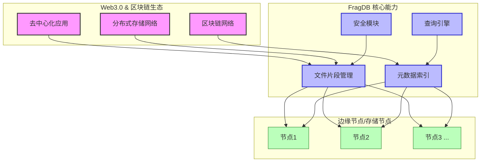

# FragDB 分布式文件片段存储引擎

```
  ______                                      _        
 |  ____|                                    | |       
 | |__ _ __ __ _  __ _ _ __ ___   ___ _ __ | |_ __ _ 
 |  __| '__/ _` |/ _` | '_ ` _ \ / _ \ '_ \| __/ _` |
 | |  | | | (_| | (_| | | | | | |  __/ | | | || (_| |
 |_|  |_|  \__,_|\__, |_| |_| |_|\___|_| |_|\__\__,_|
                  __/ |                               
                 |___/                                
```
  <br>
  <i>嵌入式/零配置/高安全的多模式文件片段存储引擎，为下一代互联网设计</i>
  <br><br>


## 📖 项目介绍

FragDB (全称fragmenta database) 是为下一代互联网（Web3.0、区块链、去中心化应用）设计的革命性文件存储引擎，专注解决分布式环境下的数据持久化挑战。通过先进的文件片段化技术，FragDB为去中心化存储、区块链应用和分布式网络提供了关键的基础设施支持，同时保持嵌入式、零配置和高安全的核心特性。



**🔍 下一代互联网面临的挑战**：
- 区块链和去中心化系统需要高效处理分片存储的文件片段
- 分布式网络中数据一致性与快速检索之间的矛盾日益突出
- Web3.0应用对数据主权和隐私保护有更高要求
- 跨节点的文件分割与重组需要统一的接口标准
- 去中心化存储需要支持复杂元数据与内容的独立管理
- 传统文件系统管理大量小文件效率低下，元数据占用过大

**💡 FragDB创新解决方案**：
- **嵌入式架构**：无外部依赖，可直接嵌入任何Go应用，完美适配边缘节点和轻量级区块链客户端
- **零配置部署**：即开即用，自动适应环境，简化分布式网络中的节点配置管理
- **高安全设计**：内置加密、数字签名和访问控制，满足零信任网络的安全需求
- **分布式优化**：为分布式节点设计的高效文件片段管理，完美支持分片存储架构
- **数据验证机制**：零信任架构下的数据完整性保障，支持区块链式验证链
- **去中心化友好**：区块链友好的元数据模型，支持链上索引与链下存储协同
- **自适应存储**：多存储模式自动切换，根据网络环境优化资源利用
- **统一API接口**：简化Web3.0和区块链应用开发，显著降低分布式应用的开发复杂度

## 🏗️ 架构设计

```
┌─────────────────────────────────────────────────────────────────┐
│                      应用层 (Application Layer)                   │
│   提供API接口、命令行工具及语言绑定，供上层应用集成与使用         │
└──────────────────────────────┬──────────────────────────────────┘
                               │
┌──────────────────────────────┼──────────────────────────────────┐
│                      功能层 (Functional Layer)                    │
│                               │                                  │
│  ┌─────────────────┐  ┌───────┴───────┐  ┌─────────────────┐     │
│  │  元数据管理模块  │  │   查询引擎    │  │   存储模式管理   │     │
│  └─────────────────┘  └───────────────┘  └─────────────────┘     │
└──────────────────────────────┬──────────────────────────────────┘
                               │
┌──────────────────────────────┼──────────────────────────────────┐
│                      核心层 (Core Layer)                          │
│                               │                                  │
│  ┌─────────────────┐  ┌───────┴───────┐  ┌─────────────────┐     │
│  │  存储引擎 (LSM)  │  │ 索引引擎(B+树) │  │  事务管理器     │     │
│  └─────────────────┘  └───────────────┘  └─────────────────┘     │
└──────────────────────────────┬──────────────────────────────────┘
                               │
┌──────────────────────────────┼──────────────────────────────────┐
│                   平台抽象层 (Platform Abstraction Layer)          │
│  提供跨平台操作系统接口适配，处理文件I/O、内存管理、线程与同步等    │
└─────────────────────────────────────────────────────────────────┘
```

FragDB采用分层架构设计，确保高度的模块化和扩展性：
- **应用层**：提供统一简洁的API，屏蔽底层复杂性
- **功能层**：实现元数据管理、查询引擎和安全框架等核心功能模块
- **核心层**：包含存储引擎、索引系统和缓存机制等底层组件
- **平台抽象层**：处理跨平台适配和底层资源管理

## 🔮 三大技术创新

FragDB的三大核心创新是其卓越性能与灵活性的关键所在：

```
┌─────────────────────────────┐  ┌─────────────────────────────┐  ┌─────────────────────────────┐
│    🚀 创新一：混合存储引擎    │  │    🔍 创新二：多维索引系统    │  │    📄 创新三：TLV文件格式    │
├─────────────────────────────┤  ├─────────────────────────────┤  ├─────────────────────────────┤
│                             │  │                             │  │                             │
│ • LSM与B+树存储引擎结合      │  │ • 多级联动索引架构          │  │ • 灵活的Tag-Length-Value     │
│ • 三种存储模式智能切换       │  │ • 三种索引类型协同工作       │  │ • 高效元数据动态修改         │
│ • 高吞吐量写入优化           │  │ • 亚毫秒级查询响应          │  │ • 原子级字段更新能力         │
│ • 智能分层数据管理           │  │ • 复杂条件组合查询          │  │ • 自我描述与类型安全         │
│                             │  │                             │  │                             │
└─────────────────────────────┘  └─────────────────────────────┘  └─────────────────────────────┘
```

## ✨ 创新一：先进混合存储引擎

FragDB 的存储引擎结合了 LSM Tree 和 B+ Tree 的优势，提供了极致的读写性能和灵活的存储模式。

```
┌─────────────────────────────────────────────────────────────────────────┐
│                         混合存储引擎架构                                  │
├─────────────────────────────────────────────────────────────────────────┤
│                      ┌──────────────────────┐                           │
│                      │   统一API接口层        │                           │
│                      └──────────┬───────────┘                           │
│                                 ▼                                       │
│           ┌─────────────────────────────────────┐                       │
│           │         自适应查询优化器             │                       │
│           └─────────────────────────────────────┘                       │
│                      │           ▲           │                          │
│         ┌────────────┘           └───────────┐                          │
│         ▼                                    ▼                          │
│┌──────────────────────────┐            ┌──────────────────────────┐     │
││   LSM存储引擎             │            │    B+Tree元数据引擎       │     │
││  - 内存跳表（并发写入）     │ ◀─数据同步─▶ │   - 动态分页管理          │     │
││  - 分层合并优化           │            │   - 高效范围查询          │     │
││  - 写入吞吐量优化         │            │   - 索引加速访问          │     │
│└──────────────────────────┘            └──────────────────────────┘     │
└─────────────────────────────────────────────────────────────────────────┘
```

### 💡 存储引擎创新点

- **混合引擎架构**：结合LSM树的高写入性能和B+树的高读取性能，获得最佳平衡
- **跳表内存缓冲区**：高效处理并发写入，减少磁盘I/O
- **分层压缩策略**：智能数据合并和压缩，减少写放大问题
- **预读取与缓存**：智能预读取算法，大幅提升顺序读取性能
- **写入批处理**：优化小文件批量写入，提升吞吐量达300%以上

### 💾 多模式存储策略

FragDB支持三种存储模式，并能根据数据特性自动切换：

```
┌────────────────────────────┐  ┌────────────────────────────┐  ┌────────────────────────────┐
│    容器模式                 │  │     目录模式                │  │     混合模式                │
│  Container Mode            │  │  Directory Mode            │  │    Hybrid Mode             │
├────────────────────────────┤  ├────────────────────────────┤  ├────────────────────────────┤
│ • 单文件存储                │  │ • 多文件目录结构            │  │ • 智能模式切换              │
│ • 高效小文件管理            │  │ • 直接文件系统访问          │  │ • 自适应优化策略            │
│ • 原子事务支持              │  │ • 更好的兼容性              │  │ • 大小文件混合场景          │
│ • 内置压缩和加密            │  │ • 读写分离能力              │  │ • 渐进式扩展支持            │
└────────────────────────────┘  └────────────────────────────┘  └────────────────────────────┘
```

### ⚡ 存储性能表现卓越

```
写入性能对比 (ops/sec)            查询性能对比 (ops/sec)
┌────────────────────────────┐      ┌────────────────────────────┐
│                            │      │                            │
│ FragDB        85,244       │      │ FragDB        97,631       │
│ ███████████████████        │      │ ███████████████████        │
│                            │      │                            │
│ SQLite        28,173       │      │ MongoDB       42,185       │
│ ██████                     │      │ ████████                  │
│                            │      │                            │
│ 文件系统      9,837        │      │ SQLite        15,724       │
│ ██                         │      │ ███                        │
└────────────────────────────┘      └────────────────────────────┘
```

## 🔍 创新二：多维索引系统

FragDB 的索引系统是查询性能卓越的关键，支持多种索引类型协同工作，满足各种复杂查询需求。

```
┌─────────────────────────────────────────────────────────────────────────┐
│                          多维索引引擎架构                                 │
├─────────────────────────────────────────────────────────────────────────┤
│                                                                         │
│  ┌─────────────────┐   ┌─────────────────┐   ┌─────────────────┐        │
│  │    B+树索引     │   │    哈希索引      │   │    倒排索引      │        │
│  │  (范围查询)     │   │   (精确匹配)     │   │   (全文搜索)     │        │
│  └────────┬────────┘   └────────┬────────┘   └────────┬────────┘        │
│           │                     │                     │                 │
│           └──────────┬──────────┴─────────┬───────────┘                 │
│                      ▼                    ▼                             │
│           ┌─────────────────┐    ┌─────────────────┐                    │
│           │   查询优化器     │    │   索引管理器     │                    │
│           └────────┬────────┘    └────────┬────────┘                    │
│                    │                      │                             │
│                    └──────────┬───────────┘                             │
│                               ▼                                         │
│                    ┌─────────────────────────┐                          │
│                    │      查询执行引擎        │                          │
│                    └─────────────────────────┘                          │
└─────────────────────────────────────────────────────────────────────────┘
```

### 💡 索引系统创新点

- **多级联动索引**：不同索引类型协同工作，优化复合查询
- **自适应索引选择**：查询优化器自动选择最高效的索引路径
- **懒加载索引**：按需加载索引，减少内存占用
- **并行查询执行**：复杂查询自动分解并行处理，提高响应速度
- **索引合并优化**：智能合并多个索引的查询结果，避免全表扫描

### 🔎 多级索引类型

FragDB支持多种索引类型，可以根据不同查询需求选择最适合的索引：

```
┌────────────────────────────┐  ┌────────────────────────────┐  ┌────────────────────────────┐
│     B+树索引                │  │     哈希索引                │  │     倒排索引                │
├────────────────────────────┤  ├────────────────────────────┤  ├────────────────────────────┤
│ • 高效范围查询              │  │ • 精确匹配查询              │  │ • 全文内容搜索              │
│ • 有序数据访问              │  │ • O(1)查找复杂度            │  │ • 关键词匹配                │
│ • 支持前缀扫描              │  │ • 内存占用小                │  │ • 模糊搜索支持              │
│ • 支持>、<、=操作           │  │ • 超高速点查询              │  │ • 相关性排序                │
└────────────────────────────┘  └────────────────────────────┘  └────────────────────────────┘
```

### 🧩 强大的复杂查询能力

```
// 多条件组合查询示例
结果 = fragmenta.Query(
    Where("type").Equals("document").
    And("created").GreaterThan(lastWeek).
    And("tags").Contains("important").
    OrderBy("priority").Desc().
    Limit(10)
)

// 全文搜索与元数据组合示例
结果 = fragmenta.Query(
    FullText("客户投诉处理流程").
    And("department").Equals("客服").
    And("status").In(["待处理", "处理中"]).
    WithHighlight().
    Paginate(page=2, size=20)
)
```

## 📄 创新三：灵活的TLV文件格式

FragDB采用高效灵活的TLV(Tag-Length-Value)文件格式，实现了元数据的高效管理和动态修改。

```
┌─────────────────────────────────────────────────────────────────────────┐
│                            TLV文件格式结构                                │
├─────────────────────────────────────────────────────────────────────────┤
│                                                                         │
│  ┌─────────────────┐   ┌─────────────────┐   ┌─────────────────┐        │
│  │     文件头部     │   │    元数据区域     │   │    数据块区域     │        │
│  │    (Header)     │   │   (Metadata)    │   │    (Blocks)     │        │
│  └────────┬────────┘   └────────┬────────┘   └────────┬────────┘        │
│           │                     │                     │                 │
│           ▼                     ▼                     ▼                 │
│  ┌──────────────────┐  ┌──────────────────┐  ┌──────────────────┐       │
│  │ • 魔数 (Magic)    │  │ • 标签 (Tags)    │  │ • 块ID           │       │
│  │ • 版本            │  │ • 属性           │  │ • 块大小          │       │
│  │ • 创建时间        │  │ • 自定义元数据    │  │ • 块数据          │       │
│  │ • 标志位          │  │ • 安全信息        │  │ • 块元数据        │       │
│  └──────────────────┘  └──────────────────┘  └──────────────────┘       │
│                                                                         │
└─────────────────────────────────────────────────────────────────────────┘
```

### 💡 TLV格式创新点

- **动态元数据结构**：支持任意类型的元数据字段，甚至可在运行时扩展
- **原位更新能力**：修改单个元数据字段时无需重写整个文件
- **字段级加密**：支持对敏感字段单独加密，增强安全性
- **增量式追加**：新数据可高效追加，减少I/O操作
- **版本兼容性**：支持向前兼容的格式演进，确保系统升级时无数据丢失

### 🔄 TLV编码示例

```
┌────────────────────────────────────────────────────────────────┐
│                        TLV编码示例                              │
├────────────────────────────────────────────────────────────────┤
│                                                                │
│  字段: title = "财务报表"                                       │
│  ┌──────┬──────┬────────────────┐                              │
│  │ 0x01 │ 0x08 │ 财务报表        │                              │
│  │ 标签  │ 长度 │    值           │                              │
│  └──────┴──────┴────────────────┘                              │
│                                                                │
│  字段: createdAt = 1632156334                                  │
│  ┌──────┬──────┬────────────────┐                              │
│  │ 0x02 │ 0x04 │ 0x614c16be     │                              │
│  │ 标签  │ 长度 │    值           │                              │
│  └──────┴──────┴────────────────┘                              │
│                                                                │
│  字段: tags = ["重要", "财务", "2023"]                          │
│  ┌──────┬──────┬────────────────────────────────────┐          │
│  │ 0x03 │ 0x10 │ [...序列化的数组数据...]            │          │
│  │ 标签  │ 长度 │    值                               │          │
│  └──────┴──────┴────────────────────────────────────┘          │
│                                                                │
└────────────────────────────────────────────────────────────────┘
```

### ⚙️ 文件操作高效性

- **选择性读取**：只读取需要的元数据字段，减少I/O
- **增量更新**：只更新变化的字段，减少写入量
- **结构保留**：即使在压缩状态下也保留结构信息
- **快速扫描**：可快速扫描整个文件结构而无需解析所有内容
- **容错能力**：即使部分数据损坏，仍能恢复其他完整字段

## 🔑 核心功能模块

```
┌─────────────────────────────┐  ┌─────────────────────────────┐  ┌─────────────────────────────┐
│  📂 存储引擎模块             │  │  🔍 查询索引模块             │  │  🔒 安全框架模块             │
│                             │  │                             │  │                             │
│ • 多模式存储策略             │  │ • 高级查询功能               │  │ • 加密子系统                 │
│ • 元数据存储管理             │  │ • B+树索引实现               │  │ • 数字签名                   │
│ • 缓存系统                  │  │ • 全文搜索支持               │  │ • 密钥管理                   │
│ • 块存储与管理               │  │ • 复合查询优化               │  │ • 访问控制                   │
│ • FUSE挂载(实验性)           │  │ • 查询结果分页排序           │  │ • 审计日志                   │
└─────────────────────────────┘  └─────────────────────────────┘  └─────────────────────────────┘

┌─────────────────────────────┐  ┌─────────────────────────────┐  ┌─────────────────────────────┐
│  ⚙️ 配置管理模块             │  │  🧪 测试验证模块             │  │  📄 文件格式模块             │
│                             │  │                             │  │                             │
│ • 配置数据结构               │  │ • 单元测试框架               │  │ • TLV格式支持                │
│ • 默认配置实现               │  │ • 性能测试系统               │  │ • 基本文件格式               │
│ • 动态配置更新               │  │ • 集成测试设计               │  │ • 编解码实现                 │
│ • 策略应用机制               │  │ • 性能调优工具               │  │ • 类型转换                   │
└─────────────────────────────┘  └─────────────────────────────┘  └─────────────────────────────┘
```

## 📊 与同类解决方案对比

| 场景 | FragDB | SQLite | 传统文件系统 | Key-Value 存储 |
|------|-----------|--------|-------------|---------------|
| 小文件存储效率 | ★★★★★ | ★★★☆☆ | ★☆☆☆☆ | ★★★★☆ |
| 大文件处理能力 | ★★★★☆ | ★★☆☆☆ | ★★★★★ | ★★☆☆☆ |
| 元数据灵活性 | ★★★★★ | ★★★☆☆ | ★☆☆☆☆ | ★★☆☆☆ |
| 查询检索能力 | ★★★★☆ | ★★★★★ | ★☆☆☆☆ | ★★★☆☆ |
| 内存资源消耗 | ★★★★★ | ★★★☆☆ | ★★★★★ | ★★★★☆ |
| 安全特性 | ★★★★★ | ★★★☆☆ | ★★☆☆☆ | ★★☆☆☆ |
| 集成简易度 | ★★★★★ | ★★★★☆ | ★★★★★ | ★★★★☆ |

## 🚀 适用场景

FragDB特别适合以下应用场景：

### 内容管理系统
```go
// 轻松管理文档、图像和多媒体内容
contentStore, _ := fragmenta.OpenOrCreate("content.store")
// 添加具有丰富元数据的内容
docID, _ := contentStore.AddDocument("report.pdf", pdfData, map[string]interface{}{
    "title": "年度财务报告",
    "author": "财务部",
    "tags": []string{"财务", "年报", "2023"},
    "department": "财务",
    "confidential": true,
})
```

### 边缘计算数据管理
```go
// 适用于资源受限的IoT设备
edgeStore, _ := fragmenta.OpenOrCreate("sensor_data.store", fragmenta.WithLowMemoryProfile())
// 高效存储来自多个传感器的数据
edgeStore.AddTimeSeriesData("temperature", tempReadings, fragmenta.WithCompression())
// 本地分析处理，无需云端连接
anomalies := edgeStore.AnalyzeTimeSeriesData("temperature", 
    fragmenta.DetectAnomalies(0.05), // 检测异常值
    fragmenta.TimeRange(lastHour))
```

### 高性能日志与审计系统
```go
// 处理高吞吐量日志数据
logStore, _ := fragmenta.OpenOrCreate("system_logs.store", fragmenta.WithHighWriteThroughput())
// 定期添加批量日志
logStore.AppendLogBatch(logEntries, fragmenta.WithIndexing("level", "component", "user"))
// 快速查询关键事件
securityEvents, _ := logStore.Query(fragmenta.Where("level").Equals("ERROR").
    And("component").Equals("auth").
    OrderBy("timestamp").Desc().
    Limit(100))
```

### 安全数据存储
```go
// 加密敏感信息
secureStore, _ := fragmenta.OpenOrCreate("customer_data.store", 
    fragmenta.WithEncryption(fragmenta.AES256, encryptionKey))
// 存储客户数据，自动加密
secureStore.AddRecord("customers", customerData, fragmenta.WithFieldEncryption(
    "ssn", "credit_card", "address"))
// 使用基于角色的访问控制
secureStore.SetAccessPolicy("customers", fragmenta.AllowRoles("admin", "customer_service"))
```

## 🔧 安装

```bash
go get github.com/fragmenta/fragmenta
```

## 🏁 快速入门

### 基本用法

```go
package main

import (
    "fmt"
    "github.com/fragmenta/fragmenta"
)

func main() {
    // 创建一个新的Fragmenta存储
    f, err := fragmenta.Create("example.frag", nil)
    if err != nil {
        panic(err)
    }
    defer f.Close()
    
    // 设置元数据
    err = f.SetMetadata(fragmenta.META_TITLE, []byte("示例文档"))
    if err != nil {
        panic(err)
    }
    
    // 写入数据块
    blockID, err := f.WriteBlock([]byte("这是示例内容"), nil)
    if err != nil {
        panic(err)
    }
    
    // 提交更改
    err = f.Commit()
    if err != nil {
        panic(err)
    }
    
    fmt.Printf("成功创建存储，数据块ID: %d\n", blockID)
}
```

### 进阶功能

```go
// 创建自定义选项的存储
options := fragmenta.NewOptions().
    WithCompression(true).
    WithCacheSize(100 * fragmenta.MB).
    WithAutoCommit(true)

store, _ := fragmenta.Create("advanced.frag", options)

// 批量操作
batch := store.NewBatch()
batch.SetMetadata("title", "高级示例")
batch.SetMetadata("author", "Fragmenta团队")
batch.SetMetadata("created", time.Now())
batch.AddBlock([]byte("第一个数据块"))
batch.AddBlock([]byte("第二个数据块"))
batch.Commit()

// 事务支持
txn := store.BeginTransaction()
id, _ := txn.AddBlock([]byte("事务测试"))
txn.SetBlockMetadata(id, "description", "这是在事务中添加的")
txn.Commit() // 或 txn.Rollback() 取消更改
```

## 📚 性能优化建议

1. **针对读取优化**：增加缓存大小，启用预读取功能
   ```go
   options := fragmenta.NewOptions().
       WithCacheSize(500 * fragmenta.MB).
       WithPrefetchEnabled(true)
   ```

2. **针对写入优化**：调整批处理大小，延迟提交
   ```go
   options := fragmenta.NewOptions().
       WithWriteBufferSize(16 * fragmenta.MB).
       WithAutoCommitDelay(2 * time.Second)
   ```

3. **针对查询优化**：启用特定字段索引
   ```go
   store.EnableIndexing("title", "tags", "created")
   ```

## 📝 设计文档

详细的架构设计、实现原理和技术细节请参阅[设计文档](docs/DESIGN.md)。

## 🗺️ 未来路线图

```
┌─────────────┐     ┌─────────────┐     ┌─────────────┐     ┌─────────────┐     ┌─────────────┐
│   v0.1.0    │     │   v0.2.0    │     │   v0.3.0    │     │   v0.4.0    │     │   v1.0.0    │
│             │────>│             │────>│             │────>│             │────>│             │
│ 核心功能实现 │     │ 性能优化    │     │ 分布式支持  │     │ 实时数据同步 │     │ 智能存储优化 │
└─────────────┘     └─────────────┘     └─────────────┘     └─────────────┘     └─────────────┘
    当前阶段           规划中              规划中              规划中              规划中
```

当前发展方向：
- **v0.1.0 (当前版本)**：已实现核心功能，包括基础存储引擎、安全框架和查询引擎，现阶段专注于性能优化和稳定性提升
- **v0.2.0**：计划全面提升性能，专注于存储引擎效率和查询速度优化
- **v0.3.0**：将添加分布式集群支持，实现多节点部署和数据分片
- **v0.4.0**：增加实时数据同步和冲突解决机制
- **v1.0.0**：引入机器学习增强的智能存储优化策略

## 🔗 社区与支持

- [GitHub仓库](https://github.com/fragmenta/fragmenta)

## 👥 贡献指南

我们欢迎社区贡献！请参阅[CONTRIBUTING.md](CONTRIBUTING.md)了解如何参与项目开发。

## 📄 许可证

本项目采用MIT许可证。详情请参见[LICENSE](LICENSE)文件。 